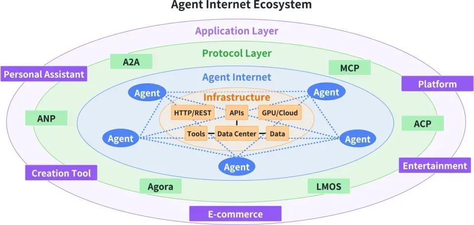
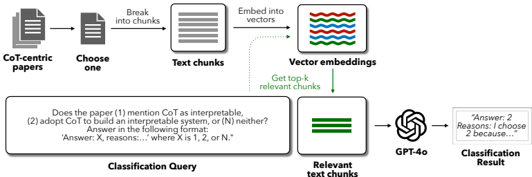
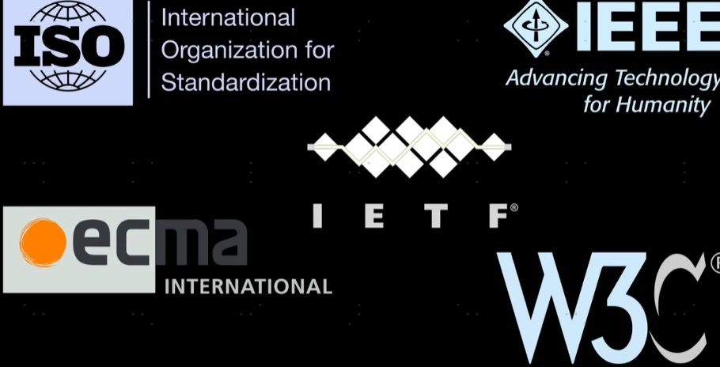

# 整体架构概述

该图呈现了一个以“Agent Internet”为核心的分层生态系统，采用环绕式设计，体现各层级的协作关系。整体分为三层：
核心层（Agent Internet）：基础设施与智能体（Agent）的交互中心。

协议层（Protocol Layer）：支撑Agent间通信与协作的协议/平台。

应用层（Application Layer）：面向用户和商业场景的具体服务。

颜色区分明确（淡紫、绿、蓝等），突出功能模块的独立性。

# 核心层：Agent Internet与基础设施

### 核心要素：
Agent（智能体）：多个Agent围绕中心分布，代表去中心化协作。Agent可能是AI助手、自动化程序或服务节点。

### 基础设施组件：

HTTP/REST & APIs：标准化接口，确保外部系统接入。

GPU/Cloud：提供算力支持（如模型训练、实时推理）。

Tools：开发工具包或插件（如代码库、调试工具）。

Data Center & Data：存储和管理海量数据（用户数据、知识库、训练数据）。

### 作用：  
作为生态的“操作系统”，整合资源并调度Agent，通过基础设施实现高效计算、数据流通和功能扩展。

# 协议层：Agent协作的“规则”

图中标注了多个协议/平台，可能的功能：
A2A（Agent-to-Agent）：Agent间直接通信协议（如任务分配、数据交换）。

### MCP（Multi-Agent Coordination Protocol）：

多Agent协同控制（如冲突解决、优先级管理）。

### ANP/ACP：

可能涉及Agent网络协议（ANP）或访问控制协议（ACP）。

### AGORA：牛津大学元协议

更具前瞻性的协议：“Agora：自然语言到协议生成” 。Agora协议代表了一种以用户为中心的设计思想，它致力于将用户的自然语言请求直接转换成标准化的协议，供下游的专业智能体执行。

首先是自然语言理解层，它负责解析用户的原始请求（例如“规划一个从北京到纽约，为期五天，预算3000美元的旅行” ），并从中提取出结构化的关键信息，如出发地、目的地、时长、预算等 。紧接着，协议生成层会将这些结构化信息转换成针对不同服务类型的形式化协议，例如生成专门的航班协议、酒店协议、天气协议和预算协议 。

Agora专注于将自然语言翻译成合适的结构化协议，充当一个中间层，将用户意图映射到不同智能体所需的特定协议上 。选择哪种协议，取决于任务所需的智能体自主性水平、通信灵活性、接口标准化程度以及任务本身的复杂性等多种因素 。这些不同的探索共同指向了一个目标：让AI智能体之间的协作更加顺畅、高效，从而更好地服务于人类的需求。

### LMOS：Language Model Operating System

提供Agent描述格式用于标准化描述Agent/工具能力和元数据，以语义抽象确保跨平台互操作。

实现发现机制：本地通过mDNS广播发现，跨网络通过集中注册中心登记查询。

提供Agent注册库充当目录服务，支持按能力元数据搜索匹配合适Agent。

通信协议灵活可插拔，不强制单一传输，允许根据Agent需要选择HTTP、消息队列(MQTT/AMQP)或P2P等最佳方案。

### 意义：  
协议层确保Agent间的互操作性、安全性和效率，类似互联网的TCP/IP层。

### 协议的重要性在于统一标准

举个例子：过去的AR/VR技术，真正可以落地的场景就是游戏行业

游戏行业不会有什么统一的设计规范，或者统一的语法表达，于是我们看到AR/VR技术,每个厂商（引擎）都有自己的设计语言

这里面就连最底层的概念，比如物体，空间的定义，都没有统一的语法

但是我们大众软件行业，统一的设计语言是很重要的

会有全行业都接受的标准、规范、协议

没有统一标准，软件行业的发展会严重受阻

在AR/VR行业，你根本看不到任何标准化的念头，在这种大环境下，怎么引导新人开发者入门呢？

AR/VR应用的开发者要怎么分享经验？

# 应用层：落地场景

### 覆盖多领域的具体应用：
Personal Assistant：个性化AI助手（如日程管理、问答）。

Platform：开放平台（开发者构建Agent服务的框架）。

Entertainment：游戏、社交等娱乐场景的Agent集成。

Creation Tool：AI生成内容（如文本、图像、代码）。

E-commerce：智能导购、自动化客服、供应链优化。

### 商业价值：  
通过Agent技术提升用户体验和自动化水平，驱动各行业创新。

# 关键交互逻辑

数据流：Data Center向Agent和应用层提供数据支持，Tools和API赋能开发。

协作模式：Agent通过协议层（如A2A）跨应用协作（如电商Agent调用支付Agent）。

扩展性：GPU/Cloud支持动态扩容，适应高负载需求。

总结：生态系统的核心价值

技术整合：将AI、云计算、大数据与多Agent系统结合。

标准化与开放：协议层促进生态兼容性，降低接入门槛。

场景驱动：从基础设施到应用层，最终服务于实际需求。

此架构反映了未来“Agent互联网”的愿景——智能体无缝融入数字世界，成为连接服务、数据和用户的核心枢纽。