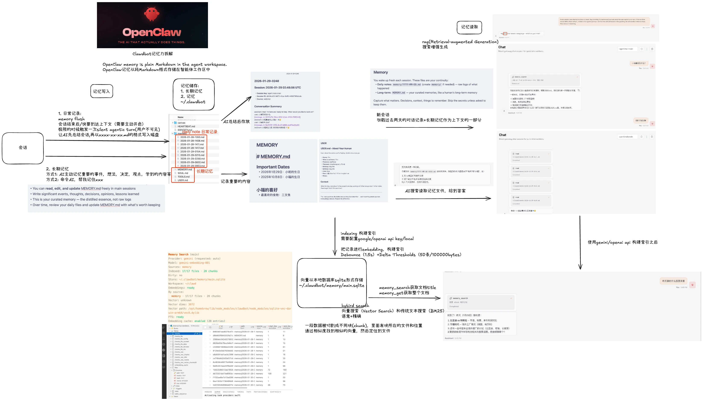
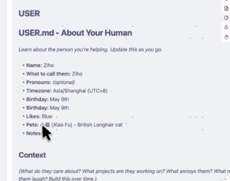
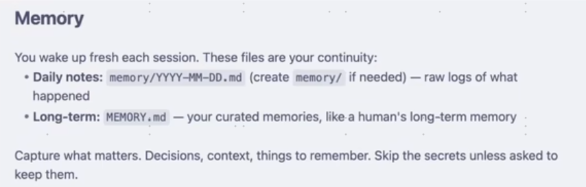
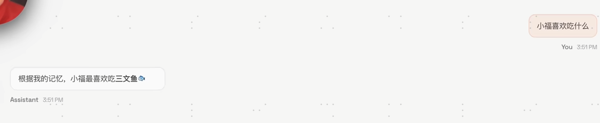

# 记录写入：日常记录

memory flush

会话结束后/快要到达上下文极限的时候

触发一次silent agentic turn（用户不可见）

让AI总结会话 以2026-01-28-XXXX.md的格式写入磁盘

# 记录写入：长期记忆

MEMORY.md记录会话中重要的信息

SOUL.md记录AI的聊天风格

TOOLS.md记录着可以使用的工具

USER.md记录着使用者的信息



## 长期记忆存储的方式有两种 

1 AI主动记录重要的时间，想法，决定，观点，学习到的内容，更新到MEMORY.md中

```text
你可以在主会话中自由地阅读、编辑和更新“MEMORY.md”文件。.
记录重要的事件、想法、决定、观点以及所吸取的教训。.
这是你精心整理的记忆——是提炼后的精华，而非原始流水账。
随着时间推移，请回顾你的每日文件（daily files），并将值得保留的内容更新到 MEMORY.md 中。
```


2 主动命令AI 帮我记住什么事情。这样AI就会把记忆写入的MEMORY.md中


# 记忆读取

## 新会话 

加载过去两天的对话记录+ 长期记录作为上下午的一部分



```text
你每次会话启动时都是全新的状态。 以下文件是你维系（记忆）连贯性的关键：

每日笔记 (Daily notes)：memory/YYYY-MM-DD.md

（如有需要，请创建 memory/ 文件夹）

这是记录发生之事的原始日志。

长期记忆 (Long-term)：MEMORY.md

这是你提炼后的记忆，就像人类的长期记忆一样。

记录核心要素 (Capture what matters)： 包括决策、背景上下文以及需要记住的事项。 除非被明确要求保留，否则请忽略秘密/敏感信息。
```

