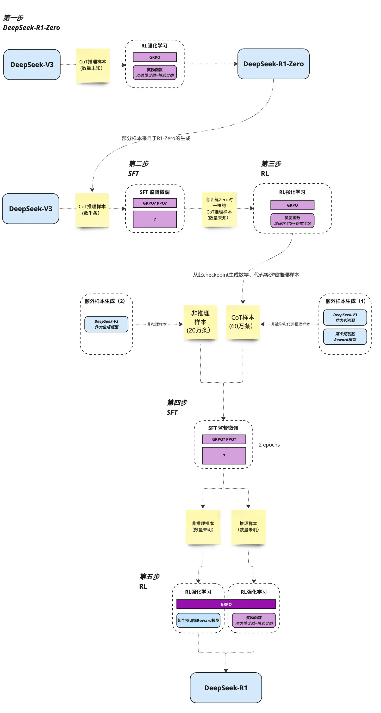

### 背景

      预训练即将结束，能拿来做LLM训练的数据几乎已经被榨干；
      入场门槛高，堆积算力成本大；国外的硬件限制，赚取卖算力硬件的高额利润同时形成护城河。

### 现象

      1,性能不分伯仲（主要指标追平O1）的同时，相比Close AI 是开源的（开源内容包括模型权重和部分训练数据，但完整的训练代码和数据集仍未开源）；
      2,用蒸馏后的小参数模型已经可以本地化部署而不是依赖云服务，意味着搭建本地AI服务实际上是可以的。（硬件成本大大降低，不到10%的成本拥有90%以上的性能）
      3,由算力改为算法的革新，打破垄断；给出了模型训练中的长链推理，或复杂推理问题的一种可行路径。

### R1训练过程

      一阶段(R1 Zero)
      见2.2.1. Reinforcement Learning Algorithm
      Base模型(V3) 跳过SFT 使用GRRO进行强化训练(RL，不是RLHF),得到R1 Zero；
      注意：Base模型如果不够强，Scaling RL的效果不会好到哪去的。

### 二阶段(R1)
见2.3.1 cold start

      Base模型(V3) 使用R1 Zero的部分COT推理数据（数千条），进行SFT后，使用GRRO进行强化训练(RL)，
      强化训练(RL)收敛后，通过拒绝采样生成 60 万条高质量推理数据，结合 20 万条非推理数据（写作、事实 QA 等）。
      LLM 的拒绝采样操作起来非常简单：让自己的模型针对 prompt 生成多个候选 response，然后用 reward_model 筛选出来高质量的 response （也可以是 pair 对），拿来再次进行训练。
      再对Base模型进行两轮的SFT后，分别进行推理样本（推理任务）和非推理样本(非推理任务)的强化训练(RL), 优化出最终R1模型。
      1. 推理导向RL：结合规则奖励（答案准确性、语言一致性），优化数学、编程等结构化任务表现。
      2. 通用对齐RL：融入人类偏好奖励模型（Helpfulness & Harmlessness），确保模型在开放域任务中的安全性与实用性。

### 为什么分两阶段？
见2.3.1 cold start
            
      一阶段的核心是GPRO的强化训练，但纯RL训练的代价是可读性差与多语言混杂。模型生成的推理过程常包含中英文混合、格式混乱等问题，限制了实际应用。（2.3.1 cold start有说明）

### V3和R1的区别

V3: 采用传统的预训练-监督微调范式，结合混合专家架构（Mixture-of-Experts, MoE）（6710亿参数，每次激活370亿），通过算法优化降低算力需求

R1: 完全摒弃了监督微调（SFT），直接通过强化学习（RL）从基础模型中激发推理能力。其核心技术包括群组相对策略优化（GRPO算法）和两阶段RL与冷启动