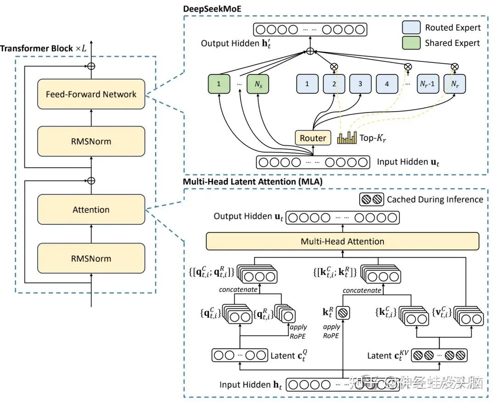

### 模型架构

DeepSeekV3的基本架构仍然基于Transformer（Vaswani et al., 2017）框架。

为了实现高效推理和成本效益高的训练，DeepSeekV3也采用了MLA和DeepSeekMoE，这些已经在DeepSeekV2中得到了充分验证。

与DeepSeekV2相比，唯一的例外是引入了无辅助损失的负载均衡策略。

#### 使用极大规模混合专家模型（MoE）

总参数量达6710亿，每个token激活370亿参数。

每个MoE层采用1个共享专家和256个路由专家，每个专家的中间隐藏维度为2048。

    混合专家模型（Mixture of Experts，MoE）是一种在大语言模型领域逐渐受到重视的架构。

    它通过将模型分解为多个专家，并动态分配任务，显著提高了模型的计算效率和性能。

    例如，Google的GShard和Switch Transformer等项目，都尝试通过MoE架构来解决单一模型架构面临的计算资源和性能瓶颈问题。

    MoE模型通过稀疏激活的特性，在每次前向传播过程中，只有与输入数据最相关的少数专家被激活进行计算，而大部分专家处于未激活状态。

    这种稀疏性显著减少了每次计算所需的资源，与传统的密集模型相比，计算效率大幅提升。
    DeepSeek MoE架构的一个重要创新是细粒度专家分割，使得每个专家能够专注于更小范围的任务，从而提高了专家的专业化程度。

    此外，DeepSeek MoE架构还可以扩展到多模态应用中，例如图像和文本的联合处理。

    通过将专家划分为不同的模态处理模块，DeepSeek MoE可以同时处理图像和文本信息，实现更高效的多模态任务处理。

    在大规模数据处理方面也表现出色，其高效的负载均衡策略和计算优化机制，使得模型能够高效地处理大规模数据。
    使用多头潜在注意力（MLA）

通过低秩联合压缩，减少键值（KV）缓存需求，提升推理效率。

注意力头数设置为128，每个头的维度为128，KV压缩维度为512。

使用无辅助损失的负载均衡策略

创新性地避免传统负载均衡方法对模型性能的负面影响。

通过灵活的批量负载均衡，允许专家在不同领域中更好地专业化。

使用多token预测（MTP）训练目标

同时预测2个未来token，增加训练信号密度，可能提高数据效率。

第二个token预测的接受率在85%到95%之间，显著加快解码速度。

使用1层MTP模块，顺序预测额外token，并在每个预测深度保持完整的因果链。

#### Transformer 块

首先，我们有一个由多个 Transformer 块组成的“流水线”。每个 Transformer 块都像一个小工厂，负责对输入数据进行处理和转换。这些块包括：

● Attention（注意力机制）：这就像给数据贴上标签，让模型知道哪些部分更重要。

● Feed-Forward Network（前馈网络）：这就像一个加工厂，对数据进行进一步的加工和处理。

● RMSNorm：这就像一个质量检查员，确保数据在处理过程中保持稳定和一致。

这些 Transformer 块会重复多次（图中用 L 表示重复次数），每一步都会对数据进行更深层次的处理。

#### DeepSeekMoE（混合专家模型）

经过 Transformer 块处理后，数据会进入 DeepSeekMoE 部分，这是模型的核心创新之处。它包含两个主要部分：

    ● Shared Expert（共享专家）：一组网络，所有输入数据都会通过这些网络。它们负责处理通用的特征，就像一个全能的团队，处理所有任务。
    
    ● Routed Expert（路由专家）：一组网络，但每个输入数据只会通过其中的一部分。这些网络负责处理更具体或特殊的特征，就像一个专业化的团队，只处理特定任务。
    
#### 路由器（Router）

路由器是决定每个输入数据应该通过哪些路由专家的关键组件。

它会根据输入数据的特征，选择最合适的专家网络。

这个过程可以看作是模型在“思考”哪个专家最能处理当前的数据。

#### 多头潜在注意力（Multi-Head Latent Attention，MLA）

在选择了合适的专家之后，模型会使用一种特殊的注意力机制，称为多头潜在注意力（MLA）。

这种机制可以让模型同时关注输入数据的不同方面，从而更全面地理解和处理数据。

#### 缓存机制

在推理（即模型实际使用时）过程中，MLA 会使用缓存机制来提高效率。这意味着模型会存储一些计算结果，以便在处理相似的输入时可以快速调用，而不需要重新计算。

### 高效训练

完整训练仅需278.8万H800 GPU小时，展现高效成本效益。训练成本仅为557万美元，远低于国内外其他已知模型。

#### 使用FP8混合精度加速训练

FP8混合精度训练是一种在深度学习模型训练过程中使用低精度数据表示（特别是FP8）来加速计算并减少内存占用的方法。FP8代表8位浮点数格式，是一种比传统的FP32（32位浮点数）和FP16（16位浮点数）更加紧凑的数据格式。

#### 使用DualPipe算法提升训练效率

通过计算-通信重叠，减少管道气泡，提升训练效率。

将每个块划分为注意力机制、全对全分发、MLP 和全对全组合四个组件，并手动调整 GPU 流式多处理器（SMs）的比例。

采用双向管道调度，从管道两端同时输入微批次，隐藏大部分通信开销。

#### 进行了极致的内存优化

重新计算 RMSNorm 和 MLA 上投影。在反向传播过程中重新计算所有 RMSNorm 操作和 MLA 上投影，从而无需持久存储其输出激活。 虽然有轻微的开销，但该策略显著减少了存储激活所需的内存。

CPU 中的指数加权平均（Exponential Moving Average, EMA）：在训练过程中，保留模型参数的 EMA 以便在学习率衰减后早期估计模型性能。EMA 参数存储在 CPU 内存中，并在每次训练步骤后异步更新。这种方法可以在不增加额外内存或时间开销的情况下维护 EMA 参数。

多Token预测（Multi-Token Prediction, MTP）模块与主模型共享嵌入层和输出头：通过 DualPipe 策略，将模型的最浅层（包括嵌入层）和最深层（包括输出头）部署在相同的 PP 排序上。
这种安排使得 MTP 模块和主模型之间可以物理共享嵌入层和输出头的参数和梯度。这种物理共享机制进一步提高了内存效率。

### 数据处理和预训练

#### 高质量多样化数据

在14.8万亿 token 上进行预训练，涵盖多语言、数学、编程等领域。
增强数学和编程样本的比例，扩展多语言覆盖范围（不仅限于英语和中文）。

#### 文档打包与FIM策略

通过文档打包保持数据完整性，避免跨样本注意力掩码。
引入Fill-in-Middle（FIM）策略

        Fill-in-Middle（FIM）策略，这是一种数据增强技术，

        通过随机选择文档中的一段文本并将其替换为一个特殊的占位符，

        迫使模型学习从上下文预测被替换文本的能力。在DeepSeek-V3的预训练中，

        FIM策略的应用率为10%，这意味着在训练过程中，

        有10%的数据被结构化为“前缀-后缀-中间”（PSM）框架，

        以0.1的比例进行FIM策略的应用。

        这种策略的应用有助于提高模型对文本中间部分的预测能力，同时不会损害其对下一个token的预测能力。

#### 多语言分词器优化

BPE字符级别改为BBPE字节级别，词汇量扩展到128K token。

引入结合标点符号和换行符的token，优化多语言压缩效率。

    DeepSeek-V3 采用了基于字节级 BPE（Byte-level BPE）的分词器，

    并构建了一个包含 128K 个 token 的词表。为了优化多语言的压缩效率，
    
    DeepSeek 对预分词器（Pretokenizer）和训练数据进行了专门的调整。
    
    与 DeepSeek-V2 相比，新的预分词器引入了将标点符号和换行符组合成新 token 的机制，
    
    这种方法可以提高压缩率，但也可能在处理不带换行符的多行输入时引入 token 边界偏差。
    
    为了减轻这种偏差，DeepSeek-V3 在训练过程中以一定概率随机地将这些组合 token 拆分开来，
    
    从而让模型能够适应更多样化的输入形式，提升了模型的鲁棒性。

#### 长上下文扩展技术

通过两阶段训练，将上下文长度从4K扩展到128K。

采用YaRN技术，确保扩展稳定性。

DeepSeek-V3 通过采用两阶段训练策略，成功地将模型的上下文窗口从4K逐步扩展到了128K。这一扩展是通过使用YaRN（Yet another RoPE extensioN method）技术实现的，YaRN 是一种高效的上下文窗口扩展方法，它通过改进 Rotary Position Embeddings (RoPE) 的位置编码方式，显著减少了扩展上下文长度所需的训练数据和步骤。

在第一阶段，上下文长度从4K扩展到32K，而在第二阶段，上下文长度进一步扩展到128K。在这两个阶段中，DeepSeek-V3 采用了YaRN方法，通过调整RoPE的位置编码和动态缩放，实现了上下文长度的扩展。在第一阶段，序列长度设置为32K，Batch Size 设置为1920，学习率设置为7.3 × 10^-6。在第二阶段，序列长度设置为128K，Batch Size 设置为480，学习率保持不变。

这种两阶段的扩展训练使得DeepSeek-V3能够处理长达128K的输入序列，显著提升了其在长文本任务中的表现。此外，YaRN 方法在扩展上下文长度时，显著减少了所需的训练数据和步骤，数据量减少至传统方法的1/10，训练步骤减少至传统方法的2.5倍。这不仅提高了训练效率，还确保了模型在长上下文任务中的稳定性

### 后训练与性能提升

#### 监督微调（SFT）

● 使用150万个指令微调实例，涵盖推理、数学、编程等多个领域。

● 通过内部DeepSeek-R1模型生成推理数据，平衡准确性和格式清晰性。

#### 强化学习（RL）

● 使用基于规则和基于模型的奖励模型，优化复杂推理任务表现。

● 采用分组相对策略优化（GRPO），从组分数中估计基线，提升模型性能。

    在DeepSeek-V3的训练过程中，采用了强化学习（RL）来优化模型在复杂推理任务上的表现。
    在RL过程中，使用了两种类型的奖励模型：基于规则的奖励模型（RM）和基于模型的RM。
    基于规则的RM用于那些可以通过特定规则验证的问题，例如数学问题或编程问题，从而可以应用规则来验证正确性。
    而基于模型的RM则用于那些具有自由形式正确答案的问题，依赖奖励模型来确定响应是否与预期的正确答案匹配。
    
    此外，为了提升模型性能，DeepSeek-V3采用了分组相对策略优化（GRPO），这是一种优化策略，
    它放弃了通常与策略模型大小相同的批评模型，而是从组分数中估计基线。
    这种方法不仅使模型更接近人类偏好，还增强了在基准测试上的表现，
    特别是在可用SFT数据有限的情况下。通过最大化特定目标函数优化策略模型，
    GRPO在RL过程中引入了来自不同领域的提示，如编程、数学、写作、角色扮演和问答等。

#### 知识蒸馏

● 从DeepSeek-R1系列模型中蒸馏推理能力，显著提升数学和编程任务表现。
● 在LiveCodeBench和MATH-500基准测试中，性能提升显著。
