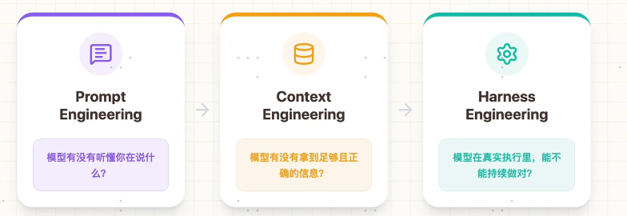
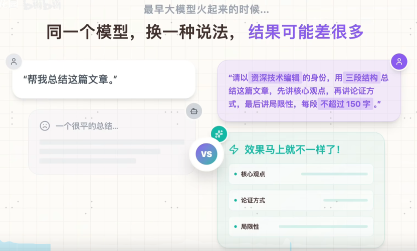
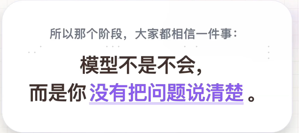
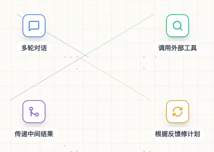
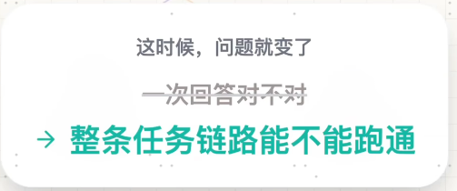
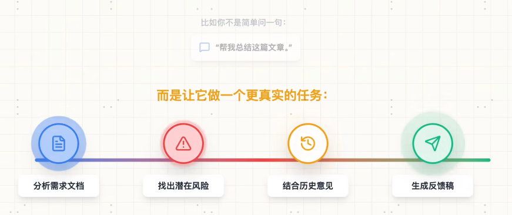
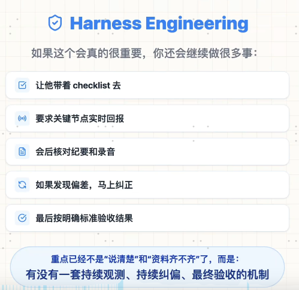

https://www.bilibili.com/video/BV1Zk9FBwELs?spm_id_from=333.788.player.player_end_recommend_autoplay&vd_source=6ea6d1d2145416db083871908dc86913&trackid=web_related_0.router-related-2479604-grjpt.1775806635637.988
-----

### 1. Prompt Engineering (提示词工程)
* **核心问题**：模型有没有**听懂**你在说什么？
* **关注点**：这是最基础的交互层。重点在于如何通过结构化的指令（如 Role, Task, Constraint, Few-shot）来降低模型理解的歧义，让模型的输出符合预期格式和语气。
* **局限性**：仅靠 Prompt 无法解决模型对私有数据的缺失或长文本记忆问题。

---

### 2. Context Engineering (上下文工程)
* **核心问题**：模型有没有**拿到**足够且正确的信息？
* **关注点**：这涉及 RAG（检索增强生成）和动态上下文管理。你需要确保在模型推理时，能从海量向量数据库或外部 API 中精准检索到最相关的背景知识，并将其“喂”给模型。
* **技术手段**：语义搜索（Embedding）、重排序（Rerank）、以及针对长上下文（Long-context）的压缩与切片策略。

---

### 3. Harness Engineering (治理/框架工程)
* **核心问题**：模型在真实执行里，能不能**持续做对**？
* **关注点**：这是通往“可靠代理”（Reliable Agents）的关键。它不再关注单次对话，而是关注系统的稳定性、一致性、错误恢复和自动化闭环。
* **核心组成**：
    * **Eval (评估)**：通过自动化 benchmark 监控模型是否退化。
    * **Self-Correction (自纠错)**：利用 Reflection 机制让模型检查自己的输出。
    * **Guardrails (护栏)**：强制约束输出的合规性与安全性，防止幻觉引发的业务风险。

---
