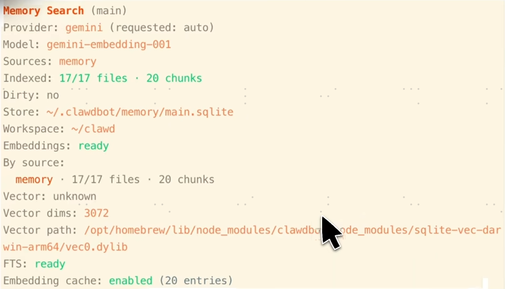
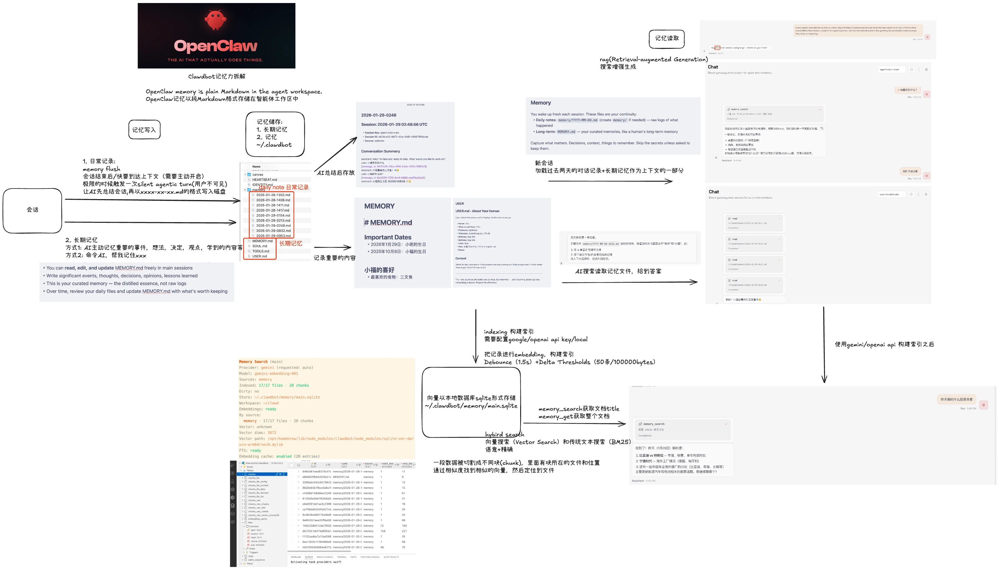

# OpenClaw vs Hermes Agent：自主 AI 代理架构深度解析 (2026)

在 2026 年的 AI 代理生态中，**OpenClaw**（原 Moltbot）与 **Hermes Agent**（Nous Research）代表了两种截然不同的演进方向。前者致力于打造极致的“个人网关”，而后者则在追求“自我进化”的认知深度。

---

## 1. 核心架构：网关模式 vs. 学习环模式


*图 1：OpenClaw 的典型混合搜索与内存索引架构*

### **OpenClaw (Gateway Architecture)**
*   **设计哲学**：**Control & Connectivity**。AI 被视为用户与其数字世界（文件、应用、聊天软件）之间的安全层。
*   **技术栈**：Node.js / TypeScript。采用插件式架构，核心是静态的技能描述文件 (`SKILL.md`)。
*   **运行模式**：作为本地守护进程运行，通过 API 或原生插件接入 iMessage、WhatsApp、Signal 等 20+ 渠道。

### **Hermes Agent (Learning Loop Architecture)**
*   **设计哲学**：**Evolution & Autonomy**。AI 被视为一个在任务中不断学习、自我改进的数字员工。
*   **技术栈**：Python / Rust。采用高度隔离的容器化环境（Docker/Singularity）执行复杂代码。
*   **核心创新**：**Autonomous Skill Generation**。当 Hermes 解决了一个新问题时，它会启动一个“复盘”流程，将成功的逻辑提取并自动生成一个 `SKILL.md` 和对应的 Python 脚本。

---

## 2. 内存存储实现方案深度拆解

Hermes Agent 的记忆系统不再仅仅是日志记录，而是一套**三层认知记忆架构 (Three-Tier Cognitive Architecture)**。

### **A. 程序记忆 (Procedural Memory) —— “技能化存储”**
这是 Hermes 最具技术特色的部分，旨在实现**逻辑复用**。
*   **实现机制**：通过 **Learning Loop** 触发。任务完成后，Agent 调用自身能力对执行过程进行代码化抽象。
*   **存储形态**：动态生成的 Python 脚本与 Markdown 说明文档，存储在容器挂载的 `skills/` 目录。
*   **加载逻辑**：系统在初始化或接收到相关任务描述时，会优先检索技能库并**动态注入**到当前 Runtime 中，从而避免重复推理。

### **B. 情景记忆 (Episodic Memory) —— “结构化会话流”**
*   **存储媒介**：采用 **SQLite + sqlite-vec (向量插件) + FTS5 (全文搜索)**。
*   **检索策略**：
    *   **语义检索**：基于 Nomic/Gemini Embedding 查找相关概念。
    *   **精确召回**：利用 BM25 对代码符号、环境变量或特定 ID 进行精确匹配。
*   **分级压缩**：采用 **Hierarchical Summarization**。旧的会话会通过“递归总结”机制转化为越来越精简的元数据，确保长期记忆不会导致上下文爆炸。

### **C. 用户建模 (User Modeling / Honcho Dialectic)**
*   **底层协议**：基于 **Honcho 协议**（一种专为 Agent 存储设计的持久层框架）。
*   **功能实现**：Hermes 在后台持续维护一个 `user_profile.json` 或图数据库，记录用户的偏好、常用技术栈及决策风格。
*   **辩证修正**：每当用户修正 Agent 的行为，系统会立即更新对应的权值。例如，如果用户说“我不喜欢这种缩进风格”，该偏好会立即在全局生效。

---

## 3. 技术组件对比表

| 组件 | **OpenClaw (Moltbot)** | **Hermes Agent (Nous)** |
| :--- | :--- | :--- |
| **持久化目标** | 信息沉淀 (Information Essence) | 逻辑复用 (Reusable Logic) |
| **存储媒介** | 纯 Markdown (`MEMORY.md`) + SQLite | 关系型 DB + 动态代码库 (Skills) |
| **检索算法** | 混合搜索 (Hybrid Search) | 向量搜索 + BM25 + **CoT 召回** |
| **记忆更新** | **防抖触发** (Memory Flush) | **自动触发** (Learning Loop 复盘) |
| **隔离性** | 系统级权限控制 | 强隔离容器 (Docker/Singularity) |

---

## 4. 总结：你应该选择哪一个？

### **场景 A：你是极客玩家，需要“随身助理”**
*   **推荐**：**OpenClaw**。
*   **理由**：它就在你的 iMessage 里，能帮你快速整理本地笔记（见图 2）、同步待办事项，且隐私保护做得最好。

### **场景 B：你是开发者，需要“数字分身”**
*   **推荐**：**Hermes Agent**。
*   **理由**：它能在深夜自主修复你的代码 Bug，并总结出一套专门针对你项目架构的“调试技巧”，第二天早上直接给你结果。

---

## 5. 互操作性

2026 年初发布的 `hermes-bridge` 支持一键迁移：
```bash
hermes claw migrate --target ./AI/Hermes_Knowledge_Base
```
这会将你的 `MEMORY.md` 知识库自动转化为向量图谱，让 Hermes 继承你此前培养的 Agent 偏好。


*图 2：OpenClaw 记忆持久化写入过程，Hermes 可完美继承此类结构化数据*
