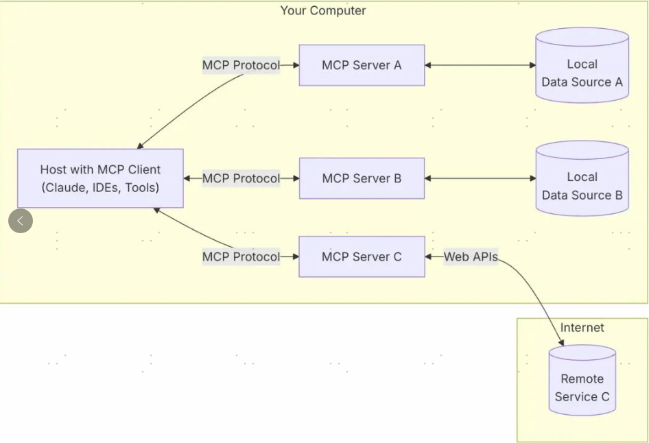

### Spring AI MCP 采用模块化架构，包括以下组件

Spring AI 应用程序：使用 Spring AI 框架构建想要通过 MCP 访问数据的生成式 AI 应用程序

Spring MCP 客户端：MCP 协议的 Spring AI 实现，与服务器保持 1:1 连接

MCP 服务器：轻量级程序，每个程序都通过标准化的模型上下文协议公开特定的功能

本地数据源：MCP 服务器可以安全访问的计算机文件、数据库和服务

远程服务：MCP 服务器可以通过互联网（例如，通过 API）连接到的外部系统

### 工作流程

AI 应用中集成MCP客户端，通过MCP协议向MCP服务端发起请求，MCP 服务端可以连接本地/远程的数据源，或者通过 API 访问其他服务，从而完成数据的获取，返回给 AI 应用去使用。