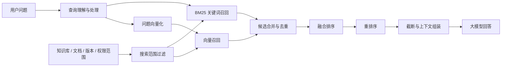
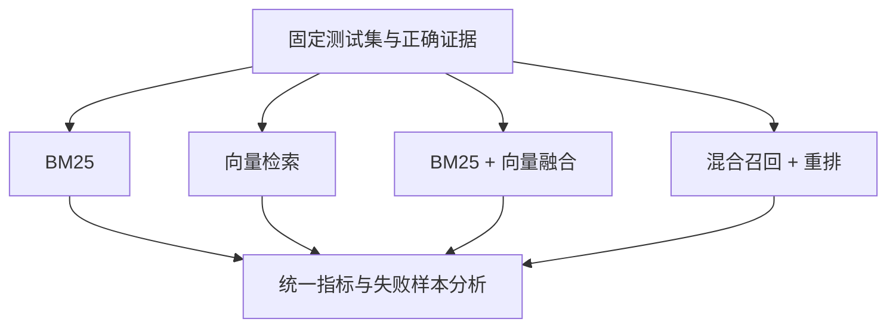

# BM25 与向量检索：混合召回、融合、重排与评估

## 一、概论

在 RAG 系统中，BM25 和向量检索解决的是两类不同的漏召回问题：

- **BM25 擅长词面精确匹配**，适合标题、编号、错误码、产品名和专业术语；
- **向量检索擅长语义匹配**，适合用户没有照抄原文、而是换了一种说法的情况。

两者结合的目的不是简单堆叠算法，而是让词面证据和语义证据相互补充。

一套完整的混合检索链路通常包含：

> **限定搜索范围 → BM25 召回 → 向量召回 → 候选去重与融合 → 重排序 → 截断与上下文组装 → 大模型回答。**

其中：

- 召回先解决“正确证据有没有进入候选集”；
- 融合解决“两路候选怎样合成一份清单”；
- 重排解决“已有候选中谁应该排在前面”；
- 评测解决“多跑一路是否真的带来了稳定收益”。



## 二、两个场景说明为什么一种检索不够

先看两个简单场景。

### 场景一：原词明确

知识库里有一份文档，标题是：

> 报销制度

用户搜索时也只输入：

> 报销制度

这个问题中，标题原词就是非常强的信号。用户输入和文档标题完全一致，词面精确命中本身就具有很高的区分度。

### 场景二：表达方式不同

另一份文档的标题是：

> 保险销售技巧

用户询问：

> 如何推销保险产品？

“推销”和“销售”没有逐字匹配，但表达的意思接近。只依靠原词匹配，正确内容可能排得不够靠前；向量检索则有机会通过语义相似将它召回。

这两个场景说明：

| 查询类型 | 示例 | 更有优势的路线 |
| --- | --- | --- |
| 标题原词 | 报销制度 | BM25 |
| 编号或错误码 | ERR-1042、GB/T 35273 | BM25 |
| 产品名或专业术语 | RRF、现金价值 | BM25 |
| 口语改写 | 如何推销保险产品 | 向量检索 |
| 同义表达 | 休假怎么审批 / 年假申请流程 | 向量检索 |
| 自然语言描述 | 系统一直转圈但没有报错 | 向量检索 |

BM25 和向量检索补的是不同类型的候选。

## 三、RAG 中检索真正负责什么

RAG 可以理解为一次开卷回答。模型回答之前，系统先从指定资料中找出一批可能支持答案的原文，再将经过筛选的证据交给模型。

检索的第一目标不是直接生成答案，而是：

> **把可能支持答案的正确原文带进候选集。**

如果正确证据没有被召回，大模型后面说得再流畅，也没有可靠依据。

因此，分析 RAG 问题时，应把下面几件事分开：

1. 搜索范围是否正确；
2. BM25 是否召回了正确证据；
3. 向量检索是否召回了正确证据；
4. 融合时是否保留了正确证据；
5. 重排后正确证据是否足够靠前；
6. 截断时是否丢掉了必要证据；
7. 大模型是否正确使用了已经提供的证据。

笼统地说“检索效果不好”或“模型幻觉了”，通常无法直接定位问题。

## 四、BM25 擅长什么，又会漏掉什么

BM25 是经典的词法相关性算法。它关注查询和文档之间的词面匹配，同时考虑：

- 查询词是否出现在文档中；
- 查询词出现的频率；
- 查询词在整个资料库中的稀有程度；
- 文档长度对词频的影响。

实际效果还会受到分词器、停用词、同义词、字段权重和查询方式等因素影响。

### 1. BM25 的优势

BM25 通常更适合：

- 文档标题；
- 条款编号；
- 产品型号；
- 错误码；
- 人名和机构名；
- 领域缩写；
- 必须精确匹配的专业术语。

用户搜索 `RRF`，通常不是想看所有与排序有关的内容；用户搜索某个错误码，也不是想看语义相近的其他故障。此时，原词命中是一条重要锚点。

在搜索标题时，还可以给标题字段更高权重，例如：

```text
标题匹配权重 > 正文匹配权重 > 附加描述匹配权重
```

### 2. BM25 的局限

BM25 依赖词面重合。当用户换一种表达方式时，它可能漏掉正确内容。

例如：

```text
用户问题：如何推销保险产品？
原文标题：保险销售技巧
```

如果没有同义词扩展或查询改写，“推销”和“销售”没有直接对上，正确原文可能无法进入前排候选。

## 五、向量检索擅长什么，又会漏掉什么

向量检索会使用 Embedding 模型把用户问题和文档片段转换成向量，再通过距离或相似度寻找可能相关的内容。

用户不必照抄原文，只要表达的意思接近，正确内容就有机会被召回。

### 1. 向量检索的优势

向量检索通常更适合：

- 同义表达；
- 口语化提问；
- 用户只描述现象、不知道专业名称；
- 原文和问题使用不同句式；
- 含义接近但关键词重合较少的内容。

### 2. 向量检索的局限

向量检索不是 BM25 的高级替代品。

**短问题容易发生语义漂移。**例如“报销制度”可能同时接近报销申请、差旅标准、费用审批等内容。问题越短，可用于约束含义的信息越少。

**领域术语可能被通用语义带偏。**例如“现金价值”在保险领域有明确含义，通用 Embedding 模型却可能把它和普通财务内容混在一起。

**编号和错误码不一定具有可靠语义。**模型可能无法稳定区分只差一个字符的型号、版本号或条款编号。

**向量相似不等于能够回答问题。**一个片段可能与问题主题相近，但不包含回答所需的具体事实。

因此，向量检索负责补充语义候选，不应取代精确词面信号。

## 六、搜索范围必须先正确

在执行两路召回之前，系统需要明确本次搜索允许使用哪些资料。

常见过滤条件包括：

- 知识库；
- 文档集合；
- 用户和部门权限；
- 文档状态；
- 文档版本；
- 生效时间和失效时间；
- 产品、地区或业务线；
- 数据密级。

搜索范围过滤和相关性排序解决的是不同问题：

- **过滤决定哪些内容有资格参与搜索；**
- **排序决定合格内容中谁更相关。**

假设用户正在查询 A 知识库，系统却把 B 知识库的内容一起召回，后续排序再准确，也是在错误范围内选择答案。

同样，如果已经停用的旧流程仍然可以被检索，它可能因为和问题高度相似而排在前面。“相关”并不等于“当前可用”。

遇到“最新流程为什么总搜到旧版本”时，第一步不应该是调整向量权重，而应检查：

1. 旧版本是否仍处于可检索状态；
2. 当前版本过滤条件是否正确；
3. 生效时间是否进入搜索范围；
4. 新旧版本是否使用了稳定的文档和版本标识；
5. 索引更新后是否仍存在旧缓存。

## 七、两路结果怎样合并

BM25 和向量检索各自返回一批候选片段。系统需要进行候选合并、去重和融合排序。

### 1. 候选合并与去重

同一个片段可能同时被 BM25 和向量检索召回。合并时应使用稳定的 `chunk_id` 或其他唯一标识去重，而不是只比较文本是否完全一致。

系统还需要防止前几条结果全部来自同一篇文档的相邻片段。它们可能看起来都相关，实际上只重复提供了一份信息。

必要时可以增加：

- 同一文档候选数量上限；
- 相邻片段合并；
- 基于内容相似度的去重；
- 结果多样性控制；
- 对不同文档或不同证据来源的适度覆盖。

### 2. 为什么两路分数不能直接比较

BM25 分数和向量相似度不是同一种数值，不能直接把两个数字放在一起比较。

它们类似于百分制成绩和五分制评价：

- BM25 分数可能没有固定上限，并会随查询和语料变化；
- 向量分数取决于相似度算法、向量模型和索引实现；
- 两边的数值范围和分布都可能不同。

即使表面上各设置 50% 权重，也不代表它们在最终排序中真的同等重要。如果一边的分数范围长期更大，结果仍可能由该路线主导。

## 八、常见融合方式

### 1. 归一化后线性加权

一种常见方式是先把两路分数转换到可比较范围，再进行加权：

```text
final_score = α × normalized_bm25_score
            + β × normalized_vector_score
```

其中：

- `α` 表示词面信号权重；
- `β` 表示语义信号权重；
- `normalized_*` 表示经过归一化或校准后的分数。

这种方式可以表达业务偏好，但需要注意：

- 归一化方法会影响结果；
- 分数分布可能随查询类型变化；
- 权重需要使用固定测试集调节；
- 一个项目中的权重不能直接复制到另一个项目。

### 2. RRF 排名融合

RRF，即 Reciprocal Rank Fusion，不直接比较两路原始分数，而是根据候选在每一路中的排名进行融合。

其思想可以简化为：

```text
RRF_score(document) = Σ 1 / (k + rank_i(document))
```

一个片段如果在 BM25 和向量路线中排名都靠前，融合分数就会更高。

RRF 的优点是减少不同分数尺度带来的影响，适合两路分数难以直接校准的情况。它的局限是主要使用排名信息，无法完整利用每一路分数差距所表达的置信程度。

### 3. 学习排序或业务规则

在数据和标注较充分时，还可以使用学习排序模型，把更多信号一起考虑：

- BM25 分数；
- 向量相似度；
- 标题是否精确命中；
- 文档版本；
- 发布时间；
- 文档权威性；
- 用户行为信号；
- 文档类型和业务优先级。

无论使用哪种方式，融合参数都应该通过实验验证，而不是凭感觉设置。

## 九、融合和重排有什么区别

融合和重排发生在候选已经被召回之后，但职责不同。

### 1. 融合

融合负责把 BM25 和向量检索的候选放进同一份清单，并根据排名或经过校准的分数形成初步顺序。

它回答的是：

> 两路候选怎样汇总并形成一份初始排名？

### 2. 重排

重排模型会同时查看用户问题和每个候选片段，更细致地判断该片段是否真正能够回答问题。

它回答的是：

> 在已经找回的候选中，哪些证据最值得放在前面？

可以记成两句话：

> **召回先解决“有没有找到”，重排再解决“找到后排得好不好”。**

### 3. 重排不能解决漏召回

重排只能调整已有候选，不能凭空找回候选集之外的内容。

如果“保险销售技巧”没有进入初次候选集，重排模型无论多强，都无法把它提到前面。

因此，排查时要先检查正确证据是否进入候选，再检查排名是否合理。这两类问题不能混在一起。

### 4. 为什么初次召回通常要多取一些候选

假设最终只准备给大模型 5 个片段，初次召回通常不会只取 5 个，而是取更多候选供融合和重排处理。

原因是：如果正确证据初始排在第 12 名，而召回阶段只保留前 5 名，重排根本看不到它。

候选数量也不能无限增加。候选越多：

- 召回覆盖可能提高；
- 噪声可能增加；
- 重排延迟和成本会上升；
- 排序难度也会增加。

候选数量需要结合 Recall@K、重排能力、延迟和成本进行测试。

## 十、混合检索伪代码

下面的伪代码只用于说明各层职责，不对应某个产品的可运行接口：

```python
question = normalize_query(user_question)
scope = build_scope(
    knowledge_base_ids=allowed_kb_ids,
    document_ids=allowed_document_ids,
    permissions=current_user_permissions,
    active_versions_only=True,
)

bm25_candidates = bm25_search(
    query=question,
    filters=scope,
    top_k=BM25_TOP_K,
)

query_vector = embedding_model.encode(question)
vector_candidates = vector_search(
    vector=query_vector,
    filters=scope,
    top_k=VECTOR_TOP_K,
)

merged_candidates = deduplicate(
    bm25_candidates + vector_candidates,
    key="chunk_id",
)

fused_candidates = reciprocal_rank_fusion(merged_candidates)
reranked_candidates = reranker.rank(question, fused_candidates)

context = select_context(
    reranked_candidates,
    max_chunks=FINAL_TOP_K,
    max_tokens=CONTEXT_TOKEN_LIMIT,
)

return generate_answer(question, context)
```

这段伪代码强调：

- 同一搜索范围必须约束两路召回；
- BM25 和向量路线分别保留自己的候选；
- 候选通过稳定标识去重；
- 融合和重排是两个独立阶段；
- 最终还需要结合片段数量和 Token 预算组装上下文。

## 十一、四种常见失败应该先查哪里

### 1. 原词标题没有排在前面

示例问题：

> 报销制度

检查顺序：

1. 搜索字段是否包含标题；
2. 标题是否配置了合理权重；
3. 分词后是否仍保留关键原词；
4. 短查询的匹配条件是否过严或过松；
5. 单独使用 BM25 时正确标题是否排在前面；
6. 如果 BM25 正常、融合后掉队，再检查融合方式和重排结果。

### 2. 用户换了一种说法

示例问题：

> 如何推销保险产品？

原文：

> 保险销售技巧

检查顺序：

1. 单独查看向量检索候选；
2. 问题和文档是否使用兼容的 Embedding 模型；
3. 原文片段是否包含足够完整的信息；
4. 候选数量是否过小；
5. 相似度门槛是否过高；
6. 向量路线已经召回时，检查融合是否保留、重排是否提升。

### 3. 领域术语被日常语义带偏

示例问题：

> 现金价值

检查顺序：

1. 对比 BM25 和向量路线的原始候选；
2. 确认术语定义是否被正确切片和索引；
3. 检查标题和术语字段的词面权重；
4. 检查 Embedding 模型的领域适配情况；
5. 检查融合是否让大量普通财务内容压过术语定义；
6. 必要时增加术语词典、查询识别或精确匹配加权。

### 4. 新旧版本混在一起

示例问题：

> 最新的车险理赔流程

检查顺序：

1. 旧文档是否本来就不应该参与检索；
2. 当前有效版本是否进入过滤条件；
3. 文档状态和生效时间是否正确；
4. 索引更新后旧版本是否仍然存在；
5. 如果新旧版本都需要保留，版本信息是否进入候选文本或元数据；
6. 重排是否能够利用“最新”等时间条件。

一个较稳妥的通用排查顺序是：

> **先看搜索范围 → 再看两路各自召回了什么 → 再看融合保留了什么 → 最后看重排和截断留下了什么。**

## 十二、如何证明混合检索真的有用

最不可靠的验证方式，是挑两三个效果好的问题进行现场演示。

一次演示答对，可能只是碰巧命中；回答听起来通顺，也不代表系统真的找到正确原文。

### 1. 建立检索测试集

每条测试样本至少应包含：

| 字段 | 说明 |
| --- | --- |
| `query` | 用户问题 |
| `reference_answer` | 参考答案 |
| `relevant_chunk_ids` | 能够直接支持答案的正确片段 |
| `document_id` | 正确片段所属文档 |
| `query_type` | 原词、改写、术语、版本、流程或多证据等类型 |

最容易被遗漏的是正确证据位置。

只有参考答案、没有正确原文片段，就无法判断检索器是否真的把证据找了回来。只标注文档名也不够：系统找到同一份长文档，并不等于找到了能够回答问题的那一段。

### 2. 覆盖不同问题类型

测试问题应覆盖：

- 原词标题；
- 口语改写；
- 领域术语；
- 编号和错误码；
- 版本和时间条件；
- 事实问题；
- 流程问题；
- 需要多段证据的问题；
- 资料中没有答案的问题；
- 权限不同的用户问题。

自动生成问题可以用于扩充初稿，但仍需人工检查：

- 正确证据是否标注准确；
- 答案是否真的可以由证据推出；
- 问题之间是否只是机械换词；
- 问题是否符合真实用户表达方式。

### 3. 做四组对照实验

使用同一批问题和证据，只改变检索配置：

1. 只使用 BM25；
2. 只使用向量检索；
3. BM25 与向量融合；
4. 混合召回后增加重排。



一次实验尽量只改变一个主要因素。每次应记录：

- 知识库和文档版本；
- 测试集版本；
- 分词器和文本查询配置；
- Embedding 模型及版本；
- BM25 和向量候选数量；
- 分数归一化方式；
- 融合算法和参数；
- 相似度或相关性门槛；
- 重排模型及版本；
- 最终保留片段数量；
- 上下文 Token 限制。

否则结果发生变化时，很难判断究竟是哪一项造成的。

## 十三、至少需要关注哪些指标

### 1. Recall@K

Recall@K 关注前 K 条结果是否覆盖了应该找回的正确证据。

它主要回答：

> 正确证据有没有进入候选集？

如果 Recall@K 很低，首先应检查搜索范围、单路召回、切片和候选数量，而不是直接调整大模型。

### 2. Precision@K

Precision@K 关注前 K 条结果中有多少真正相关。

候选取得更多时，覆盖可能提高，但无关内容也可能增加。Precision@K 可以帮助观察噪声是否过多。

### 3. MRR

MRR 关注第一条正确证据出现的位置。

正确证据排第 1 和排第 10，虽然都可以说“找回了”，但后续如果只保留前 5 条，两者结果完全不同。

### 4. nDCG@K

当证据存在多级相关性，或者多个片段都相关但重要程度不同，可以使用 nDCG@K 观察高相关结果是否排在更靠前的位置。

### 5. 重复率和证据覆盖

传统排名指标不一定能反映结果重复问题。还应检查：

- 前 K 条中是否大量出现相邻重复片段；
- 是否覆盖回答所需的不同事实；
- 多段证据问题是否找全关键步骤；
- 结果是否过度集中在同一篇文档。

### 6. 延迟和成本

混合检索和重排会增加计算、调用和维护成本。还需要记录：

- BM25 查询延迟；
- 问题向量化延迟；
- 向量检索延迟；
- 重排延迟；
- 端到端检索延迟；
- 单次查询成本；
- 峰值并发能力。

质量提升必须与延迟、成本和系统复杂度一起评估。

## 十四、评测结果应该保留什么

评测表不应只有一个总分。对于每个问题，最好保留：

- 用户问题；
- 正确证据标识；
- BM25 前 K 条候选及分数；
- 向量检索前 K 条候选及分数；
- 融合后的排名；
- 重排后的排名；
- 最终交给大模型的片段；
- 来源文档和版本；
- 是否存在重复候选；
- 最终回答是否由证据支持。

这样才能回答：

- BM25 漏掉了哪些改写问题；
- 向量检索补回了哪些证据；
- 向量检索又引入了哪些语义噪声；
- 融合是否错误压低了精确标题；
- 重排是否稳定提升了正确证据；
- 截断是否丢失了完整答案所需的片段。

总指标上升后，仍应按问题类型查看失败样本。某类改写问题变好，不代表短标题、领域术语和版本问题也一定变好。

## 十五、常见追问

### 1. 融合权重怎么定

先固定问题集、Embedding 模型、候选数量和重排配置，只调整融合参数，观察不同类型问题的证据排名。

选定参数后，再使用没有参与调参的测试集复核，避免只记住调参样本。

两边各占一半不代表天然公平；某个项目使用过的比例也不能直接搬到另一份知识库。

### 2. 有了混合检索，是否一定要增加重排

不一定。

需要比较混合召回和混合召回加重排两组结果，观察重排是否能够稳定提升正确证据排名，同时评估新增的延迟、成本和维护复杂度。

如果候选本身已经非常精确，重排带来的收益可能有限。

### 3. 混合检索是否一定优于单路

不一定。

混合检索增加了候选来源，也增加了融合参数和排查成本。是否值得保留，取决于：

- 单路检索具体漏掉了什么；
- 混合后是否稳定补回；
- 是否引入更多噪声；
- 系统是否能够接受新增复杂度；
- 延迟和成本是否满足要求。

### 4. 最终答案错误，先查模型还是先查检索

先查看模型实际收到的原文。

- 正确证据没有进入候选：检查搜索范围和两路召回；
- 正确证据进入候选但排名靠后：检查融合、重排和截断；
- 正确证据已经排在前面但模型仍回答错误：检查上下文组织、提示词和生成环节；
- 正确证据本身过期或无权限：检查文档治理和过滤条件。

这比笼统地归结为“模型幻觉”更容易定位。

## 十六、30 秒回答模板

面试时可以先这样回答：

> BM25 和向量检索解决的是不同类型的漏召回问题。BM25 更擅长标题、编号和专业术语等原词明确的内容，向量检索更擅长用户换了一种说法的情况。系统可以让两路各自召回一批原文，在同一权限和文档范围内合并候选，再通过融合与重排选出最适合交给模型的证据。验证时不能只看几个演示问题，而应固定同一批问题和正确原文，对比 BM25、向量、混合召回和混合加重排，观察正确证据是否进入前 K 条以及最终排名。

这段回答可以概括为四个关键词：

> **互补、候选、排序、验证。**

## 十七、完整回答模板

如果有一分多钟，可以这样回答：

> RAG 保留 BM25，是因为向量检索不能覆盖所有查询。BM25 对标题、编号、错误码和领域术语等原词明确的问题更稳定，向量检索则更适合用户没有照抄原文、而是进行语义改写的情况。两路先在同一知识库、权限和文档版本范围内各自召回一批原文，再进行去重和融合。
>
> 融合负责把两路候选放到同一份清单中，可以使用分数归一化后的加权方式，也可以使用 RRF 等基于排名的融合方式。重排则重新比较用户问题和已有候选，决定谁应该排在前面。重排只能调整已经召回的内容，无法找回候选集之外的正确证据。
>
> 验证时，我会固定同一批用户问题、参考答案和正确原文片段，分别测试只用 BM25、只用向量检索、混合召回以及混合召回加重排。除了比较 Recall@K、Precision@K、MRR 等指标，还会检查重复候选、不同问题类型的失败样本、延迟和成本。最终根据自己的数据决定混合检索和重排是否值得保留，而不是默认组件越多效果越好。

## 十八、总结

“BM25 找关键词、向量找语义”只是这道问题的起点。

真正需要理解的是：

1. **两路各自会漏什么；**
2. **搜索范围、单路召回、候选融合、重排和截断分别负责什么；**
3. **BM25 分数与向量分数为什么不能直接比较；**
4. **融合负责汇总候选，重排负责改善已有候选的顺序；**
5. **重排不能解决漏召回；**
6. **混合检索和重排都不是必然更好；**
7. **任何改动都应通过固定问题、正确证据和对照实验验证。**

最终可以把整套方法记成一句话：

> **先限定正确的资料范围，再让 BM25 和向量检索互补召回；通过合理融合和重排改善候选顺序，最后用固定测试集证明它确实找得更全、排得更准，并且成本可以接受。**
