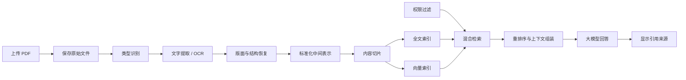

# PDF 文件进入企业 AI 知识库后的处理与检索

## 一、概述

一份 PDF 上传到知识库，并不意味着它已经可以被 AI 正确搜索和使用。

PDF 进入知识库后，通常需要经历以下过程：

1. 保存原始文件；
2. 判断 PDF 类型；
3. 提取文字、表格和页面结构；
4. 对扫描内容进行 OCR；
5. 清理并恢复文档结构；
6. 建立标准化的文档中间表示；
7. 将内容拆分成适合检索的片段；
8. 建立全文索引和向量索引；
9. 用户提问时按权限过滤，并召回、融合、重排序相关片段；
10. 将经过筛选的证据交给大模型；
11. 生成回答并展示文件名、页码和章节等出处。

换句话说，PDF 能不能被搜到，取决于它的内容有没有被解析成机器可以处理、定位和检索的数据——光把文件传上去还不算数。



## 二、保存原始 PDF

原始 PDF 是整个知识库的权威数据，应首先保存到对象存储(Object Storage)或文件存储中，例如 MinIO、S3、OSS、COS 或 Ceph。

保存原始文件时，至少应记录：

| 字段 | 说明 |
| --- | --- |
| `document_id` | 文档唯一标识 |
| `file_name` | 原始文件名 |
| `source_uri` | 文件存储位置 |
| `version_id` | 文档版本 |
| `content_hash` | 文件内容哈希，用于查重和变更判断 |
| `file_size` | 文件大小 |
| `mime_type` | 文件类型 |
| `owner` | 文档负责人或所属部门 |
| `acl` | 用户、角色、部门或密级等访问权限 |
| `created_at` | 上传时间 |
| `status` | 待解析、处理中、成功或失败等状态 |

后续生成的解析结果、检索片段和向量都属于派生数据。即使这些派生数据丢失，也应能够根据原始 PDF 重新生成。

不要只保存提取后的文字或向量，否则会失去原始版面、图片、签章和页码等信息，也无法可靠地重新解析和验证来源。

## 三、先判断 PDF 属于哪种类型

虽然文件后缀都是 `.pdf`，但内容形态可能完全不同。

### 1. 文本型 PDF

这类 PDF 内部已经包含文字对象，可以直接提取文字。由 Word、WPS 或排版软件导出的 PDF 通常属于这一类。

它的主要问题不是 OCR，而是：

- 多栏文字的阅读顺序；
- 页眉和页脚混入正文；
- 标题层级丢失；
- 表格被拆成无意义的字符；
- 跨页段落被错误截断。

### 2. 扫描型 PDF

这类 PDF 的每一页实际上是一张图片，内部没有可直接提取的文字，需要先进行 OCR。

OCR 需要关注：

- 图片分辨率；
- 页面旋转和倾斜；
- 印章、底纹和水印干扰；
- 手写内容；
- 复杂表格；
- OCR 置信度；
- 中英文混排和特殊符号。

### 3. 混合型 PDF

同一个文件中可能同时包含文本页、扫描页、图片、表格和附件。系统应按页或按内容区域选择处理方式，而不是对整个文件统一执行 OCR。

如果对已有文字的页面再次 OCR，可能产生重复文字和识别错误；如果只做文字提取，又会遗漏扫描页内容。

## 四、提取出文字还不够

提取出字符，不代表机器读懂了这一页在讲什么。PDF 本质上是一种页面绘制格式，它记录的是某个字符画在页面的哪个坐标，至于这个字符是标题、正文、表格还是页脚，它并不交代。所以光有文字还不行，得把内容之间的结构关系重新还原出来。

例如，双栏页面如果处理不当，可能被提取成：

```text
左栏第一行
右栏第一行
左栏第二行
右栏第二行
```

虽然每个字都提取成功了，但阅读顺序已经错误。

解析阶段通常需要识别：

- 页面及页码；
- 文字块及阅读顺序；
- 文档标题；
- 章节和标题层级；
- 普通段落；
- 项目符号和编号列表；
- 表格、表头及单元格关系；
- 图片、图注和脚注；
- 页眉、页脚和水印；
- 内容在页面中的坐标。

## 五、建立文档中间表示

提取完文字，先别急着按固定长度切片。更稳妥的做法是先建一层标准化的文档中间表示(Intermediate Representation)，把内容和它的结构一起存下来。

例如：

```text
Document
├─ document_id
├─ version_id
├─ Page 1
│  ├─ Heading：员工休假管理
│  ├─ Paragraph：公司员工依法享有年休假……
│  └─ Table：员工工龄与年假天数
└─ Page 2
   ├─ Heading：年假审批流程
   ├─ List Item：员工在系统中提交申请
   └─ List Item：直属主管进行审批
```

每个内容块除了文字，还应保留：

- 内容类型；
- 所属页面；
- 标题路径；
- 页面坐标；
- 前后顺序；
- OCR 置信度；
- 来源文件和版本。

这样，后续即使调整切片策略或更换 Embedding 模型，也不需要重新解析原始 PDF。

解析结果可以用 JSON 等格式存到对象存储里。这是一份从原始文件加工出来的标准化中间数据，方便复用，但替代不了原件。

## 六、如何进行内容切片

每次提问都把整本 PDF 交给模型并不现实，所以一般会先把文档拆成许多较短的内容片段(Chunk)。

比如一份员工手册，可以拆成“年假申请条件”“年假审批流程”“报销所需材料”“试用期考核规则”这样一个个小块。用户问“年假怎么走审批”时，系统不用把整本手册喂给模型，找到“年假审批流程”那一块、再带上必要的上下文就够了。

### 1. 切片的目标

一个好的片段应尽量满足：

- 内容围绕一个相对完整的主题；
- 单独取出时仍然可以理解；
- 不超过检索模型和大模型的处理限制；
- 能够准确定位回原始文档；
- 不破坏列表、表格和步骤之间的关系。

### 2. 不要只按固定字数切片

如果每 500 个字强制切一段，可能会：

- 从一句话中间截断；
- 将标题和正文分开；
- 把审批步骤拆散；
- 破坏表头和数据行之间的关系；
- 让片段失去必要语境。

更合理的策略是优先按照标题、段落、列表和表格边界切分，再用 Token 数量控制片段大小。

### 3. 标题需要随正文进入片段

假设原文是：

```text
第三章 休假管理
3.2 年假审批流程
员工应提前在系统中提交年假申请……
```

片段不应只保存最后一段正文，而应形成：

```text
第三章 休假管理 > 3.2 年假审批流程

员工应提前在系统中提交年假申请……
```

这样可以减少脱离章节后产生的歧义。

### 4. 小片段检索，大上下文生成

较小的片段更容易精确命中，但可能缺少上下文；较大的片段上下文更完整，但会降低检索精度并占用更多模型上下文。

一种常见做法是：

1. 使用较小片段进行检索；
2. 命中后取得它的父章节或相邻片段；
3. 合并成更完整的上下文交给大模型。

因此，检索片段和最终提交给大模型的上下文不一定相同。

## 七、片段需要保存哪些信息

一个片段不应只有一段文字。建议至少保存：

| 字段 | 说明 |
| --- | --- |
| `chunk_id` | 片段唯一标识 |
| `document_id` | 所属文档 |
| `version_id` | 所属文档版本 |
| `chunk_text` | 片段正文 |
| `heading_path` | 所属章节路径 |
| `page_start` | 起始页码 |
| `page_end` | 结束页码 |
| `block_type` | 段落、列表、表格或图注等内容类型 |
| `previous_chunk_id` | 前一个片段 |
| `next_chunk_id` | 后一个片段 |
| `parent_id` | 所属父章节或父片段 |
| `acl` | 访问权限 |
| `content_hash` | 片段内容哈希 |
| `embedding_model` | 生成向量所使用的模型和版本 |

这些信息支持来源展示、上下文扩展、权限过滤、版本更新和问题排查。

## 八、全文索引和向量索引

内容片段生成后，通常会建立两类互补的索引。

### 1. 全文索引(Full-text Index)

全文索引适合查找：

- 合同编号；
- 制度名称；
- 产品型号；
- 人员姓名；
- 法规条款；
- 精确关键词和专业术语。

常见实现包括 Elasticsearch 和 OpenSearch，其相关性计算通常基于 BM25 等算法，会考虑关键词是否出现、出现次数以及词语在文档中的区分度等因素。

### 2. 向量索引(Vector Index)

Embedding 模型会把用户问题和文档片段转换成向量(Vector)。向量是一组数值，用于表达模型对文本特征的编码结果。

系统可以通过向量距离或相似度，寻找表达方式不同但语义可能接近的内容。

例如：

```text
用户问题：休假怎么审批？
文档标题：年假申请流程
```

两段文字没有使用完全相同的词，但向量检索仍有机会把它们关联起来。

不过要留意，向量相似只说明两段内容在模型看来可能相关，并不代表它就一定能回答问题。所以向量检索的结果一般还得再过一轮重排序(Rerank)。

### 3. 向量数据库保存什么

向量数据库或向量索引通常保存：

- 片段向量；
- `chunk_id`；
- `document_id`；
- 文档版本；
- 页码和章节；
- 权限及其他过滤字段；
- 片段正文或正文存储位置。

向量数据库存的是面向语义检索的派生索引，随时能从文档片段重新生成，替代不了原始 PDF。

常见实现包括 pgvector、Milvus、Qdrant、Weaviate 等。

## 九、用户提问后发生了什么

假设用户提出：

> 年假怎么走审批？

这时系统不会让大模型直接凭记忆作答。它会先走一遍检索流程，把相关证据找出来。

### 第一步：身份识别与权限过滤

系统确认当前用户能够访问哪些知识库、部门和文档。权限条件应进入检索过程，不能在已经取回敏感内容后才过滤。

### 第二步：问题理解与查询改写

系统可能识别出：

- 主题：年假；
- 意图：查询审批流程；
- 可能的近义表达：休假申请、年假申请、请假审批。

对于依赖对话上下文的问题，还需要补全省略的信息。例如用户先问“年假有几天”，接着问“那怎么申请”，第二个问题需要改写成“年假怎么申请”。

### 第三步：混合召回

系统同时执行：

- 全文检索：查找“年假”“审批”“申请流程”等词语；
- 向量检索：查找与整个问题语义相近的片段。

混合检索(Hybrid Search)可以同时利用精确词匹配和语义相似度。

### 第四步：结果融合与去重

同一个片段可能同时被全文检索和向量检索召回。系统需要合并结果、消除重复，并控制来自同一文档或同一章节的候选数量。

### 第五步：重排序

召回(Recall)阶段强调尽量不要漏掉相关内容，因此可能得到：

1. 年假审批流程；
2. 病假审批流程；
3. 年假天数计算规则；
4. 请假系统操作说明；
5. 休假期间工资规则。

重排序模型会同时查看用户问题和每个候选片段，判断哪些内容最能直接回答问题，再选出最终证据。

### 第六步：上下文扩展与组装

如果命中的片段过短，系统可以补充：

- 片段所属标题；
- 前后相邻片段；
- 相关表格；
- 父级章节中的适用条件；
- 文档版本和生效日期。

随后，系统在模型上下文限制内完成去重、排序和长度控制。

### 第七步：生成答案并引用来源

系统把用户问题连同筛选后的证据一起交给大模型。模型只负责根据这些证据把答案组织出来，企业制度这类内容不能靠它自己的记忆去补。

页面应同时展示：

- 文件名称；
- 章节标题；
- 页码；
- 文档版本或生效日期；
- 可跳转的原文位置。

如果检索结果不足以回答问题，系统应明确表示资料不足，而不是生成看似合理但无法验证的内容。

## 十、表格、图片和复杂页面怎么处理

### 1. 表格

表格不能简单转换成按行排列的文字，否则可能丢失表头与单元格之间的关系。

处理表格时应保留：

- 表格标题；
- 表头；
- 行标题；
- 单元格内容；
- 合并单元格关系；
- 所属页码；
- 跨页表格之间的连续关系。

对于适合检索的小型制度表格，可以将表头补充到每一行；对于需要计算、过滤和统计的大型表格，更适合转入结构化查询链路。

### 2. 图片和图表

PDF 中的流程图、组织架构图和统计图可能没有可提取文字。系统可以结合：

- OCR；
- 图片说明生成；
- 多模态模型理解；
- 图表数据抽取；
- 人工补充说明。

图片生成的说明同样需要关联原始页码和图片区域，不能脱离来源独立存在。

### 3. 签章和手写内容

合同签章、批注和手写文字可能影响业务含义。是否需要识别，应根据具体场景决定。制度问答可能不关心印章图像，合同审核则可能必须保留签章位置、签署人和日期。

## 十一、文档更新、删除和重新建索引

### 1. 文档更新

当 PDF 内容发生变化时，建议创建新版本，并执行：

1. 保存新版本原件；
2. 计算新的内容哈希；
3. 重新解析发生变化的内容；
4. 重新生成相关片段；
5. 删除或停用旧版本索引；
6. 建立新的全文索引和向量索引；
7. 更新文档状态和版本关系。

如果只覆盖原文件而不更新索引，系统仍可能检索到旧内容。

### 2. 更换 Embedding 模型

不同 Embedding 模型生成的向量通常不能直接混用。系统应记录模型名称和版本，并在更换模型后重新生成向量索引。

重新生成向量不需要重新上传 PDF。如果解析结果和片段仍然有效，可以直接从这些派生数据重新计算。

### 3. 文档删除

删除文档时，需要根据企业的数据保留制度处理：

- 原始 PDF；
- 文档元数据；
- 解析结果；
- 全文索引；
- 向量索引；
- 缓存；
- 备份及审计记录。

只删除原始文件或只删除向量记录都可能留下不可见的残余数据。

## 十二、权限和安全

企业知识库必须继承源文档权限。用户无权查看原始 PDF 时，也不应通过搜索结果、模型回答或引用片段看到其中的内容。

权限可以来自：

- 用户；
- 角色；
- 部门；
- 项目组；
- 文档密级；
- 地域；
- 有效时间范围。

权限字段应与文档和片段同时进入检索索引，在全文检索和向量检索阶段完成过滤。

敏感数据还应考虑：

- 传输和静态加密；
- 日志脱敏；
- 模型调用边界；
- 第三方服务的数据留存策略；
- 操作审计；
- 删除和保留期限。

## 十三、如何判断处理质量

知识库是否可用，不能只检查文件是否上传成功或向量是否生成成功。至少应评估以下指标。

### 1. 解析质量

- 文字是否完整；
- 阅读顺序是否正确；
- 标题层级是否保留；
- 表格结构是否恢复；
- OCR 错误率是否可接受；
- 页码和原文位置是否准确。

### 2. 检索质量

- 正确证据是否进入候选结果；
- 正确证据在结果中的排名；
- 精确编号和专业术语能否命中；
- 不同表达方式能否找到相同含义；
- 无关内容是否过多；
- 权限过滤是否正确。

### 3. 回答质量

- 回答是否由证据支持；
- 是否准确引用文件、章节和页码；
- 是否遗漏适用条件和例外；
- 资料不足时是否拒绝猜测；
- 文档更新后是否仍引用旧版本。

评估时应准备一组包含标准答案和标准出处的问题，而不是只依赖人工随意试问。

## 十四、常见问题

### 1. 文件已经上传，为什么搜不到？

常见的原因有这么几类：

- 文件尚未解析；
- 扫描 PDF 没有执行 OCR；
- 解析任务失败；
- 切片没有生成；
- 索引任务失败；
- 权限过滤排除了该文件；
- 用户问题与索引内容匹配度不足；
- 文档仍处于旧版本或未发布状态。

### 2. 为什么搜到了错误段落？

多半出在这几个地方：

- 切片过大或过小；
- 标题没有随正文进入片段；
- 只使用向量检索；
- 没有进行重排序；
- 用户问题表达不完整；
- 文档中存在大量相似制度；
- 缺少部门、版本或时间等元数据过滤。

### 3. 为什么模型回答正确，但引用页码不对？

通常是因为解析时没有保留准确的页面映射，或者切片经过合并后丢失了来源范围。页码和坐标必须在解析阶段建立，并在后续加工过程中一直传递。

### 4. PDF 是否一定要放进向量数据库？

不需要，也不应该把整个 PDF 文件本身存进向量数据库。向量数据库保存的是从文档片段生成的向量以及关联信息，原始 PDF 应保存在对象存储或文件存储中。

### 5. 有了向量检索，还需要全文检索吗？

通常需要。向量检索擅长语义相似，全文检索擅长精确词、编号、名称和专业术语。两者组合通常比单独使用其中一种更稳定。

## 十五、推荐的基础实现

对于企业内部知识库，可以从以下组合开始：

| 能力 | 推荐实现 |
| --- | --- |
| 原始 PDF 和解析结果 | MinIO 或其他对象存储 |
| 文档元数据、权限、版本和任务状态 | PostgreSQL |
| 全文检索 | Elasticsearch 或 OpenSearch |
| 向量检索 | pgvector、Milvus 或 Qdrant |
| 文档解析 | PDF 解析器、版面分析模型及 OCR 服务 |
| 检索服务 | 权限过滤、查询改写、混合召回、融合和重排序 |
| 回答生成 | 支持引用约束的大模型服务 |

在文件数量和查询并发较小时，可以先使用 PostgreSQL、pgvector 和 MinIO，减少组件数量。随着规模扩大，再根据全文检索能力、索引规模和性能要求引入独立的搜索引擎或向量数据库。

## 十六、完整示例：员工手册问答

假设企业上传了一份 80 页的《员工手册》。其中第 26 页包含“年假审批流程”。

### 入库阶段

1. 系统将原始 PDF 保存到对象存储；
2. 为文件生成 `document_id`、版本和内容哈希；
3. 判断该文件为文本型 PDF；
4. 提取正文、标题、列表和页码；
5. 去除重复页眉和页脚；
6. 根据章节结构生成“年假审批流程”片段；
7. 为片段建立全文索引；
8. 使用 Embedding 模型生成向量并建立向量索引；
9. 记录该片段来自《员工手册》第 26 页。

### 查询阶段

用户提出：

> 年假怎么走审批？

系统执行：

1. 根据用户身份限定可访问的员工制度；
2. 将问题改写或补充为“员工年假申请和审批流程”；
3. 执行全文检索和向量检索；
4. 召回“年假审批流程”等候选片段；
5. 通过重排序选出最相关内容；
6. 补充该片段所属章节和必要的前置条件；
7. 将问题和证据交给大模型；
8. 生成审批步骤；
9. 页面展示“来源：《员工手册》，第 26 页”。

可以看出，模型并没有把 80 页 PDF 从头读一遍再现场找答案。定位证据的是检索系统，模型只是拿到证据后负责把话组织出来。

## 十七、总结

PDF 进入企业 AI 知识库后，核心不是“上传文件并生成向量”，而是建立一条可以解析、检索、验证、更新和审计的完整数据链路：

> **保存原件 → 类型识别 → 文字提取或 OCR → 版面与结构恢复 → 标准化表示 → 内容切片 → 全文与向量索引 → 权限过滤 → 混合召回 → 重排序 → 上下文组装 → 生成回答 → 引用原文。**

其中：

- 原始 PDF 是权威数据；
- 解析结果是可复用的中间数据；
- 片段是检索单元；
- 全文索引和向量索引是互补的检索手段；
- 重排序决定哪些候选内容真正适合回答问题；
- 大模型负责根据证据组织答案；
- 文件名、版本、章节和页码保证回答可以追溯；
- 权限、更新和删除机制保证知识库能够在企业环境中长期运行。
