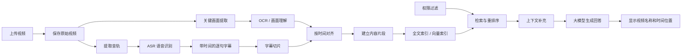

# 视频进入企业 AI 知识库后的处理与检索

## 一、概述

视频上传到知识库，并不意味着系统已经能够搜索和理解其中的内容。

文档里通常已经存在可以提取的文字，而视频里的信息主要藏在声音和画面中。为了让视频可以被检索，系统通常需要先把声音转换成带时间位置的字幕，再将相邻字幕整理成语义完整的内容片段。如果答案依赖 PPT、操作界面或表格，还需要提取同一时间段的画面信息。

完成这些处理后，文档 RAG(检索增强生成)中常见的索引、检索、重排序和回答生成链路才能继续复用。



这条链路中，搜索系统负责把相关证据找出来，大模型负责根据证据组织回答。第一步找错了，第二步写得越流畅，反而越容易让人误信。

## 二、视频和文档有什么不同

PDF、Word 等文档的正文通常已经以文字形式存在。视频则同时包含多种信息：

- 讲解者说出的内容；
- PPT、字幕条和操作界面中的文字；
- 表格、流程图和图形表达的关系；
- 讲解过程中发生的画面变化；
- 每句话、每个画面在时间轴上的位置。

因此，视频相对文档多出了两个关键问题：

1. **需要把声音和画面转换成机器可以处理的内容；**
2. **需要保留声音、字幕和画面在时间轴上的对应关系。**

对讲解类视频而言，可以把处理过程概括为三层：

1. 人声变成带时间位置的字幕；
2. 相邻字幕合并成语义完整的内容片段；
3. 如果答案依赖画面，再补充同一时间段的画面文字或画面说明。

## 三、先保存原始视频

原始视频是后续处理和来源核验的基础，应保存在对象存储(Object Storage)或文件存储中。ASR 字幕、OCR 结果、关键帧、内容片段和向量索引都属于从视频生成的派生数据。

保存视频时，建议记录：

| 字段 | 说明 |
| --- | --- |
| `video_id` | 视频唯一标识 |
| `file_name` | 原始文件名 |
| `source_uri` | 视频存储位置 |
| `version_id` | 视频版本 |
| `duration_ms` | 视频总时长 |
| `content_hash` | 内容哈希，用于查重和变更判断 |
| `owner` | 负责人或所属部门 |
| `acl` | 用户、角色、部门或密级等访问权限 |
| `created_at` | 上传时间 |
| `status` | 待处理、处理中、成功或失败等状态 |

只有保存原始视频，用户才能在查看答案来源时回到真实内容，系统也才能在更换 ASR、OCR 或切片方法后重新处理视频。

## 四、把人声转换成带时间的字幕

对讲解类视频来说，第一步通常是把音轨里的人声转换成带时间的文字（也就是字幕）。这一步叫自动语音识别(ASR)。

如果只得到一整篇没有时间位置的字幕，虽然可以阅读，却很难准确对应回原视频。因此，字幕应同时保留开始时间和结束时间，例如：

```text
08:12 - 08:19  申请年假前先确认剩余额度
08:19 - 08:27  然后在系统里提交申请
08:27 - 08:34  审批通过后申请才正式生效
```

### 1. 时间位置用于返回原视频

当播放器支持按时间跳转时，用户点击来源可以直接跳到 `08:12`，而不必从一小时视频的开头慢慢寻找。

### 2. 时间位置用于恢复上下文

时间可以帮助系统判断哪些句子原本连续出现。两个字幕片段时间接近，通常说明它们可能属于同一段讲解；如果中间间隔很长，则可能已经切换了主题。

### 3. 时间位置用于对齐声音和画面

讲解者可能在 `08:20` 说：“具体数字看右边这张表。”这句话本身没有给出答案，真正的信息位于同一时间附近的 PPT 或操作画面中。

只有保留时间，系统才有机会把字幕与对应画面重新关联。时间信息一旦丢失，字幕和画面就像被打乱的两摞卡片，很难准确拼回去。

### 4. ASR 结果需要质量检查

语音识别可能受到以下因素影响：

- 背景噪声；
- 多人同时讲话；
- 口音和语速；
- 专业术语、人名和产品名称；
- 中英文混说；
- 音量过低或音轨缺失。

因此，ASR 成功不等于字幕准确。对于重要业务视频，可以增加术语词表、说话人识别、人工抽查或字幕修订机制。

## 五、为什么还需要处理画面

声音处理完成后，视频中的信息仍然可能不完整。

讲解者经常会使用下面这些表达：

- “具体数字看右边这张表”；
- “点击这里进入审批页面”；
- “红框中的字段必须填写”；
- “流程顺序就是屏幕上的这几步”。

这些话依赖当时的画面。如果知识库只保存字幕，就只能知道讲解者让用户“看这张表”，却不知道表里到底写了什么。

### 1. 提取关键画面

不一定要逐帧分析整段视频。对于讲解类视频，可以优先选择：

- PPT 页面发生变化的位置；
- 操作界面明显切换的位置；
- 字幕中出现“这张表”“这里”“右边”“如下”等指代表达的位置；
- 按一定时间间隔抽取的补充画面。

固定时间抽帧实现简单，但可能错过停留时间很短的重要画面。更稳妥的方式是结合场景变化、PPT 切换和字幕内容选择关键帧。

### 2. 读取画面文字

画面里的文字要靠图片文字识别(OCR)读出来。它可以帮助提取：

- PPT 标题和要点；
- 页面按钮和字段名称；
- 表格中的文字和数字；
- 流程图中的节点文字；
- 视频自带的字幕条。

OCR 只能识别画面中的字符，不能自动保证理解了表头、行列、箭头或图形之间的关系。复杂表格、流程图和统计图可能还需要版面分析、多模态模型或人工核验。

### 3. 将字幕与画面按时间对齐

画面信息不应脱离时间单独保存。系统应将关键帧、OCR 文字和画面说明与同一时间段的字幕关联起来。

例如：

```text
时间：08:19 - 08:27
字幕：然后在系统里提交申请
画面文字：开始日期、结束日期、请假类型、提交审批
画面位置：关键帧 08:22
```

这样，用户询问具体操作字段时，系统不仅能找到讲解字幕，还能补充当时画面中的信息。

## 六、字幕为什么不能随便切

逐句字幕通常太碎，直接用于检索容易失去上下文。

假设知识库中只有一句：

> 然后在系统里提交申请。

脱离上下文后，用户无法判断提交的是年假、报销还是其他申请。系统需要参考标点、停顿、时间间隔和内容连贯性，将相邻字幕合并成一段能够独立说清楚事情的文字。

原始内容可能是：

```text
申请年假前，需要先确认剩余额度。
确认后，在系统里选择休假日期并提交审批。
直属负责人和人事审批通过后，申请才正式生效。
```

如果第一段停在“选择休假日期”，下一段从“并提交审批”开始，用户问“年假怎么申请”时，即使系统找到其中一段，也可能只能取得半个流程。

### 1. 片段过短

片段过短可能出现：

- 主语或主题丢失；
- 操作步骤被拆散；
- 指代关系无法还原；
- 检索命中后仍无法回答问题。

### 2. 片段过长

片段过长也会产生问题：

- 年假、报销和考勤等多个主题混在一起；
- 搜索年假时，大量无关内容同时进入模型上下文；
- 向量表达被多个主题稀释；
- 占用更多模型上下文空间。

### 3. 切片的合理目标

切片追求的不是长度整齐，而是每段都能独立说清一件事——这两件事经常是冲突的，长度要给语义让路。

文档可以参考标题、段落、列表和表格边界；视频可以参考：

- 标点；
- 语音停顿；
- 字幕之间的时间间隔；
- 说话主题变化；
- 视频章节变化；
- PPT 或场景切换；
- 说话人变化；
- 最大 Token 数量。

一段究竟应该多长，没有适合所有资料的固定数值。需要使用企业自己的视频和真实问题进行测试。

很多“资料里明明有答案却搜不到”的问题，未必出在大模型，也可能是答案在切片时被拆散了。

## 七、真正进入知识库的是什么

经过处理后，真正拿去检索的其实是一组带来源信息的内容片段，整条视频并不会直接参与检索。

每个片段至少要回答两个问题：

1. **讲了什么？**用于全文检索、向量检索和回答生成；
2. **来自哪里？**用于返回原视频、展示引用和人工核验。

一个简化的视频知识片段可以表示为：

```text
内容：申请年假前先确认剩余额度，然后在系统里提交申请
来源：员工制度讲解
位置：08:12 到 08:27
章节：年假申请
```

在工程实现中，可以保存更完整的信息：

| 字段 | 说明 |
| --- | --- |
| `segment_id` | 内容片段唯一标识 |
| `video_id` | 所属视频 |
| `version_id` | 视频版本 |
| `start_ms` | 片段开始时间 |
| `end_ms` | 片段结束时间 |
| `transcript` | 合并后的字幕内容 |
| `chapter` | 所属章节或主题 |
| `speaker` | 说话人，可选 |
| `visual_text` | 同一时间段的画面文字 |
| `visual_description` | 必要的画面说明 |
| `keyframe_refs` | 对应关键帧的位置 |
| `previous_segment_id` | 前一个内容片段 |
| `next_segment_id` | 后一个内容片段 |
| `acl` | 访问权限 |
| `content_hash` | 片段内容哈希 |

内容负责参与搜索，来源信息负责定位和检查，两者缺一不可。缺了内容，系统就没法按含义去搜；缺了来源，答案哪怕碰巧对了，用户也没办法回到原视频确认它有没有被讲歪。

## 八、如何建立检索索引

视频内容片段生成后，可以复用文档 RAG 的主要索引方式。

### 1. 全文索引(Full-text Index)

全文索引适合查找：

- 视频中出现的制度名称；
- 产品型号和系统字段；
- 人员、部门和项目名称；
- 精确的操作名称；
- 专业术语和编号。

### 2. 向量索引(Vector Index)

Embedding 模型可以把用户问题和内容片段转换成向量(Vector)，帮助系统寻找表达方式不同但含义相近的内容。

例如：

```text
用户问题：视频里是怎么讲年假申请的？
字幕片段：申请年假前先确认剩余额度，然后在系统里提交申请。
```

两段文字不完全相同，但语义接近，向量检索有机会将它们关联起来。

### 3. 混合检索(Hybrid Search)和重排序(Rerank)

企业知识库通常同时使用全文检索和向量检索，合并两路候选结果后，再由重排序模型判断哪些片段最能回答当前问题。

向量相似只表示两个内容可能相关，不等于候选片段一定包含答案。重排序也不是绝对正确，因此仍需要通过测试集验证最终检索效果。

## 九、用户提问后发生了什么

假设用户提出：

> 视频里是怎么讲年假申请的？

系统通常会执行以下步骤：

1. 根据用户身份确定可以访问哪些视频；
2. 理解用户问题，并生成适合全文检索和向量检索的查询；
3. 在已建立索引的字幕和画面内容中寻找候选片段；
4. 合并并去除重复结果；
5. 对候选片段进行重排序；
6. 必要时补充相邻字幕和同一时间段的画面内容；
7. 将筛选后的证据和用户问题交给大模型；
8. 大模型根据证据整理出申请步骤；
9. 页面显示视频名称和 `08:12 - 08:27` 等时间位置；
10. 用户点击来源后，播放器跳到对应时间。

在这条链路中，大模型没有临时看完一小时视频。真正参与回答的是提前处理并建立索引的几个内容片段。

如果字幕缺失、时间不正确、画面没有对齐，或者相关片段没有进入索引，只更换回答模型通常不能解决根本问题。

## 十、资料中没有答案时怎么办

搜索系统通常总能从资料库中选出一些“最接近”的内容，但最接近不等于真正相关。

假设资料中没有“海外差旅补贴”的规定，系统仍然可能找到一段国内报销流程。如果直接把这段内容交给大模型，模型可能生成一段听起来合理、实际却没有资料依据的答案。

因此，系统需要判断候选证据是否足以支持回答：

- 相关性足够，才根据资料回答；
- 相关性不足，明确说明“现有资料中没有找到答案”；
- 证据只能回答一部分时，说明能够确认的范围，不补充未经资料支持的内容。

相关性门槛不能凭感觉设定：

- 门槛太低，容易把无关资料当成答案；
- 门槛太高，可能拒绝原本有答案的问题。

而且不能只依赖某一个向量相似度数值。不同 Embedding 模型、索引和资料类型的分数分布可能不同。更稳妥的做法是结合检索得分、重排序结果、证据覆盖情况和真实测试集校准回答条件。

测试时需要同时准备：

1. 资料中确实有答案的问题；
2. 资料中明确没有答案的问题。

这样才能观察系统该回答时是否找得到，该拒绝时是否能够拒绝。

## 十一、怎么判断视频 RAG 是否真的有用

页面能够上传视频，聊天框能够返回一段话，只能说明流程跑通了，不能说明结果可靠。

验证之前，应准备一批来自真实资料的问题。每个问题至少人工确认：

- 正确答案是什么；
- 答案来自哪条视频；
- 正确内容位于哪个时间段；
- 是否还依赖对应的画面信息。

例如，人工先确认“年假申请需要哪些审批”的答案位于 `08:12 - 08:34`。测试时不能只看系统是否写出一段通顺的话，而要顺着结果检查整条链路。

### 1. 找对

用户问年假时，检索结果中应该出现讲年假的字幕，而不是只因为存在“申请”两个字，就找回报销流程。

需要检查：

- 正确片段是否进入候选结果；
- 正确片段的排名是否足够靠前；
- 相似但不同主题的内容是否被错误召回。

### 2. 找全

如果完整答案需要连续两段字幕，系统只找回其中一段，回答就可能遗漏关键步骤。

需要检查：

- 证据是否覆盖完整流程；
- 是否需要补充前后片段；
- 字幕与画面信息是否一起进入上下文；
- 多段证据之间是否存在矛盾。

### 3. 不乱说

大模型写出的事实应当能够在字幕、画面文字或其他明确证据中找到依据。资料没有说的内容，即使听起来合理，也不能当成已确认事实。

需要检查：

- 回答中的每个关键事实是否有证据；
- 是否增加了视频没有表达的条件；
- 证据不足时是否明确拒绝或保留；
- 模型是否把常识误写成企业规定。

### 4. 指对位置

回答标注 `08:12`，点击后就应该回到真正讲这件事的位置。来源格式再漂亮，如果指向错误时间，用户仍然无法复查。

需要检查：

- 视频名称是否正确；
- 开始时间和结束时间是否准确；
- 点击后播放器能否跳转；
- 跳转后是否需要少量时间缓冲；
- 字幕、画面和答案是否来自同一时间段。

这四项检查可以概括为：

> **找对、找全、不乱说、指对位置。**

第一次接触 RAG，先理解这四个目标，比急着记一串英文指标更重要。

## 十二、测试问题应该怎么设计

测试问题不能只挑最容易的。至少应包括：

| 问题类型 | 检查目的 |
| --- | --- |
| 与字幕原话接近的问题 | 检查基础关键词和全文检索 |
| 换一种表达方式的问题 | 检查语义检索 |
| 需要连续多段字幕的问题 | 检查上下文补充和证据完整性 |
| 答案依赖 PPT 或操作画面的问题 | 检查字幕与画面对齐 |
| 资料中明确没有答案的问题 | 检查系统能否拒绝猜测 |
| 多个视频讲述相似主题的问题 | 检查来源选择和版本区分 |
| 用户无权访问相关视频的问题 | 检查权限过滤 |

每次测试应保留：

- 用户问题；
- 系统召回的原始片段；
- 片段得分和排序；
- 最终交给大模型的上下文；
- 生成的答案；
- 返回的视频和时间位置；
- 人工判断结果。

没有这些原始记录，只看最终回答，很难判断问题究竟出在 ASR、切片、检索、重排序、上下文组装还是回答生成。

## 十三、常见问题如何定位

### 1. 字幕根本没有被找回

优先检查：

- ASR 是否识别出正确内容；
- 专业术语是否被识别错误；
- 字幕切片是否把答案拆散；
- 片段是否成功进入索引；
- 全文和向量检索是否召回相关片段；
- 权限条件是否错误地排除了视频。

### 2. 字幕找对了，但回答漏掉步骤

优先检查：

- 召回的证据是否完整；
- 是否需要相邻字幕；
- 重排序是否丢弃了关键片段；
- 交给模型的上下文是否被截断；
- 回答提示是否要求覆盖全部步骤。

### 3. 回答正确，但时间跳转错误

优先检查：

- ASR 时间戳是否准确；
- 合并字幕后是否保留了正确的起止时间；
- 播放器使用的是秒、毫秒还是其他时间单位；
- 视频是否经过转码、剪辑或增加片头；
- 引用时间是否需要提前几秒，为用户保留理解上下文。

### 4. 字幕中没有答案，但画面里有

优先检查：

- 是否提取了对应时间的关键帧；
- OCR 是否识别出画面文字；
- 表格、流程图关系是否被破坏；
- 画面结果是否和字幕按时间对齐；
- 画面内容是否进入检索索引。

不同问题需要修正不同环节，不能全部归结为“大模型不够强”。

## 十四、视频时间跳转需要真正实现和验证

在方案设计中写下“支持跳转到原视频时间位置”，不代表这一能力已经可用。

要实现时间跳转，至少需要：

- ASR 或人工字幕中存在可靠时间戳；
- 内容片段保存开始和结束时间；
- 播放器支持根据时间参数定位；
- 视频转码前后的时间轴保持一致；
- 前端引用信息能够传递正确的 `video_id` 和时间；
- 测试问题能够核对跳转后的位置是否正确。

字幕和画面对齐同样需要实现和验证。没有播放器记录、测试问题和原始检索结果，只能说“准备这样做”或“流程已经跑通”，不能直接宣称效果提升了多少。

## 十五、完整示例：员工制度讲解视频

假设企业上传了一段一小时的《员工制度讲解》视频，其中 `08:12 - 08:34` 讲解年假申请流程。

### 入库阶段

1. 将原始视频保存到对象存储；
2. 提取音轨并执行 ASR；
3. 得到带开始时间和结束时间的逐句字幕；
4. 根据停顿、时间间隔和语义连贯性合并字幕；
5. 检测该时间段中的 PPT 或操作画面；
6. 对关键画面执行 OCR，并与字幕按时间对齐；
7. 生成“年假申请”内容片段；
8. 保存视频名称、章节和 `08:12 - 08:34` 等来源信息；
9. 为片段建立全文索引和向量索引。

### 查询阶段

用户提出：

> 视频里是怎么讲年假申请的？

系统执行：

1. 根据用户权限限定可访问视频；
2. 从字幕和画面索引中召回候选片段；
3. 通过融合与重排序选出“年假申请”相关内容；
4. 补充相邻字幕和必要的画面文字；
5. 把问题和证据交给大模型；
6. 大模型整理申请条件、提交步骤和审批要求；
7. 页面展示来源“《员工制度讲解》08:12 - 08:34”；
8. 用户点击来源后，播放器跳转到对应时间。

大模型并没有临时看完整段一小时视频。定位证据的是提前构建好的检索系统，大模型负责把证据整理成容易阅读的回答。

## 十六、总结

讲解类视频进入企业 AI 知识库后，核心链路是：

> **保存原始视频 → 提取音轨 → ASR 语音识别 → 保留字幕时间 → 提取关键画面 → OCR 或画面理解 → 字幕与画面对齐 → 语义切片 → 建立全文和向量索引 → 权限过滤 → 检索与重排序 → 上下文补充 → 大模型回答 → 返回视频和时间位置。**

其中：

- 原始视频是权威来源；
- 字幕把声音转换成可以检索的文字；
- 时间轴连接字幕、画面和播放器位置；
- 关键画面补充字幕没有说完整的信息；
- 内容片段是实际参与检索的基本单元；
- 全文检索和向量检索负责寻找候选证据；
- 重排序和上下文补充负责提高证据相关性与完整性；
- 大模型负责根据证据组织回答；
- 视频名称和时间位置让用户可以回到原视频核验；
- 没有答案时明确拒绝，比根据相近字幕猜测更可靠；
- 视频 RAG 的基本验收目标是找对、找全、不乱说、指对位置。
