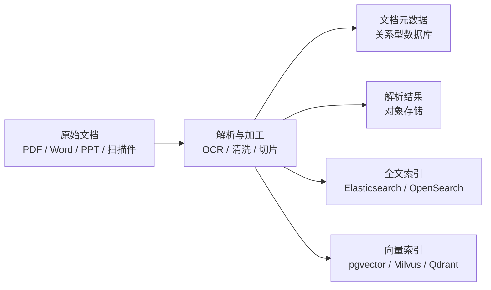
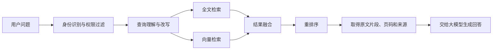

# 企业 AI 场景落地：数据存储

企业 AI 场景中的数据可以分为两大类：

1. **非结构化数据**：文档、图片、音频、视频等；
2. **结构化数据**：客户、订单、设备、交易、指标等。

本文分别说明两类数据如何存储、加工和检索。本轮先整理非结构化数据中的文档。

## 一、非结构化数据

### 1. 文档

企业文档包括 PDF、Word、PPT、Excel、邮件、网页、扫描件和合同等。一个文档进入 AI 知识库后，通常会形成多种数据表示，但它们并不是几类相互独立的业务数据，而是**同一份文档在不同处理阶段产生的原件、元数据和派生索引**。

#### 1.1 文档的整体处理过程

原始文档是权威数据，解析结果、全文索引和向量索引都是可以根据原始文档重新生成的派生数据。

#### 1.2 一份文档需要保存哪些内容

| 层次 | 保存内容 | 推荐存储 | 主要作用 |
| --- | --- | --- | --- |
| 原始文档 | PDF、Word、PPT、扫描件等原文件 | MinIO、S3、OSS、COS、Ceph | 保存权威原件，用于下载、预览、引用和追溯 |
| 文档元数据 | 文件名、来源、版本、部门、密级、权限、状态 | PostgreSQL、MySQL 等关系型数据库 | 权限控制、版本管理、状态管理和业务关联 |
| 解析结果 | 正文、标题层级、表格、页码、图片说明等 | 对象存储中的 JSON/文本文件，必要时保存到数据库 | 避免重复解析，为重新建索引提供基础数据 |
| 全文索引 | 正文、标题、关键词、编号及可过滤字段 | Elasticsearch、OpenSearch | 关键词、编号、名称和专业术语检索 |
| 向量索引 | 文档切片的 Embedding 及必要的过滤字段 | pgvector、Milvus、Qdrant 等 | 语义相似检索 |

因此，“文档原件、文档全文、文档向量”不应被看成三个并列的数据类型。更准确的关系是：

- **文档原件**是源数据；
- **解析结果**是加工后的中间数据；
- **全文索引**和**向量索引**是面向检索的两种派生索引；
- **元数据**负责把原件、解析结果和各种索引关联起来。

#### 1.3 为什么需要全文索引和向量索引

两种索引解决的问题不同。

**全文检索**适合查找：

- 合同编号、产品型号、人员姓名；
- 法规条款、专业术语、固定关键词；
- 必须精确匹配的文字内容。

**向量检索**适合查找：

- 表达方式不同但含义相近的内容；
- 用户只描述问题，没有提供原文关键词的内容；
- 与某段文字在语义上相似的段落。

例如，文档中写的是“员工不得将客户资料发送到私人邮箱”，用户问“能不能用个人邮箱传客户文件”。两句话没有完全一致的关键词，但语义接近，向量检索更容易召回相关内容。

企业知识库通常采用**全文检索与向量检索结合的混合检索**，而不是只选择其中一种。

#### 1.4 文档检索流程

检索不是一种数据存储，而是使用元数据、全文索引和向量索引的服务过程。

典型流程如下：

1. 识别用户身份和可访问的数据范围；
2. 对用户问题进行查询理解或改写；
3. 同时执行全文检索和向量检索；
4. 合并两路召回结果并去重；
5. 使用重排序模型选择最相关的文档片段；
6. 根据文档标识、版本和页码定位原始内容；
7. 将原文片段及出处交给大模型生成回答。

检索结果必须携带来源信息，例如文档名称、版本、章节、页码和更新时间，使回答可以验证和追溯。

#### 1.5 数据之间如何关联

建议为文档及其切片设计稳定的唯一标识：

| 字段 | 含义 |
| --- | --- |
| `document_id` | 文档的唯一标识，用于关联原件、元数据和索引 |
| `version_id` | 文档版本标识，用于区分新旧版本 |
| `chunk_id` | 文档切片的唯一标识 |
| `source_uri` | 原始文件在对象存储中的位置 |
| `page_no` | 切片所在页码 |
| `section_path` | 切片所在章节路径 |
| `acl` | 部门、人员、角色或密级等权限信息 |
| `embedding_model` | 生成当前向量所使用的模型及版本 |

全文索引和向量索引都应保存 `document_id`、`version_id`、`chunk_id` 以及必要的权限字段。这样才能从检索结果准确定位原文，并在文档更新或删除时同步处理所有派生数据。

#### 1.6 文档更新与删除

文档更新时，应执行以下操作：

1. 保存新版本原件；
2. 更新文档元数据和版本状态；
3. 重新解析并生成文档切片；
4. 删除或停用旧版本的全文索引和向量索引；
5. 为新版本重新建立索引；
6. 保留必要的版本记录和审计信息。

文档删除时，需要根据企业的数据保留制度处理原件、解析结果、全文索引、向量索引、缓存和备份，不能只删除向量数据库中的记录。

#### 1.7 推荐的基础方案

对于企业知识库的初期建设，可以采用以下组合：

- **MinIO**：保存原始文档和解析结果；
- **PostgreSQL**：保存文档元数据、权限和处理状态；
- **Elasticsearch/OpenSearch**：提供全文检索；
- **pgvector 或 Milvus**：提供向量检索；
- **统一检索服务**：完成权限过滤、混合召回、结果融合和重排序。

数据量较小时，可以先采用 PostgreSQL、pgvector 和 MinIO，减少系统组件；当文档数量、查询并发或检索要求提高后，再引入独立的全文检索和向量数据库。

## 二、结构化数据

> 待下一步补充。
