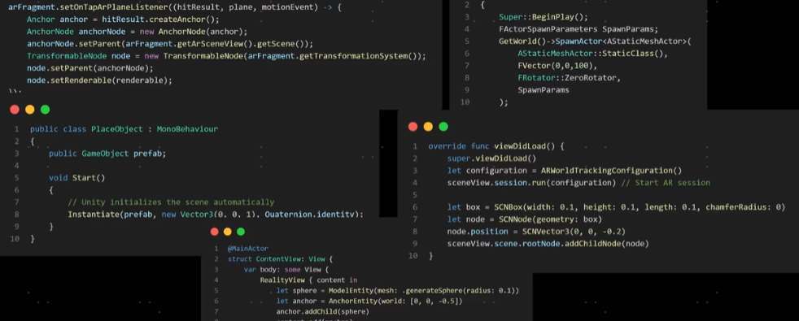

在多模态模型（比如文字+图片、文字+语音、文字+视频的 AI 模型）里，模型对齐（alignment）主要是指
让模型内部对不同模态的信息建立起统一、可互相理解的表示方式，从而在多个模态之间顺畅地交流和推理。

# 技术层面的“对齐”

这是最核心的意思，和训练方式有关。

## 目标

不同模态（文字、图片、音频等）在输入时，先经过各自的编码器（encoder）得到“向量表示”（embedding）。

这些向量需要映射到同一个语义空间，让模型能理解“同一事物在不同模态下的表现是等价的”。

这样，模型才能把“看到的猫”和“文字描述的猫”对应起来。

## 方法

**联合训练（Joint Training）**

文本、图片编码器一起训练，优化目标让对应的图片和文字在向量空间里距离更近。
典型例子：CLIP（OpenAI）

**跨模态对齐（Cross-modal Alignment）**

使用跨注意力机制（Cross-Attention）或投影层，把不同模态的表示映射到同一维度，再融合。

**多模态预训练任务**

图文匹配（Image-Text Matching）

多模态掩码预测（Masked Multimodal Modeling）

生成任务（比如“看图写文案”或“看文生成图”）

# 价值观/行为层面的“对齐”

当提到 对齐（alignment） 时，也可能是指 AI 对人类意图和价值观的对齐，尤其是在多模态大模型里：

确保模型在处理图片、文字等混合输入时，不输出不安全或不合规的内容。

训练方式包括：

    RLHF（人类反馈强化学习）：人类给模型输出打分，优化其行为。
    
    安全过滤与红队测试：专门检查多模态输入中的攻击（如隐写提示）。

# 举个例子

假设你有个多模态模型，可以：

    看一张图片 🖼
    
    听一句音频 🎤
    
    读一段文字 📝

## 对齐前：

模型看到“猫”的图片，得到一个向量 [0.3, 0.8, ...]

模型读到“cat”这个单词，得到 [1.2, -0.5, ...]

这两个向量完全不在同一个空间，模型没法直接推断它们是同一概念。

## 对齐后：

“猫”的图片 → [0.95, 0.12, ...]

“cat”文字 → [0.93, 0.14, ...]

向量接近 → 模型知道它们是同一东西，就能用文字描述图片、用图片回答问题。