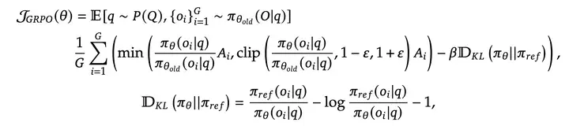
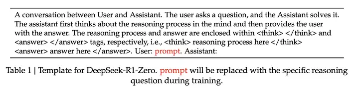

见4. Discussion

准确性奖励：通过规则验证答案正确性（如数学问题的最终答案格式、代码编译测试）

格式奖励：强制模型将推理过程包裹在 `<think>` 和 `<answer>` 标签中。

训练模板：使用固定模板引导模型首先生成推理链，再输出答案

### 为什么没有过程奖励？

作者认为，过程奖励很容易被偷分（reward hacking），就像人类学生在考试时，瞎写公式试图骗分一样。而且，能给过程进行打分的模型很难实现。

### 为什么没有MCTS(蒙特卡洛树搜索,一种搜索算法)？

因为推理到每一步时，下一步的选项都太多太多了，比围棋要多得多，而且这是指数级别的增速。如果限制搜索空间，又会很容易陷入局部最优。其次，和过程奖励的问题一样，给思路打分的模型（value model）同样很难实现。

1. 相对比较评估：GPRO通过候选答案之间的相对比较来实现隐式的过程奖励评估，而不是依赖外部评估器（critics）。
2. 奖励函数：GPRO主要使用两种奖励函数：
   ○ 准确性奖励：评估响应是否正确，例如数学问题的最终答案是否正确。
   ○ 格式奖励：通过奖励模型将“思考过程”和“答案”分开，来强化思考过程。
3. 优化效率：GPRO避免了传统强化学习中需要训练额外价值函数（value function）的复杂性，直接根据最终奖励推算每步的优势（advantage），从而节省计算资源