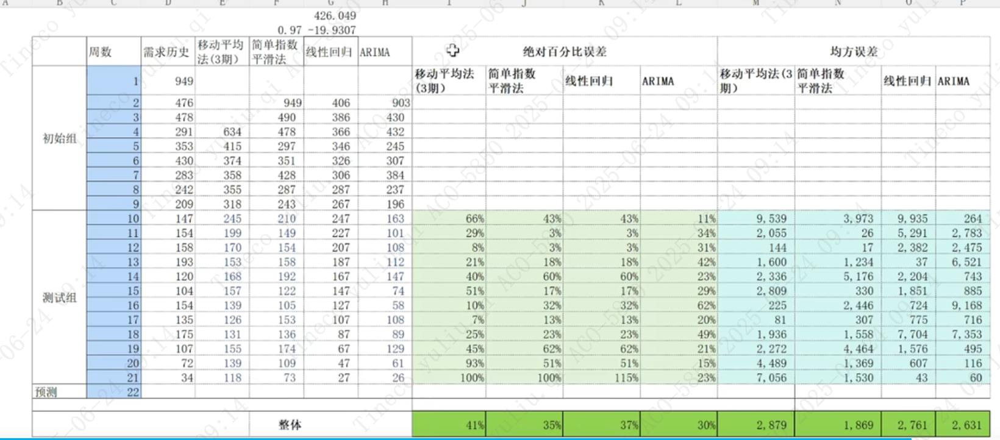

### LSTM (Long Short-Term Memory) 长短期记忆网络

论文首次发表于1997年。由于独特的设计结构，LSTM适合于处理和预测时间序列中间隔和延迟非常长的重要事件。

LSTM是RNN的变体，它通过特殊结构解决RNN的梯度消失问题，能够记住长期依赖关系。它通过记忆单元来控制信息的传递或遗忘。
擅长处理长时依赖 LSTM能捕捉长时间序列中的复杂依赖关系。
支持非线性关系 LSTM适合处理复杂的非线性数据关系。
无需对数据进行差分或平稳处理。
缺点：计算成本高 LSTM模型较大，训练和预测时计算开销较大。在小数据集上容易出现过拟合问题。LSTM除了计算成本，还存在黑箱问题（解释性差）
适用场景：适合复杂的长周期预测，如股票价格和长期能源消耗预测。

##### LSTM是串行的吗
LSTM（Long Short-Term Memory，长短期记忆网络）本质上是一种循环神经网络（RNN），它的结构决定了其时间步之间是串行的。具体来说：

串行性：LSTM在处理序列数据时，每一个时间步的输出都依赖于前一个时间步的隐藏状态（hidden state）和细胞状态（cell state）。也就是说，当前时刻的计算需要用到上一个时刻的结果。因此，在时间维度上，LSTM的计算是串行的，不能像卷积神经网络（CNN）那样在所有时间步上并行计算。
并行性：虽然在时间步之间是串行的，但在每个时间步内部（即对一个batch的多个样本），LSTM的计算是可以并行的。
总结：
LSTM在时间维度上是串行的。
在batch维度上可以并行。
参考：

《深度学习》（Ian Goodfellow等）第10章
PyTorch官方文档：FAQ: Why is LSTM slow?
如果你需要在时间维度上并行处理序列，可以考虑Transformer等模型。

### ARIMA (AutoRegressive Integrated Moving Average)

ARIMA是一种经典的统计方法，适合处理线性时间序列数据。由三部分组成：AR（自回归）、I（差分）和MA（移动平均）。
擅长线性数据 ARIMA适合处理具有线性趋势和季节性规律的数据。
模型结构简单 ARIMA可以帮助理解数据内部的关系。
相对简单 不需要大量计算资源。
缺点：只适合线性关系 不能处理复杂的非线性数据。
需要数据平稳 需要对数据进行差分或转换，以保证平稳性。
适用场景：适合季节性销售数据等简单周期性数据预测。

### RNN (Recurrent Neural Network)
RNN是一种序列数据模型，能利用序列中的历史信息来进行预测，但其记忆效果有限。
适合短时依赖 RNN擅长捕捉短期的依赖关系，适合较短序列的数据。
可以处理非线性 RNN能够捕捉数据中的非线性关系，灵活性较高。
缺点：长期依赖弱 RNN在处理长时依赖时表现不佳，会出现梯度消失或爆炸的问题。RNN的并行化训练困难。
记忆能力有限 在长序列上表现有限，不适合长时间预测。
适用场景：短期天气预测等。

ARIMA 适合处理简单的线性数据。
LSTM 适合复杂的长时序列预测，尤其是非线性关系。
RNN适合短时序列预测，对长期依赖的捕捉能力有限。

### 移动平均

移动平均是指对一组时间序列数据，按照一定的“窗口长度”取连续若干期的平均值，并将这个平均值作为该期的平滑值。随着时间的推移，窗口向前“移动”，每次都计算新的平均值，形成一条平滑的曲线。

简单移动平均（Simple Moving Average, SMA）
计算方法：取最近N期的数据的算术平均值。

加权移动平均（Weighted Moving Average, WMA）
计算方法：对不同期的数据赋予不同权重，通常越近的数据权重越大。

指数加权移动平均（Exponential Moving Average, EMA）
计算方法：对最近的数据赋予更高的权重，权重以指数方式递减。

优点：

简单易懂，计算方便。
能有效消除短期波动，突出长期趋势。
缺点：

对突发性变化反应慢（尤其是窗口较大时）。
不能很好地捕捉季节性、周期性等复杂模式。

### 指数加权移动平均和指数平滑有什么区别
**指数加权移动平均（EWMA）**更强调“加权平均”的过程，常用于实时数据流、金融K线、异常检测等场景。
指数平滑更强调“平滑”与“预测”，在时间序列分析中有一阶（简单）、二阶（趋势）、三阶（季节）等多种扩展。

### 线性关系
本质：自变量和因变量之间的关系可以用“加减法”表达，或者说是一次方的关系。
特征：变量的变化对结果的影响是“线性叠加”的。

### 非线性关系
变量和因变量之间的关系不能用简单的加减法表达，可能涉及乘法、除法、指数、对数、幂、交互项等。
变量之间可能有交互、放大、递减、阈值等复杂关系。

### 对比
线性：

销量 = 1000 + 2 × 广告费 + 3 × 价格降幅
（广告费每增加1元，销量增加2件，价格每降1元，销量增加3件）

非线性：

销量 = 1000 + 2 × 广告费 × 价格降幅
或
销量 = 1000 + 2 × 广告费^2
或
销量 = 1000 + 2 × e^(广告费)
（广告费和价格降幅的乘积、广告费的平方、广告费的指数等，都是非线性）