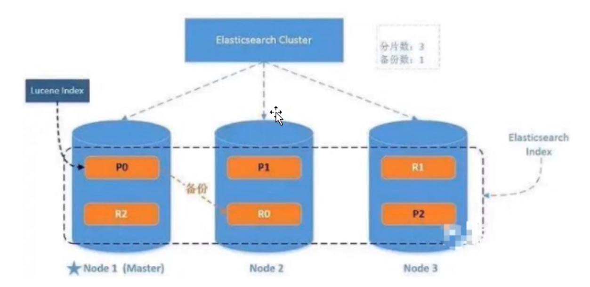

索引index
---
索引就是相似特征的文档的集合，对索引中文档document的增删查改都要使用到这个名字

类型type
---
一个索引中可以定义一种和多种类型（不同版本）。

最开始的elastic search的type 类似于 关系型数据库中的表概念 

5.x:支持多种type
6.x:只能有一种type
7.x:默认不再支持自定义索引类型 默认类型为 _doc

文档document
---
一个文档是可被索引的基础信息单元，也就是一条数据。以JSON格式保存。

字段field
---
文档中有多个属性 每个属性都是一个字段field

映射mapping
---
设置某个字段的数据类型，默认值，是否可被索引等，都是在映射mapping中配置的。

分片shards
---
类似于关系型数据库中的分表概念，每个分片都会保存功能完善且独立的索引
在操作索引时，可以进行分布式，并行的操作。提升性能，吞吐量。

副本replicas
---
对主分片的复制，保存数据的备份，保证高可用。 默认值:1

分配 allocation
---
将分片分配给某个节点node的过程，保存分配主分片和副本，

如果是副本，包含从主分片复制数据的过程，过程由master节点完成。

架构图
---

分为：单节点 多节点

分片的副本是不能放在分片本身的节点内的。

 

