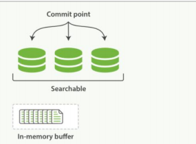
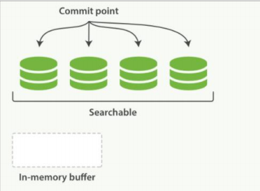

关键词：

按段搜索

写入段（段就是倒排索引） 段从内存写入到磁盘 段在内存中就可以搜索和删除（del标识） 

动态更新索引
---

如何在保留不变性的前提下实现倒排索引的更新？

用更多的索引。通过增加新的补充索引来反映新近的修改，而不是直接重写整

个倒排索引。每一个倒排索引都会被轮流查询到，从最早的开始查询完后再对结果进行合并。

Elasticsearch 基于 Lucene, 这个 java 库引入了按段搜索的概念。 每一 段 本身都是一

个倒排索引， 但索引在 Lucene 中除表示所有段的集合外， 还增加了提交点的概念 

一个列出了所有已知段的文件

按段搜索会以如下流程执行：
---

1. 新文档被收集到内存索引缓存

2. 不时地, 缓存被 提交
   (1) 一个新的段—一个追加的倒排索引—被写入磁盘。
   (2) 一个新的包含新段名字的 提交点 被写入磁盘
   (3) 磁盘进行 同步 — 所有在文件系统缓存中等待的写入都刷新到磁盘，以确保它们
   被写入物理文件
3. 新的段被开启，让它包含的文档可见以被搜索
4. 内存缓存被清空，等待接收新的文档

当一个查询被触发，所有已知的段按顺序被查询。词项统计会对所有段的结果进行聚合，以

保证每个词和每个文档的关联都被准确计算。 这种方式可以用相对较低的成本将新文档添

加到索引。
段是不可改变的，所以既不能从把文档从旧的段中移除，也不能修改旧的段来进行反映文档

的更新。 取而代之的是，每个提交点会包含一个 .del 文件，文件中会列出这些被删除文档

的段信息。

当一个文档被 “删除” 时，它实际上只是在 .del 文件中被 标记 删除。一个被标记删除的

文档仍然可以被查询匹配到， 但它会在最终结果被返回前从结果集中移除。

文档更新也是类似的操作方式：当一个文档被更新时，旧版本文档被标记删除，文档的新版

本被索引到一个新的段中。 可能两个版本的文档都会被一个查询匹配到，但被删除的那个

旧版本文档在结果集返回前就已经被移除。
