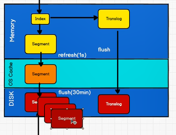
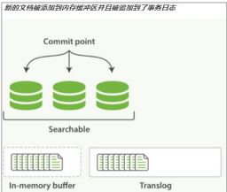
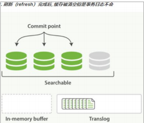
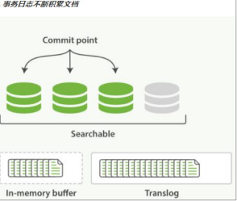
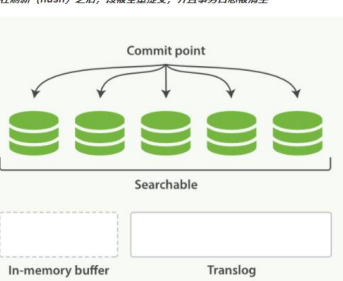

Elasticsearch -> 文件系统缓存(1s) -> 磁盘(30min)

如果没有用 fsync 把数据从文件系统缓存刷（flush）到硬盘，我们不能保证数据在断

电甚至是程序正常退出之后依然存在。为了保证 Elasticsearch 的可靠性，需要确保数据变

化被持久化到磁盘。在 动态更新索引，我们说一次完整的提交会将段刷到磁盘，并写入一

个包含所有段列表的提交点。Elasticsearch 在启动或重新打开一个索引的过程中使用这个提

交点来判断哪些段隶属于当前分片。

即使通过每秒刷新（refresh）实现了近实时搜索，我们仍然需要经常进行完整提交来确

保能从失败中恢复。但在两次提交之间发生变化的文档怎么办？我们也不希望丢失掉这些数

据。Elasticsearch 增加了一个 translog ，或者叫事务日志，在每一次对 Elasticsearch 进行

操作时均进行了日志记录

整个流程如下：
1. 一个文档被索引之后，就会被添加到内存缓冲区，并且追加到了 translog
   

2. 刷新（refresh）使分片每秒被刷新（refresh）一次：
   
    这些在内存缓冲区的文档被写入到一个新的段中，且没有进行 fsync 操作。
   
    这个段被打开，使其可被搜索

    内存缓冲区被清空
   

3. 这个进程继续工作，更多的文档被添加到内存缓冲区和追加到事务日志

4. 每隔一段时间—例如 translog 变得越来越大—索引被刷新（flush）；一个新的 translog
   被创建，并且一个全量提交被执行
   
    所有在内存缓冲区的文档都被写入一个新的段。
   
    缓冲区被清空。
   
    一个提交点被写入硬盘。
   
    文件系统缓存通过 fsync 被刷新（flush）。
   
    老的 translog 被删除。
   
translog 提供所有还没有被刷到磁盘的操作的一个持久化纪录。当 Elasticsearch 启动的时
   
候， 它会从磁盘中使用最后一个提交点去恢复已知的段，并且会重放 translog 中所有在最
   
后一次提交后发生的变更操作。
   
translog 也被用来提供实时 CRUD 。当你试着通过 ID 查询、更新、删除一个文档，它会
   
在尝试从相应的段中检索之前， 首先检查 translog 任何最近的变更。这意味着它总是能够

实时地获取到文档的最新版本。

执行一个提交并且截断 translog 的行为在 Elasticsearch 被称作一次 flush

分片每 30 分钟被自动刷新（flush），或者在 translog 太大的时候也会刷新

你很少需要自己手动执行 flush 操作；通常情况下，自动刷新就足够了。这就是说，在

重启节点或关闭索引之前执行 flush 有益于你的索引。当 Elasticsearch 尝试恢复或重新打

开一个索引， 它需要重放 translog 中所有的操作，所以如果日志越短，恢复越快。

translog 的目的是保证操作不会丢失，在文件被 fsync 到磁盘前，被写入的文件在重启

之后就会丢失。默认 translog 是每 5 秒被 fsync 刷新到硬盘， 或者在每次写请求完成之

后执行(e.g. index, delete, update, bulk)。这个过程在主分片和复制分片都会发生。最终， 基

本上，这意味着在整个请求被 fsync 到主分片和复制分片的 translog 之前，你的客户端不会

得到一个 200 OK 响应。

在每次请求后都执行一个 fsync 会带来一些性能损失，尽管实践表明这种损失相对较

小（特别是 bulk 导入，它在一次请求中平摊了大量文档的开销）。

但是对于一些大容量的偶尔丢失几秒数据问题也并不严重的集群，使用异步的 fsync

还是比较有益的。比如，写入的数据被缓存到内存中，再每 5 秒执行一次 fsync 。如果你

决定使用异步 translog 的话，你需要 保证 在发生 crash 时，丢失掉 sync_interval 时间段

的数据也无所谓。请在决定前知晓这个特性。如果你不确定这个行为的后果，最好是使用默

认的参数（ "index.translog.durability": "request" ）来避免数据丢失。

