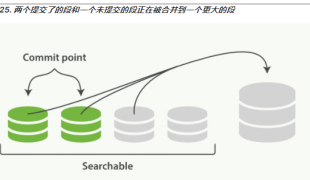
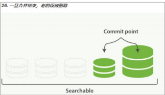

由于自动刷新流程每秒会创建一个新的段 ，这样会导致短时间内的段数量暴增。而段

数目太多会带来较大的麻烦。 每一个段都会消耗文件句柄、内存和 cpu 运行周期。更重要

的是，每个搜索请求都必须轮流检查每个段；所以段越多，搜索也就越慢。

Elasticsearch 通过在后台进行段合并来解决这个问题。小的段被合并到大的段，然后这些大

的段再被合并到更大的段。

段合并的时候会将那些旧的已删除文档从文件系统中清除。被删除的文档（或被更新文档的

旧版本）不会被拷贝到新的大段中。

启动段合并不需要你做任何事。进行索引和搜索时会自动进行。

1. 当索引的时候，刷新（refresh）操作会创建新的段并将段打开以供搜索使用。
   
2. 合并进程选择一小部分大小相似的段，并且在后台将它们合并到更大的段中。这并不会
   
   中断索引和搜索。

3. 一旦合并结束，老的段被删除
   
    新的段被刷新（flush）到了磁盘。 ** 写入一个包含新段且排除旧的和较小的段
   
   的新提交点。
   
    新的段被打开用来搜索。
   
    老的段被删除。

合并大的段需要消耗大量的 I/O 和 CPU 资源，如果任其发展会影响搜索性能。Elasticsearch

在默认情况下会对合并流程进行资源限制，所以搜索仍然 有足够的资源很好地执行。