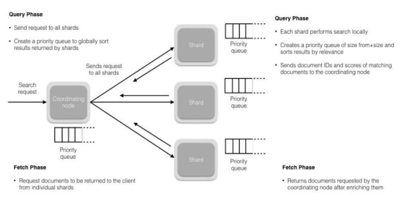

 搜索被执行成一个两阶段过程，我们称之为 Query Then Fetch；  在初始查询阶段时，查询会广播到索引中每一个分片拷贝（主分片或者副本分片）。 每个分片在本
地执行搜索并构建一个匹配文档的大小为 from + size 的优先队列。PS：在搜索的时候是会查询
Filesystem Cache 的，但是有部分数据还在 Memory Buffer，所以搜索是近实时的。

 每个分片返回各自优先队列中 所有文档的 ID 和排序值 给协调节点，它合并这些值到自己的优先队
列中来产生一个全局排序后的结果列表。

 接下来就是取回阶段，协调节点辨别出哪些文档需要被取回并向相关的分片提交多个 GET 请求。每
个分片加载并丰富文档，如果有需要的话，接着返回文档给协调节点。一旦所有的文档都被取回了，
协调节点返回结果给客户端。

 Query Then Fetch 的搜索类型在文档相关性打分的时候参考的是本分片的数据，这样在文档数量较少
的时候可能不够准确，DFS Query Then Fetch 增加了一个预查询的处理，询问 Term 和 Document
frequency，这个评分更准确，但是性能会变差。