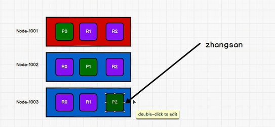
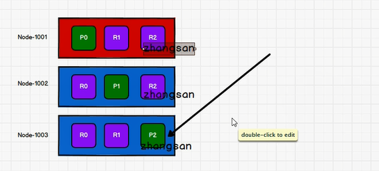

数据根据什么条件插入到哪个分片？查询时如何知道数据在哪个分片？
---

增加数据
---

根据`路由计算`

    
    hash( id ) & 主分片数量

计算出数据ID的hash值 和 主分片数量 进行取模计算 来确定主分片的节点 进行存储数据

routing 是一个可变值，默认是文档的 _id ，也可以设置成一个自定义的值。 routing 通过

hash 函数生成一个数字，然后这个数字再除以 number_of_primary_shards （主分片的数量）

后得到余数 。这个分布在 0 到 number_of_primary_shards-1 之间的余数，就是我们所寻求

的文档所在分片的位置

查询数据（分片控制）
---

用户可以访问任何一个节点获取数据

这个节点称之为协调节点

如果这个节点比较繁忙，可以将请求转发到另外的节点

