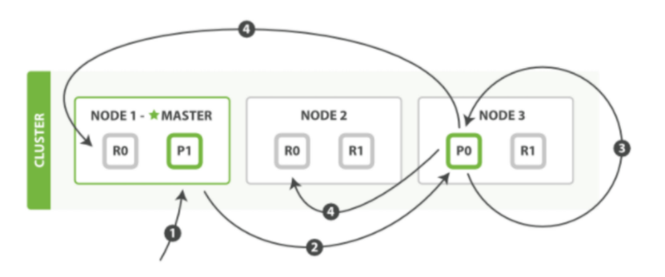
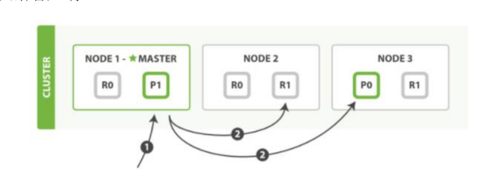
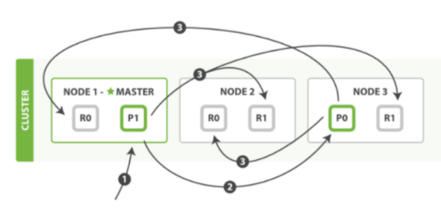

部分更新一个文档流程
---

如果有并发修改同一个文档 会有竞争锁和获取锁失败重试的机制

    1. 客户端向 Node 1 发送更新请求。
       
    2. 它将请求转发到主分片所在的 Node 3 。
       
    3. Node 3 从主分片检索文档，修改 _source 字段中的 JSON ，并且尝试重新索引主分片
       的文档。如果文档已经被另一个进程修改，它会重试步骤 3 ，超过 retry_on_conflict 次
       后放弃。
       
    4. 如果 Node 3 成功地更新文档，它将新版本的文档并行转发到 Node 1 和 Node 2 上的
       副本分片，重新建立索引。一旦所有副本分片都返回成功， Node 3 向协调节点也返回
       成功，协调节点向客户端返回成功。

当主分片把更改转发到副本分片时， 它不会转发更新请求。 

相反，它转发完整文档的新版本。请记住， 

这些更改将会异步转发到副本分片，并且不能保证它们以发送它们相同的顺序到达。 

如果 Elasticsearch 仅转发更改请求，

则可能以错误的顺序应用更改，导致得到损坏的文档。

多文档操作流程
---

mget 和 bulk API 的模式类似于单文档模式。区别在于协调节点知道每个文档存在于

哪个分片中。它将整个多文档请求分解成 每个分片 的多文档请求，并且将这些请求并行转

发到每个参与节点。

协调节点一旦收到来自每个节点的应答，就将每个节点的响应收集整理成单个响应，返

回给客户端

用单个 mget 请求取回多个文档所需的步骤顺序:

    1. 客户端向 Node 1 发送 mget 请求。
    
    2. Node 1 为每个分片构建多文档获取请求，然后并行转发这些请求到托管在每个所需的
       主分片或者副本分片的节点上。一旦收到所有答复， Node 1 构建响应并将其返回给客
       户端。

可以对 docs 数组中每个文档设置 routing 参数。

bulk API
---

允许在单个批量请求中执行多个创建、索引、删除和更新请求。

bulk API 按如下步骤顺序执行：

    1. 客户端向 Node 1 发送 bulk 请求。
    
    2. Node 1 为每个节点创建一个批量请求，并将这些请求并行转发到每个包含主分片的节
       点主机。
       
    3. 主分片一个接一个按顺序执行每个操作。当每个操作成功时，主分片并行转发新文档（或
       删除）到副本分片，然后执行下一个操作。 一旦所有的副本分片报告所有操作成功，
       该节点将向协调节点报告成功，协调节点将这些响应收集整理并返回给客户端。
