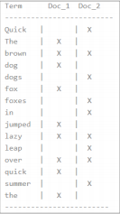
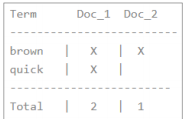

Elasticsearch 使用一种称为倒排索引的结构，它适用于快速的全文搜索。

见其名，知其意，有倒排索引，肯定会对应有正向索引。正向索引（forward index），

反向索引（inverted index）更熟悉的名字是倒排索引。

所谓的正向索引，就是搜索引擎会将待搜索的文件都对应一个文件 ID，搜索时将这个

ID 和搜索关键字进行对应，形成 K-V 对，然后对关键字进行统计计数

但是互联网上收录在搜索引擎中的文档的数目是个天文数字，这样的索引结构根本无法满足

实时返回排名结果的要求。所以，搜索引擎会将正向索引重新构建为倒排索引，即把文件

ID对应到关键词的映射转换为关键词到文件ID的映射，每个关键词都对应着一系列的文件，

这些文件中都出现这个关键词。

    keyword作为关键字不可用使用分词器
    
    text可使用分词器

一个倒排索引由文档中所有不重复词的列表构成，对于其中每个词，有一个包含它的文

档列表。例如，假设我们有两个文档，每个文档的 content 域包含如下内容：

    The quick brown fox jumped over the lazy dog

    Quick brown foxes leap over lazy dogs in summer

为了创建倒排索引，我们首先将每个文档的 content 域拆分成单独的 词（我们称它为 词条

或 tokens ），创建一个包含所有不重复词条的排序列表，然后列出每个词条出现在哪个文

档。结果如下所示：

现在，如果我们想搜索 quick brown ，我们只需要查找包含每个词条的文档：

两个文档都匹配，但是第一个文档比第二个匹配度更高。如果我们使用仅计算匹配词条数量
的简单相似性算法，那么我们可以说，对于我们查询的相关性来讲，第一个文档比第二个文
档更佳
