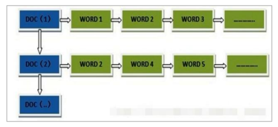
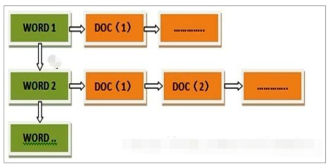

Elasticsearch 使用一种称为倒排索引的结构，它适用于快速的全文搜索。

见其名，知其意，有倒排索引，肯定会对应有正向索引。正向索引（forward index），

反向索引（inverted index）更熟悉的名字是倒排索引。

所谓的正向索引，就是搜索引擎会将待搜索的文件都对应一个文件 ID，搜索时将这个

ID 和搜索关键字进行对应，形成 K-V 对，然后对关键字进行统计计数

但是互联网上收录在搜索引擎中的文档的数目是个天文数字，这样的索引结构根本无法满足

实时返回排名结果的要求。所以，搜索引擎会将正向索引重新构建为倒排索引，即把文件

ID对应到关键词的映射转换为关键词到文件ID的映射，每个关键词都对应着一系列的文件，

这些文件中都出现这个关键词。

    keyword作为关键字不可用使用分词器
    
    text可使用分词器
