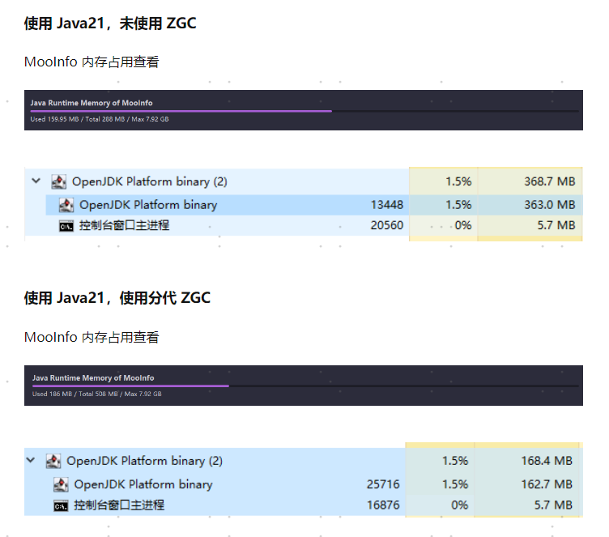

运行在分代 ZGC 上的应用应该能够享受以下好处：
1. 减少分配停滞的风险：
分代 ZGC 减少了分配停滞的风险，因为它将对象分为新生代和老年代，并且在新生代中进行分配，老年代中进行老年代的回收。
2. 减少所需的堆内存量：
分代 ZGC 减少了堆内存的使用量，因为它将对象分为新生代和老年代，并且在新生代中进行
3. 减少垃圾回收的CPU负载

```
通过命令行选项 -XX:+UseZGC -XX:+ZGenerational 启用分代 ZGC。
```

