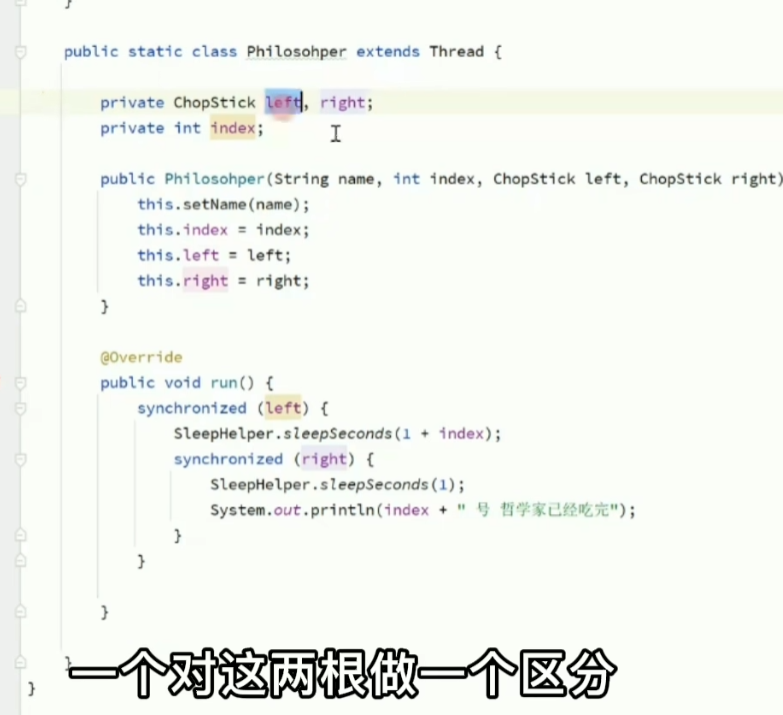
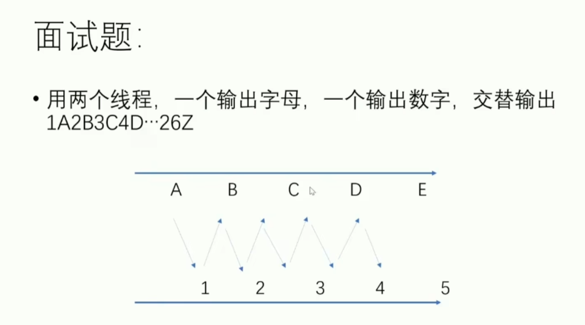
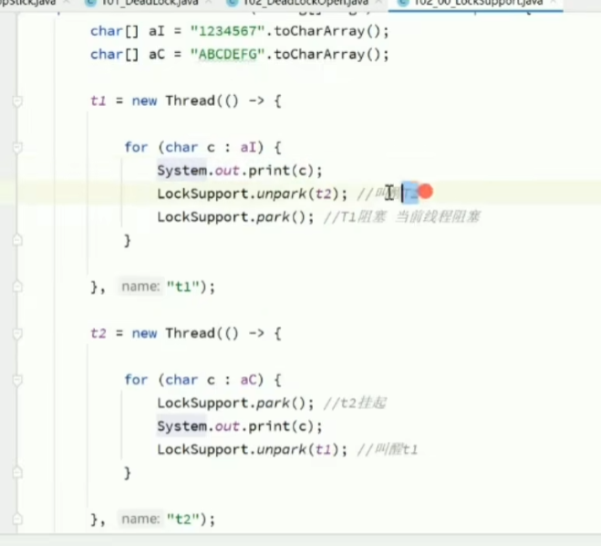
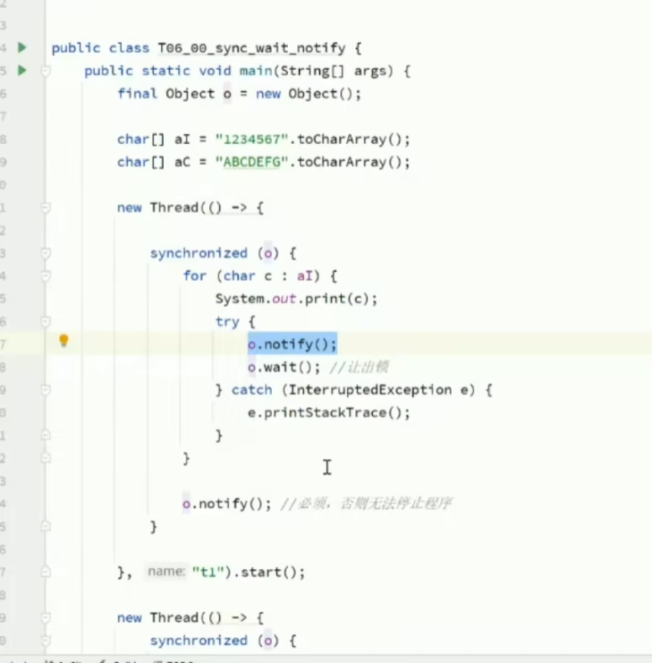

1 什么是JUC
---

thread 普通的线程类

runnable 没有返回值 效率比 callable 较低

2 线程和进程
---
进程：一个程序，QQ.exe 
一个进程包含多个线程，至少一个。

Java默认有几个线程？2个
一个是main线程，一个是GC线程

线程：开了一个进程 idea， 可以写代码，自动保存本地（线程负责）

对于Java而言 ：thread，runnable,callable

Java真的可以开启线程吗？NO，通过native方法，调用本地C++
Java无法直接操作硬件

并发编程：

并发（多线程操作同一个资源）：
    单核CPU，模拟出多个线程，快速交替    
    
并行（多个人一起行走）
    多核CPU，才会有多个线程同时执行

并发编程本质:充分利用CPU资源

线程有几个状态？ 6个

new 线程新生
runnable 运行（ready->running）
blocked 阻塞
waiting 等待 一直等
timed_waiting 超时等待 等待固定时间
terminated 终止

wait/sleep区别？

wait->object的方法 ，sleep->thread的方法

wait释放锁，sleep不释放

wait必须在同步代码块睡，sleep可以在任何地方睡

如何让线程睡眠？用thread.sleep? 

Lock锁
---

加锁 在try catch finally 最后解锁
new lock()
lock.lock() 
lock.unlock()

锁对象和锁类

reentrantLock  

重入锁 分 公平锁和非公平锁
公平锁 先来后到 
非公平锁 可以插队 
默认是非公平锁
（两个线程一个耗时一分钟，一个耗时1小时，肯定是使用非公平锁好） 

synchronized和lock的区别？

1.synchronized是内置关键字，lock是Java类
2.lock手动获取锁，手动解锁（不解锁死锁）；synchronized自动加锁解锁
3.synchronized阻塞的线程会一直等；lock不一定会等待（lock.tryLock()尝试获取锁）
4.synchronized是可重入锁，不可以中断，非公平；lock是可重入锁，可以判断锁，可设置公平锁；
5.synchronized适合锁少量的代码同步问题；lock适合锁大量的同步代码块；

锁是什么？如何判断锁的是谁？

生产者和消费者
---

如果加上C,D两个线程就会出现问题

if 改为while 

condition（await和signalAll） 对应 wait和notifyAll
---

如何让A B C D有序 