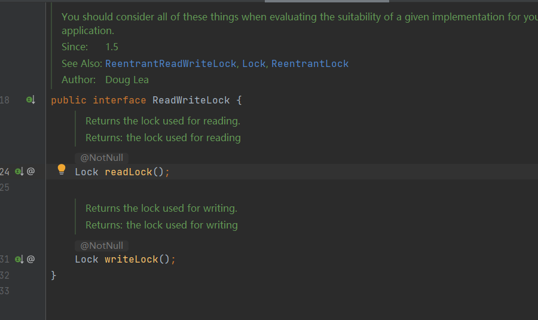

ReentrantReadWriteLock
--

ReentrantLock是互斥锁，排它锁

    public interface ReadWriteLock {
    
        Lock readLock();
        

        Lock writeLock();

readLock不是互斥锁，writeLock是互斥锁

支持公平和非公平的获取锁的方式