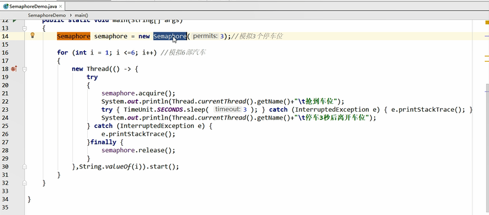

semaphore 信号量 基于AQS实现。

当一个线程执行时先通过其方法进行获取许可操作，

获取到许可的线程继续执行业务逻辑，当线程执行完成后进行释放许可操作，

未获取达到许可的线程进行等待或者直接结束。

tryAcquire() 尝试获取许可。

release() 释放许可。



```
private static class MyRunnable implements Runnable {
    // 成员属性 Semaphore对象
    private final Semaphore semaphore;
​
    public MyRunnable(Semaphore semaphore) {
        this.semaphore = semaphore;
    }
​
    public void run() {
        String threadName = Thread.currentThread().getName();
        // 获取许可
        boolean acquire = semaphore.tryAcquire();
        // 未获取到许可 结束
        if (!acquire) {
            System.out.println("线程【" + threadName + "】未获取到许可，结束");
            return;
        }
        // 获取到许可
        try {
            System.out.println("线程【" + threadName + "】获取到许可");
            Thread.sleep(1000);
        } catch (InterruptedException e) {
            e.printStackTrace();
        } finally {
            // 释放许可
            semaphore.release();
            System.out.println("线程【" + threadName + "】释放许可");
        }
    }
}
```

```
public static void main(String[] args) {
    Semaphore semaphore = new Semaphore(2);
    for (int i = 0; i <= 10; i ++) {
        MyRunnable runnable = new MyRunnable(semaphore);
        Thread thread = new Thread(runnable, "Thread-" + i);
        thread.start();
    }
}
```


参考：
---
https://zhuanlan.zhihu.com/p/408712970