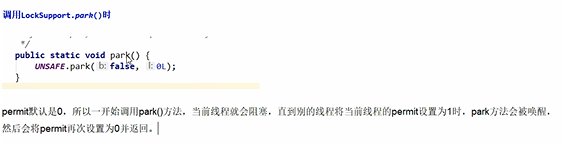

LockSupport是wait和notify是升级版
---

lock support使用了一种交permit（许可）的概念来做到 线程阻塞和缓存

每个线程都有一个许可（permit） permit只有两个值1和0，默认是0

permit类似于semaphore，但是和semaphore不同的是，permit的的累加上限是1


调用lockSupport.park()时

内部调用的UNSAFE.park方法




关键字park 停放，unpark 唤醒
---

    park可以看作wait
    
    unpark可以看作notify

LockSupport是一个线程阻塞工具类，所有的方法都是静态方法，

可以让线程在任意位置阻塞，当然阻塞之后肯定得有唤醒的方法。


park和unpark可以实现类似wait和notify的功能，但是并不和wait和notify交叉，也就是说unpark不会对wait起作用，notify也不会对park起作用。

park和unpark的使用不会出现死锁的情况

blocker的作用是在dump线程的时候看到阻塞对象的信息

park & unpark 可以先 unpark，而 wait & notify 不能先 notify


```
public static void park(Object blocker); // 暂停当前线程
public static void parkNanos(Object blocker, long nanos); // 暂停当前线程，不过有超时时间的限制
public static void parkUntil(Object blocker, long deadline); // 暂停当前线程，直到某个时间
public static void park(); // 无期限暂停当前线程
public static void parkNanos(long nanos); // 暂停当前线程，不过有超时时间的限制
public static void parkUntil(long deadline); // 暂停当前线程，直到某个时间
public static void unpark(Thread thread); // 恢复当前线程
public static Object getBlocker(Thread t);

```

```
public class LockSupportDemo {

    public static Object u = new Object();
    static ChangeObjectThread t1 = new ChangeObjectThread("t1");
    static ChangeObjectThread t2 = new ChangeObjectThread("t2");

    public static class ChangeObjectThread extends Thread {
        public ChangeObjectThread(String name) {
            super(name);
        }
        @Override public void run() {
            synchronized (u) {
                System.out.println("in " + getName());
                LockSupport.park();
                if (Thread.currentThread().isInterrupted()) {
                    System.out.println("被中断了");
                }
                System.out.println("继续执行");
            }
        }
    }

    public static void main(String[] args) throws InterruptedException {
        t1.start();
        Thread.sleep(1000L);
        t2.start();
        Thread.sleep(3000L);
        t1.interrupt();
        LockSupport.unpark(t2);
        t1.join();
        t2.join();
    }
}
```

参考：
---
https://www.jianshu.com/p/f1f2cd289205