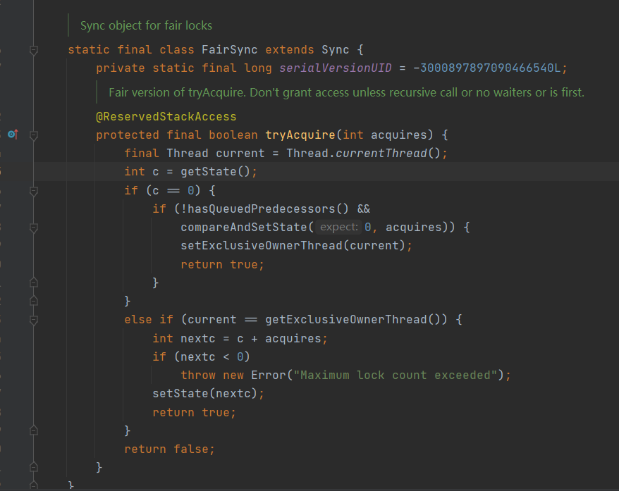
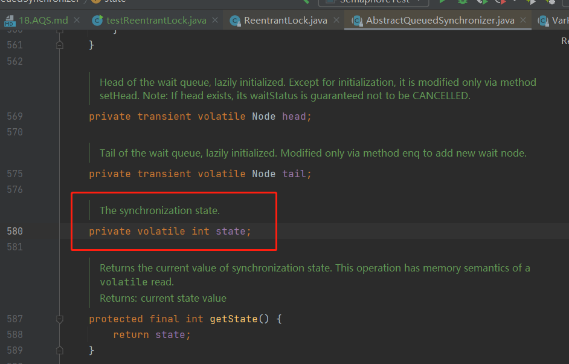

template method 模板方法

callback function 回调函数

像reentrantLock cyclicBarrier countdownLatch都是AQS实现

JUC的同步组件主要实现的AQS是哪些主要方法？

sync: FairSync NonFairSync

acquire

tryAcquire

为什么说AQS底层是CAS+volatile？

state（volatile） 当前线程获取了锁 state就变成1 释放了就变成0.
1和0就是加锁和解锁。

等待队列节点类。node内部存放着阻塞等待线程。

node有prev和next，等待队列就是双向链表。

reentrantLock.tryAcquire方法。

获取state，如果等于0，使用cas 尝试改成1，设定当前线程独占该锁。

如果当前线程已获得锁，state加1.

等待队列入队出队都是用CAS（compareAndSetState）

公平锁:
    
    线程尝试获取锁 先检查 等待队列

AQS中的state有什么作用
---

AQS（AbstractQueuedSynchronizer）是Java中一个非常重要的同步框架，它中的state是一个同步状态变量，用于表示当前同步状态。state的值通常是一个int类型的整数，不同的同步工具会对state赋予不同的含义和语义。

在AQS中，使用state来表示同步状态的占用情况。

对于独占式同步状态（如ReentrantLock），state的值通常是0或1，表示锁当前是否被占用。

当一个线程获取锁时，会将state的值从0改为1，并将执行线程设置为占用锁的线程；当占用锁的线程释放锁时，会将state的值从1改为0，并将等待的线程唤醒。

对于共享式同步状态（如CountDownLatch、Semaphore），state的值通常是一个计数器，表示还需要多少个线程完成任务。

当一个线程完成任务时，会将state的值减1，表示任务已完成；

当所有任务都完成后，state的值为0，表示所有线程都已完成任务，等待的线程可以继续执行。

在使用AQS实现自定义同步工具时，state的值可以根据具体需求进行定义和设置。

可以将其设置为一个对象、集合或自定义数据类型等，以实现不同的同步功能。

需要注意的是，对于state的操作必须是原子性的，因为可能有多个线程同时操作同一个state变量，如果没有保证原子性，可能会导致数据不一致、竞争问题等。

因此，在使用AQS时，需要保证对state变量的操作是原子的，并且要注意通过同步操作保证数据的一致性。

Java中的JUC中基于AQS实现的有哪些类？
---

Java中的JUC（Java并发编程包）中基于AQS（AbstractQueuedSynchronizer）实现的类有很多，其中比较常用的包括：

    ReentrantLock：可重入的互斥锁，使用AQS实现对资源的独占访问。
    
    CountDownLatch：倒计时锁，使用AQS实现等待一组线程完成任务的同步器。
    
    Semaphore：信号量，使用AQS实现控制对临界区资源的访问。
    
    Condition：条件变量，使用AQS实现等待某个条件满足的同步器。
    
    ReentrantReadWriteLock：可重入的读写锁，使用AQS实现读写锁的管理。
    
    ThreadPoolExecutor：线程池，使用AQS实现线程池的管理。

这些类都是Java中非常常用的并发编程工具，它们的实现都基于AQS框架。

AQS是Java中一个非常重要的同步框架，它提供了一个可扩展的抽象队列同步器，使得Java中的同步工具能够以线程安全的方式进行操作，并实现了多种同步工具的构建。它是Java并发编程中的核心组件之一。

需要注意的是，虽然这些类都是基于AQS实现的，但是它们的实现方式却各不相同，每个类都有其独特的用途和实现方式。

因此，在使用这些类时，需要根据具体的需求选择合适的工具类。

