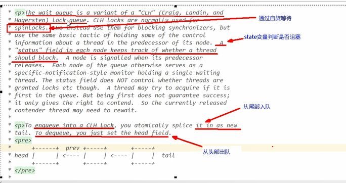

AbstractQueuedSynchronizer抽象队列同步器
---

通过内置的FIFO(先进先出)队列完成资源获取线程的排队工作

并通过一个int类型的变量（state）表示持有锁的状态

AQS中的state用volatile修饰，当前线程获取了锁 state就变成1 释放了就变成0

AQS中的队列是双向链表

AQS的具体实现（模板方法模式）
---

reentrantLock

CountDownLatch

reentrantReadWriteLock

semaphore

比如reentrantLock内部中，内部类sync就继承了AbstractQueuedSynchronizer

在countDownLatch内部，内部类sync也继承了AbstractQueuedSynchronizer

锁和同步器的关系
---

加锁就会导致阻塞，有阻塞排队就必须有某些形式的队列来进行管理

如果共享资源被占用，就需要一定的阻塞等待唤醒的机制来保证锁分配

将暂时获取不到锁的线程放入队列

双向队列和node节点
---

队列中每个排队的个体就是node

node节点内存放了抢占资源的thread

上一个节点prev，下一个节点next，头指针head，尾指针tail

还有一个waitStatus等待状态

node中的waitStatus
---

abstractQueuedSynchronized中的sync
---

在reentrantLock和countDownLatch内部有一个内部类sync

sync继承了AQS抽象类

在reentrantLock内部实现公平锁和非公平锁实际上

用了Fair(公平)（fei e）Sync和NonfairSync继承了sync

AQS中的state
---

    private volatile int state;

等待队列通过自旋等待，用state变量判断是否阻塞

等待队列从尾部入队，从头部出队

