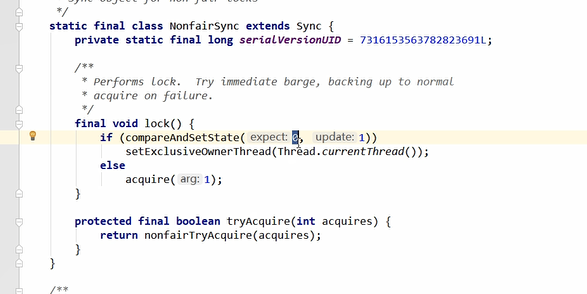
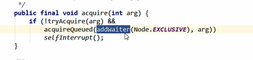
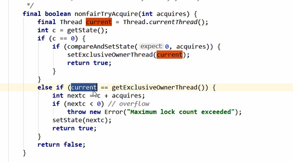
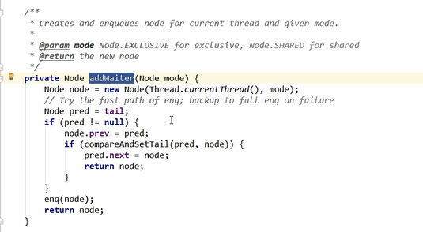
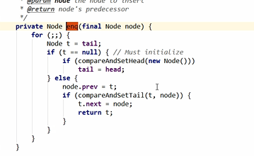
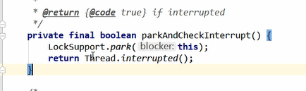
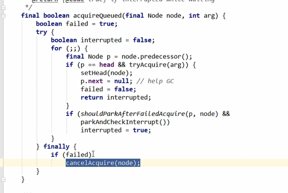
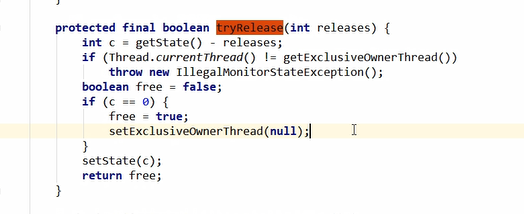

reentrantLock内部类sync继承了AQS

而sync又有两个实现类 分别是fairSync和NonFairSync

reentrantLock借由这两个内部类实现公平锁和非公平锁

reentrantLock默认是非公平锁
---

公平锁和非公平锁在lock（）加锁时，区别在于

公平锁的tryAcquire方法内部多了一个限制条件

判断等待队列中是否存储有效节点的方法

公平锁在lock时，判断如果等待队列有线程在等待，那么当前线程就会进入到等待队列

非公平锁在lock时，不管等待队列有没有数据，如果能获取锁，则立刻占有锁

NonFairLock非公平锁 加锁过程 lock()方法
---

自旋锁（）

通过CAS compareAndSetState(0,1) 如果state是0，设置成1（state是0代表没人占有锁）

将当前线程设置为占有该锁的线程

其他的线程进入等待队列

非公平锁的acquire()方法 tryAcquire()方法
---

tryAcquire内部: 

判断state状态是否是0，或者说当前线程是否是持有锁的线程

如果state是0，当前线程就设置为持有锁的线程，并把state改为1

如果当前线程就是持有锁的线程 将AQS的state加1

进入等待队列,addWaiter()方法
---

添加到队列中

队列头是虚拟节点，队尾是插入的线程

acquireQueued方法
---

将虚拟头节点的waitStatus变为-1 signal（表示线程已经准备等待资源释放）

for (;;) 不断循环 将等待线程设置为阻塞状态

tryRelease方法 
---

将state设置为0

取出等待队列头节点下一个节点node ，唤醒node中的线程
将node中的thread设置为null,将头节点的指针指向node节点 让node节点成为虚拟头节点

