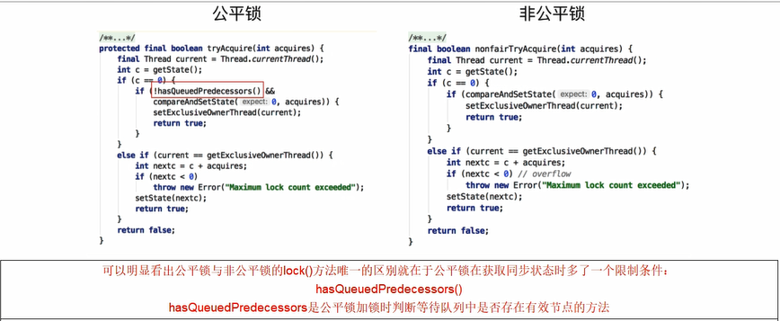

reentrantLock内部类sync继承了AQS

而sync又有两个实现类 分别是fairSync和NonFairSync

reentrantLock借由这两个内部类实现公平锁和非公平锁

reentrantLock默认是非公平锁
---

公平锁和非公平锁在lock（）加锁时，区别在于

公平锁的tryAcquire方法内部多了一个限制条件

判断等待队列中是否存储有效节点的方法

公平锁在lock时，判断如果等待队列有线程在等待，那么当前线程就会进入到等待队列

非公平锁在lock时，不管等待队列有没有数据，如果能获取锁，则立刻占有锁