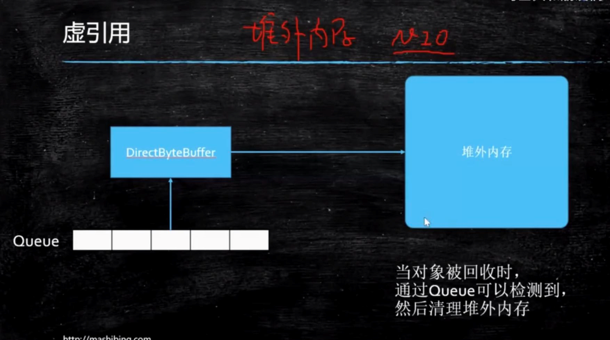
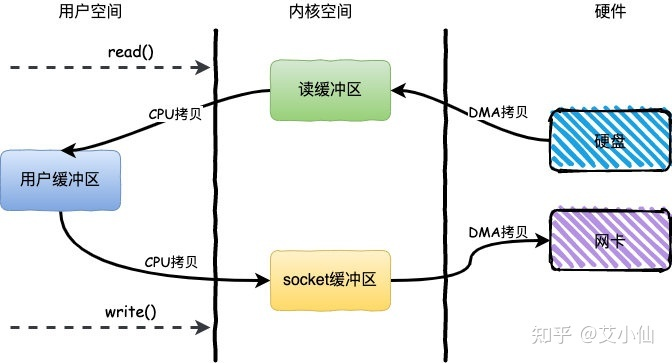

softReference软引用(内存不够就回收)
---
内存不够的时候，GC会回收SoftReference所引用的对象。

软引用通常用来实现内存敏感的缓存。比如: 高速缓存就有用到软引用。如果还有空闲内存,就可以暂时保留缓存,当内存不足时清理掉,这样就保证了使用缓存的同时,不会耗尽内存。

垃圾回收器在某个时刻决定回收软可达的对象的时候,会清理软引用,并可选地把引用存放到一个引用队列(Reference Queue)。

类似弱引用,只不过Java虚拟机尽量让软引用的存活时间长一些,迫不得已才清理。

又比如从网络上下载图片，可以使用软引用把下载的图片使用softReference类型对象保存在内存中，尽量避免网络和磁盘读写开销。

weakReference弱引用(发现即回收) weakHashMap???
---

只被弱引用关联的对象只能生存到下一次垃圾回收，无论内存空间是否不足，都会被回收。

    WeakReference<Object> m = new WekReference<>(new Object());

    System.out.println(m.get());

    System.gc();

    //每次GC都会回收，下次再打印就没了

    System.out.println(m.get());

弱引用的使用参考20.ThreadLocal.md

PhantomReference虚引用（对象回收跟踪）
---

    /*
    *   队列控制虚引用
    */
    ReferenceQueue referenceQueue = new ReferenceQueue<>();

    PhantomReference<M> phantomReference = new PhantomReference<>(new M(),referenceQueue);

    //调用get()方法是get不到的,弱引用没GC还能get到，虚引用get不到

    phantomReference.get()

虚引用的作用？

    管理堆外内存

如果想把数据从系统写出去(1)，交给操作系统(2)，再给网卡(3)，JVM内存复制到操作系统内存这块操作。

NIO就使用了虚引用来管理直接内存（堆外内存），实现了zeroCopy。

java中有directByteBuffer代表了堆外内存。

ReferenceQueue(控制Reference入队) 

ReferenceHandler(线程实现类,一直for循环) 

这些会控制堆外内存的处理。

