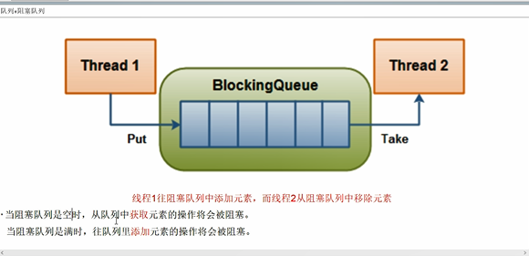
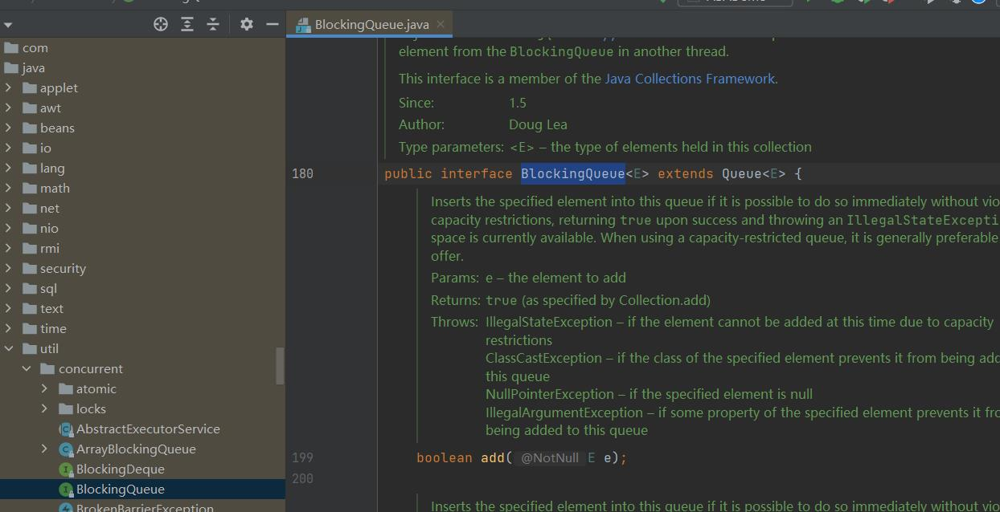
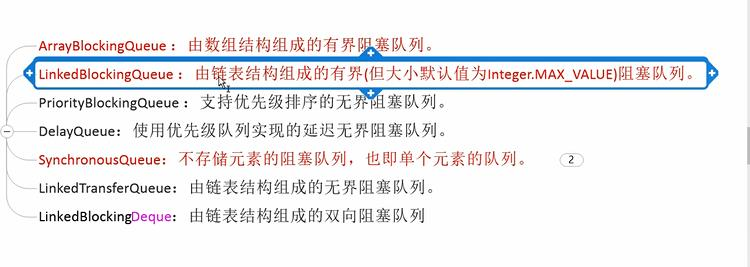
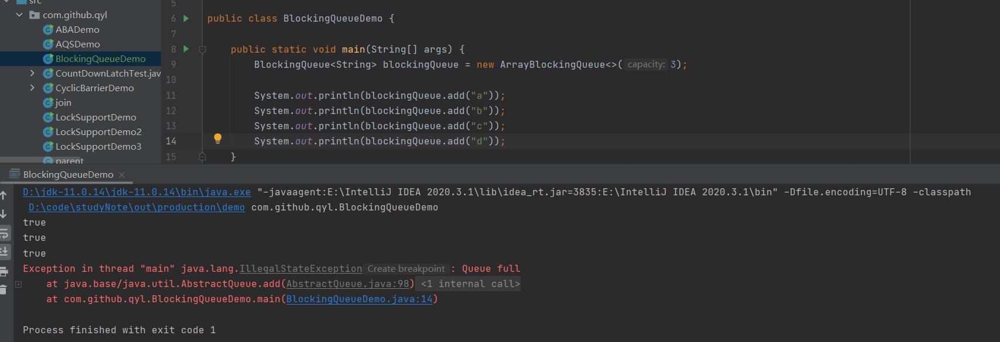
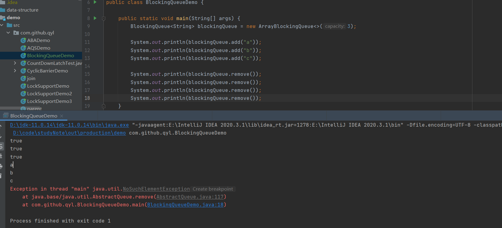
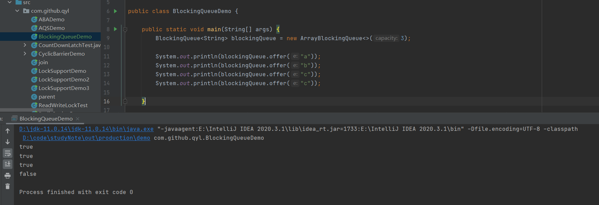
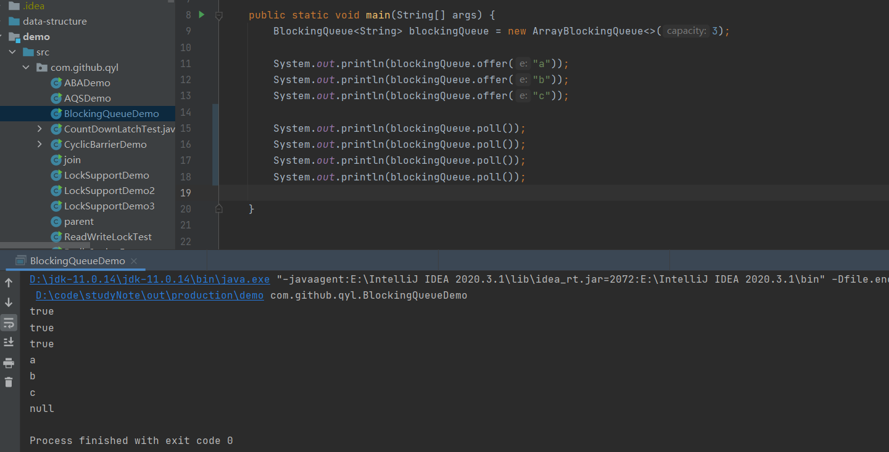

BlockingQueue
---

当阻塞队列是空的时候，从队列中获取元素的操作会被阻塞

当阻塞队列是满的时候，向队列中插入元素的操作会被阻塞

BlockingQueue接口下有七个实现类
---

    *ArrayBlockingQueue:由数组结构组成的有界阻塞队列

    *LinkedBlockingQueue：由链表结构组成的有界（默认大小为Integer.MAX_VALUE）阻塞队列

    PriorityBlockingQueue: 支持优先级排序的无界阻塞队列

    DelayQueue： 使用优先级队列实现的延迟无界阻塞队列

    *SynchronousQueue：不存储元素的阻塞队列，也即是单个元素的队列（只有一个元素）

    LinkedTransfer: 由链表结构组成的无界阻塞队列

    LinkedBlockingDuque：由链表结构组成的双向阻塞队列

插入删除数据失败抛出异常 add方法 remove方法
---

队列已满，插入数据报错: IllegalStateException: Queue full

队列空，删除数据异常：NoSuchElementException

插入删除数据成功返回true失败返回false offer方法 poll方法
---

队列已满，插入数据返回false

队列空，删除数据返回false

