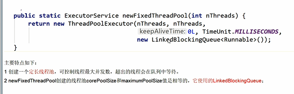

newFixedThreadPool
---
    固定线程数N的线程池

fixed的线程池使用的是LinkedBlockingQueue

默认keepAliveTime存活时间设置0，核心线程数N，最大线程数N

newSingleThreadExecutor
---
    固定线程数1的线程池

single的线程池使用的是LinkedBlockingQueue

默认keepAliveTime存活时间设置0，核心线程数1，最大线程数1

newCachedThreadPool
---
    非固定线程数N的线程池

cache的线程池使用的是SynchronousQueue

默认keepAliveTime存活时间设置60，核心线程数0，最大线程数Interesting.MAX

这三类线程池的底层都是用核心类

    ThreadPoolExecutor

来实现

 