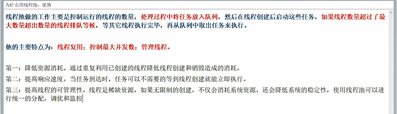
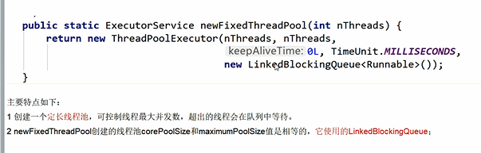
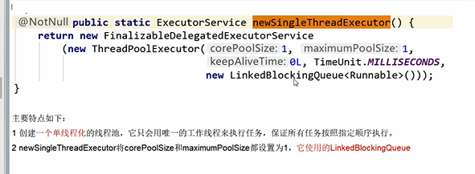
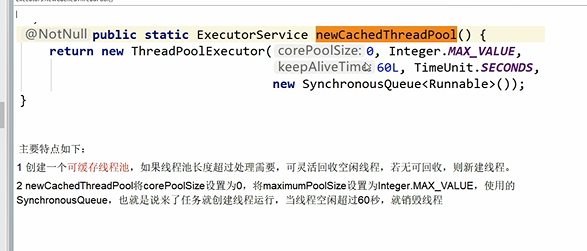
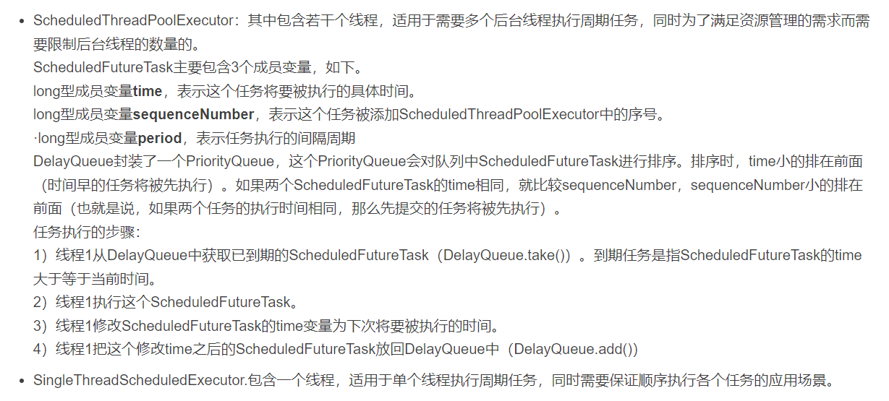

newFixedThreadPool（执行长期任务，性能好很多）
---
    固定线程数N的线程池

fixed的线程池使用的是LinkedBlockingQueue

默认keepAliveTime存活时间设置0，核心线程数N，最大线程数N

newSingleThreadExecutor（一个任务一个任务的执行）
---
    固定线程数1的线程池

single的线程池使用的是LinkedBlockingQueue

默认keepAliveTime存活时间设置0，核心线程数1，最大线程数1

newCachedThreadPool（适合一些短期异步的小程序或者负载较轻的服务器）
---
    非固定线程数N的线程池

cache的线程池使用的是SynchronousQueue

默认keepAliveTime存活时间设置60，核心线程数0，最大线程数Interesting.MAX

这三类线程池的底层都是用核心类

    ThreadPoolExecutor

来实现

ScheduledThreadPoolExecutor（适合执行周期性定时任务的线程池）
---

其中包含若干个线程，适用于需要多个后台线程执行周期任务，

同时为了满足资源管理的需求而需要限制后台线程的数量的。

