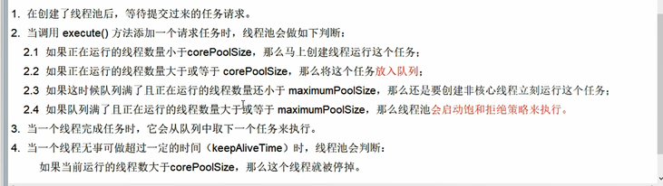
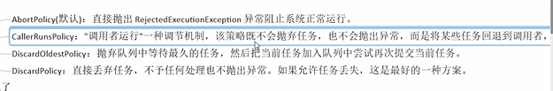

核心类ThreadPoolExecutor七大参数
---

    public ThreadPoolExecutor(int corePoolSize,
                              int maximumPoolSize,
                              long keepAliveTime,
                              TimeUnit unit,
                              BlockingQueue<Runnable> workQueue,
                              ThreadFactory threadFactory,
                              RejectedExecutionHandler handler) {
        if (corePoolSize < 0 ||
            maximumPoolSize <= 0 ||
            maximumPoolSize < corePoolSize ||
            keepAliveTime < 0)
            throw new IllegalArgumentException();
        if (workQueue == null || threadFactory == null || handler == null)
            throw new NullPointerException();
        this.acc = System.getSecurityManager() == null ?
                null :
                AccessController.getContext();
        this.corePoolSize = corePoolSize;
        this.maximumPoolSize = maximumPoolSize;
        this.workQueue = workQueue;
        this.keepAliveTime = unit.toNanos(keepAliveTime);
        this.threadFactory = threadFactory;
        this.handler = handler;
    }

corePoolSize

    保留在池中的线程数，即使它们是空闲的（没有任务），除非设置了allowCoreThreadTimeOut(允许核心线程超时)

    必须大于1 

    超过了该参数，就会放入blockingQueue中

maximumPoolSize

    线程池中最大允许的线程数 必须大于1 必须大于corePoolSize

keepAliveTime

    当线程数大于核心时，这是多余空闲线程在终止前等待新任务的最大时间。

    超过了核心线程数的线程，如果没有任务的情况下存活时间。

TimeUnit

    keepAliveTime的计量单  位：例如秒，毫秒

workQueue

    阻塞队列<Runnable> 超过核心线程数的线程都会放入workQueue阻塞队列

ThreadFactory

    执行线程时创建线程的工厂，一般都是executors中的默认工厂

    Executors.defaultThreadFactory()

RejectedExecutionHandler(拒绝策略)

    如果workQueue已满，且工作线程等于线程池的最大线程数时，拒绝新的线程任务的策略方式

线程池工作流程
---

RejectedExecutionHandler拒绝策略
---

AbortPolicy（默认，直接抛出异常）

    拒绝任务的处理程序，抛出RejectedExecutionException

CallerRunsPolicy（任务交给提交任务的线程处理）

    被拒绝任务的处理程序，它直接在execute方法的调用线程中运行被拒绝的任务，
    
    除非执行程序已经关闭，在这种情况下，任务被丢弃。

DiscardPolicy（直接丢弃任务）

    被拒绝任务的处理程序，该处理程序将默默地丢弃被拒绝的任务。

DiscardPolicy（丢弃最老的任务）

    被拒绝任务的处理程序，它丢弃最老的未处理请求，

    然后重试执行，除非执行程序关闭，在这种情况下，任务被丢弃。