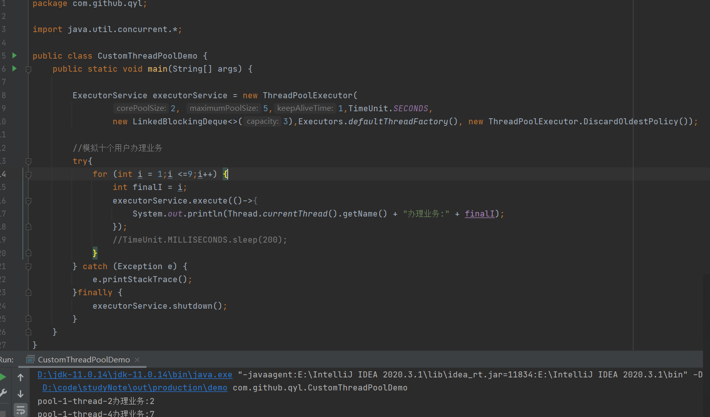

为什么要使用自定义线程池？
---
fixedThreadPool中的workQueue允许的长度为Integer.MAX_VALUE

cacheThreadPool的workQueue允许创建核心线程数量maximumPoolSize为Integer.MAX_VALUE

两种都会造成创建大量线程，堆积大量请求。从而造成OOM 

所以要用ThreadPoolExecutor自定义线程池，明确最大线程数和等待队列 

