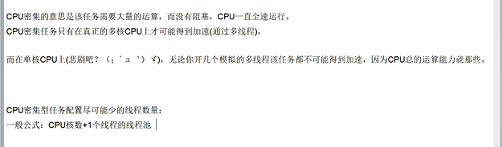
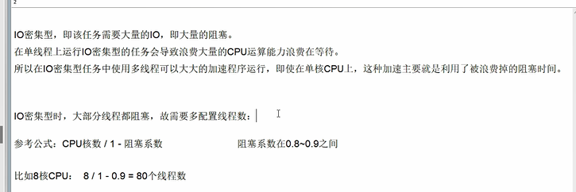

为什么要使用自定义线程池？
---
fixedThreadPool中的workQueue允许的长度为Integer.MAX_VALUE

cacheThreadPool的workQueue允许创建核心线程数量maximumPoolSize为Integer.MAX_VALUE

两种都会造成创建大量线程，堆积大量请求。从而造成OOM 

所以要用ThreadPoolExecutor自定义线程池，明确最大线程数和等待队列 

合理的线程池配置
---

CPU密集，需要大量运算，没有或者很少阻塞

    CPU核数+1个线程的线程池

IO密集，任务线程并不是一直在执行任务，则应该配置尽可能多的线程，如CPU核数 * 2

再细化说 IO密集，大部分线程会阻塞，所以需要多配置线程数

参考公式

    CPU核数 / (1 -阻塞系数（阻塞系数在0.8-0.9之间）)

    比如8核CPU 8 / (1 - 0.9) = 80个线程

例如

    /** 核心线程数（默认线程数） */
    private static final int CORE_POOL_SIZE = Runtime.getRuntime().availableProcessors() * 2;
    /** 最大线程数 */
    private static final int MAX_POOL_SIZE = (int) (Runtime.getRuntime().availableProcessors() / (1 - 0.9));

