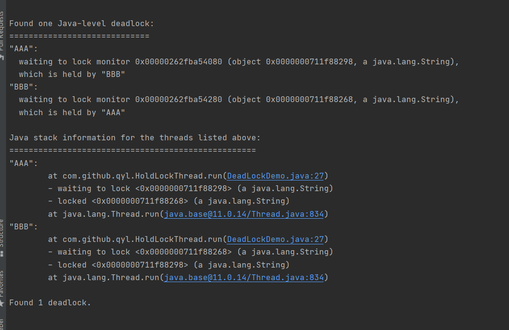

案例
---

    class HoldLockThread implements Runnable {
    
        private String lockA;
        private String lockB;
    
        public HoldLockThread(String lockA, String lockB) {
            this.lockA = lockA;
            this.lockB = lockB;
        }
    
        @Override
        public void run() {
            synchronized (lockA) {
                System.out.println(Thread.currentThread().getName() + "持有" + lockA + "尝试获取" + lockB);
    
                try {
                    TimeUnit.SECONDS.sleep(2);
                } catch (InterruptedException e) {
                    e.printStackTrace();
                }
                synchronized (lockB) {
                    System.out.println(Thread.currentThread().getName() + "持有" + lockB + "尝试获取" + lockA);
                }
            }
        }
    }
    
    public class DeadLockDemo {
    
        public static void main(String[] args) {
            String lockA = "lockA";
            String lockB = "lockB";
    
            new Thread(new HoldLockThread(lockA,lockB),"AAA").start();
            new Thread(new HoldLockThread(lockB,lockA),"BBB").start();
        }
    }

使用ps -ef|grep java或者jps查找Java进程

然后使用jstack 进程号 查看是否有死锁

    Found one Java-level deadlock:
    =============================
    "AAA":
    waiting to lock monitor 0x00000262fba54080 (object 0x0000000711f88298, a java.lang.String),
    which is held by "BBB"
    "BBB":
    waiting to lock monitor 0x00000262fba54280 (object 0x0000000711f88268, a java.lang.String),
    which is held by "AAA"
    
    Java stack information for the threads listed above:
    ===================================================
    "AAA":
    at com.github.qyl.HoldLockThread.run(DeadLockDemo.java:27)
    - waiting to lock <0x0000000711f88298> (a java.lang.String)
    - locked <0x0000000711f88268> (a java.lang.String)
    at java.lang.Thread.run(java.base@11.0.14/Thread.java:834)
    "BBB":
    at com.github.qyl.HoldLockThread.run(DeadLockDemo.java:27)
    - waiting to lock <0x0000000711f88268> (a java.lang.String)
    - locked <0x0000000711f88298> (a java.lang.String)
    at java.lang.Thread.run(java.base@11.0.14/Thread.java:834)
    
    Found 1 deadlock.

