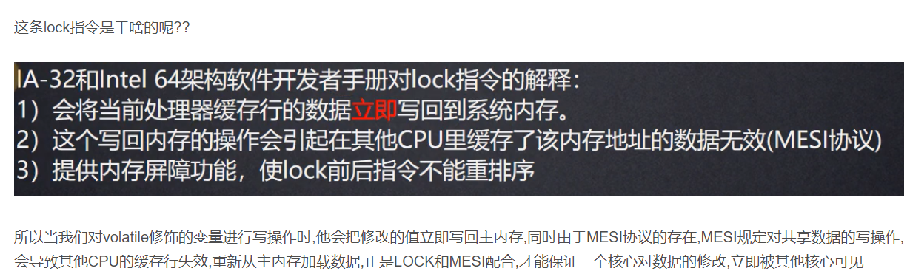

volatile 可变；易变的。

保证线程可见性
---
主线程，工作线程
```
这里所提到的主内存可以简单认为是堆内存，而工作内存则可以认为是栈内存。
```

volatile变量每次读都需要去主内存读取最新的值，每次写也需要写回到主内存。
非volatile变量允许在缓存中读写以加快计算速度。

内存屏障：读屏障 写屏障
---


volatile写是前后分别加storeStore,storeLoad


Lock汇编指令



volatile读是后面加两个storeLoad


CPU缓存读写一致性

禁止指令重排序
---
    -DCL单例
    -double check lock

重排序需要遵循happens-before原则，简单说就是

    A happens-before B，B happens-before C，那么A happens-before C

DCL单例简述:

    Object object = new Object()
    ...
    if(object != null) {
        synchronized(this) {
            if (Object != null) {
                object = new Object();
            }
        }
    } 


说说 volatile变量的可见性 
---

CPU最小的存储单位是缓存行，volatile修饰的变量和普通变量，都会被存放到CPU的缓存行里。如果我们的程序，仅仅是想要读取volatile修饰的变量的值，那么直接可以从CPU的缓存行里进行读取，无需考虑内存的可见性。

    volatile的可见性主要发生在多核并发场景下，对于volatile所修饰变量的一个读写操作上。

    多线程环境下，如果一条线程，对volatile的变量进行了一个写操作，那么该写操作，会直接透过总线推送到主存，并且同时致其他CPU的缓存行为无效。

    那么另外一条线程，想要读取该值的时候，发现当前CPU的缓存行无效，那么会透过总线从主存重新拉取该值。

    volatile变量之所以有这个特性，是因为对于volatile的写操作，我们的汇编层面的代码，会在该写操作前边加一个LOCK指令，

LOCK指令有两个作用:
---

    第一个作用: 

    将我们的当前的修改立即透过总线推送到主存；

    第二个作用: 

    在透过总线时，由于总线的嗅探技术，对于lock前缀的一个嗅探，会让其他CPU的缓存行为无效。

    这就是volatile的可见性。


所有人都在说汇编层的lock前缀，这个回答太表面了，能具体说说，为什么volatile修饰的，变量写操作会添加lock前缀吗?
---

volatile变量的写操作，之所以会在汇编层面增加lock前缀，是需要从JVM的class文件数据结构开始聊的。当我们的Java文件里边包含volatile修饰的字段时，通过javac将其编译为class文件，那么class文件会拥有魔数、次版本号、主版本号、常量池计数器、常量池、访问标志、类索引、父类索引、接口索引计数器、接口索引集合、字段表计数器、字段表、方法表计数器、方法表，属性表计数器、属性表。

    对于class文件数据结构，我们需要关注访问标志，访问标志中有一个叫做ACC_volatile的访问标志，

    当我们的volatile字段编译到class文件时，我们当前字段的访问标志就是ACC_volatile.

    当我们的一条线程，对该volatile变量进行写操作时，会经过open JDK中的Batcodeintercept.CPP这个文件源码，

    在该文件中，它会调用当前字段的访问标志，如果得到的是ACC_volatile，那么就会直接组装lock前缀的汇编代码。

volatile除了保证可见性，还有其他特性吗?
---

volatile变量除了能够保证当前变量的可见性以外，还能够保证当前变量的读写操作变得有序性，也就是所谓的禁止指令重排序。

    在JVM编译期会为volatile修饰的变量的读写，加上4种内存屏障，对于内存屏障我们有loadload，storetore，loadstore和storeload 四种内存屏障，

    对于volatile变量，写前我们加入storetore屏障，volatile写之后加入storeload的屏障，volatile读后边加入loadload屏障，然后在后边加入loadstore屏障。

    这4种屏障的加入，能够保证我们volatile对同一个变量的写操作是有序的，

    对同一个变量的写读操作，读写操作是有序的，对同一个变量的读读操作也是有序的。

内存屏障具体是怎么加入的，能说说加入屏障的原理吗？
---

当我们有volatile修饰的字段，当前字段所在的Java文件，

通过JVM编译器编译为class文件后，会为该字段标记一个 ACC_volatile的访问标志。

该访问标志的意思就是：“该字段是被volatile修饰的字段“。

其实，在JVM的编译期，并没有添加任何内存屏障，仅仅是为volatile修饰的字段添加了ACC_volatile的字段访问标志。

当我们的线程访问到该volatile字段，进行该字段的读操作或者写操作时，

当前线程中的-栈帧中的-操作数栈会加载操作对应的JVM字节码指令，如果是读操作，那么就对应JVM的getfields指令；

如果是写操作，就对应JVM的putfields指令。

我们以写操作为例，在执行JVM的putfields指令之前，先会调用byteCodeIntercepter.cpp的代码进行访问标志的判断，

看当前字段的访问标志是不是ACC_volatile。

如果是ACC_volatile, 那么就会执行两个操作：

为汇编层代码添加Lock前缀；

执行pufiedls时，在写前加入storestore屏障，在写后加入storeload屏障。这才是内存屏障加入的底层原理知识。

volatile为什么不能保证i++的原子性
---

volatile关键词只能保证变量的单一的读操作和写操作的原子性，换句话说，volatile关键词只能保证单一JVM操作指令的原子性。

对于i++而言，其中包含了3条JVM指令码：读取i的值 - iload；

为i的值+1 - iadd；

将i进行从新赋值 - istore。

volatile不能保证3条JVM指令操作的原子性，因此不能保证i++操作的原子性。

volatile只能保证单一JVM操作指令的原子性。

比如对i变量进行赋值操作，只对应JVM的istore指令；

对i变量的读取操作，只对应JVM的iload指令，这种场景是可以保证原子性的。

包括双重检查锁中，之所以对变量进行volatile的修饰，就是为了保证对象创建的操作是原子性的。

通过new关键字创建Java对象，对应的JVM的指令码只有一个 - new指令。

双重检查锁为什么要用volatile修饰变量
---

在Java语言层面，通过new关键字创建一个对象，其实底层经历了3个步骤：


    为对象开辟内存空间；
    
    调用对象的构造函数初始化对象；
    
    将变量的指针指向存储对象的内存空间。


其中第三步“将变量的指针指向存储对象的内存空间” 意味着对象创建的完成。

但是，在实际的执行过程中，第二步“调用对象的构造函数初始化对象”和第三步“将变量的指针指向存储对象的内存空间” 可能会发生指令重排序，

也就是说可能先执行 第三步“将变量的指针指向存储对象的内存空间” ，再执行第二步“调用对象的构造函数初始化对象”。

如果先执行完第三步，还没来得及执行第二步之前，有一个线程访问该对象，会获取到null值。

为了解决这个问题，我们使用volatile关键词修饰这个变量，这里的volatile有2个核心点：


    volatile修饰的变量，在进行赋值操作时，能够保证该变量的原子性，

    应为new一个对象，对应的JVM字节码指令为单一的 new指令。
    
    volatile修饰的变量，可以为变量的读写操作添加内存屏障，防止指令的重排序。

    这里的防止指令重排序，并不是防止的第二步和第三步的重排序。而是防止的volatile所修饰变量的读操作和写操作的重排序。

    对于对象的写操作，就是new这个对象，在这个对象new完之前，不允许其他线程读取该对象，

    因此，即便是第二步和第三步发生了重排序，也不会有任何影响，因为外层已经禁止了读写的重排序。

    这样永远不会有null值的出现。