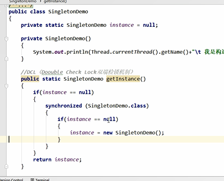

双重检锁

在synchronized前后判断变量是否为null

双重检锁机制不一定线程安全

对单例对象需要增加volatile修饰符 禁止指令重排

    指令重拍只保证串行语义的执行的一致性（单线程）
    
    但是并不关心多线创建的语义一致性

在if (instance==null)

在对象不等于null但是类加载器未完成初始化，未赋显式值时。

会会将默认值的对象返回。

比如说int的默认值就是0，它不是null，就会返回。