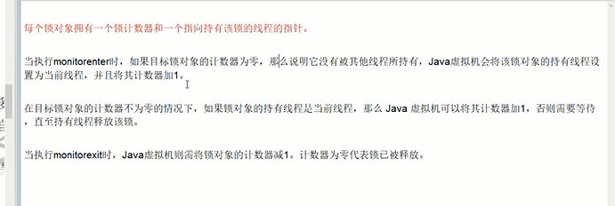

隐式锁Synchronized实现原理
---
objectMonitor

每个Java对象内部都有一个监视器锁（monitor）

拿可重入锁举例：

线程获取锁时将0改为1，如果线程已经占有该锁，加1.

当同一个线程再次获得该对象的锁的时候，计数器再次自增

其他线程竞争会进入阻塞状态，直到monitor为0

为0表示可以被其他线程获得锁，不为0时，只有当前锁的线程才能再次获得锁。

monitor存放在哪？
---

对象内存布局中的对象头 中mark word

Mark Word指针指向了monitor

字节码层级（类加载器加载到内存）:

    monitorEnter 

    monitorExit

执行过程中进行锁升级。

在汇编层级（JIT编译器翻译成机器码）：

    lock comxchg

锁消除 lock eliminate
---

    public void add() {
        StringBuffer sb = new StringBuffer();
        sb.append("aaa").append("bbb");
    }

JDK检测到StringBuffer在方法内，没有被外部其他线程应用，
JVM会自动消除StringBuffer对象内部的锁。

锁粗化 lock coarsening
---

JVM检测到一连串循环都是对同一对象加锁
（while循环内100次 就有100次加锁/解锁）
JVM会将锁的范围粗话的一连串循环外部 比如 while前面。
使得这一串操作只需要加一次锁。

比如在一张数据库上所有行加行锁，不如整个表锁。

使用对象作为锁，属性发生变化，不影响锁使用，但对象被重新赋值，会发生问题。

所以避免对象引用发生变化，如使用final修饰符。

锁细化
---

执行时间短的更适合synchronized，如:

锁升级过程中 Java对象头markWord的变化。

wait和notify
---

wait和notify必须在synchronized同步代码块中

wait必须在notify前面

ObjectMonitor
---

在Java虚拟机（HotSpot）中，Monitor（管程）是由ObjectMonitor实现的，其主要数据结构如下

    ObjectMonitor() {
    _header       = NULL;
    _count        = 0; // 记录个数
    _waiters      = 0,
    _recursions   = 0; //锁的重入次数
    _object       = NULL;
    _owner        = NULL; //指向持有该锁的线程
    _WaitSet      = NULL;  // 处于wait状态的线程，会被加入到_WaitSet
    _WaitSetLock  = 0 ;
    _Responsible  = NULL ;
    _succ         = NULL ;
    _cxq          = NULL ;
    FreeNext      = NULL ;
    _EntryList    = NULL ;  // 处于等待锁block状态的线程，会被加入到该列表
    _SpinFreq     = 0 ;
    _SpinClock    = 0 ;
    OwnerIsThread = 0 ;
    }

想要获取monitor的线程,首先会进入_EntryList队列。

当某个线程获取到对象的monitor后,进入_Owner区域，设置为当前线程,同时计数器_count加1。

如果线程调用了wait()方法，则会进入_WaitSet队列。它会释放monitor锁，即将_owner赋值为null,_count自减1,进入_WaitSet队列阻塞等待。

如果其他线程调用 notify() / notifyAll() ，会唤醒_WaitSet中的某个线程，该线程再次尝试获取monitor锁，成功即进入_Owner区域。

同步方法执行完毕了，线程退出临界区，会将monitor的owner设为null，并释放监视锁。