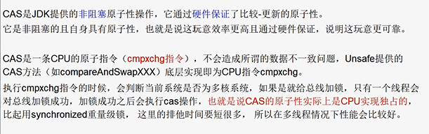
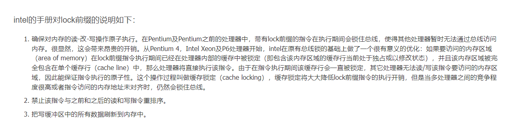
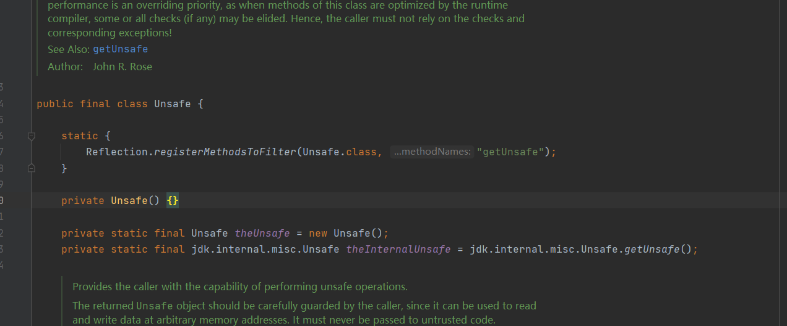
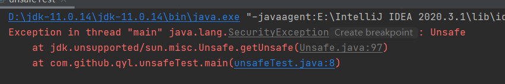
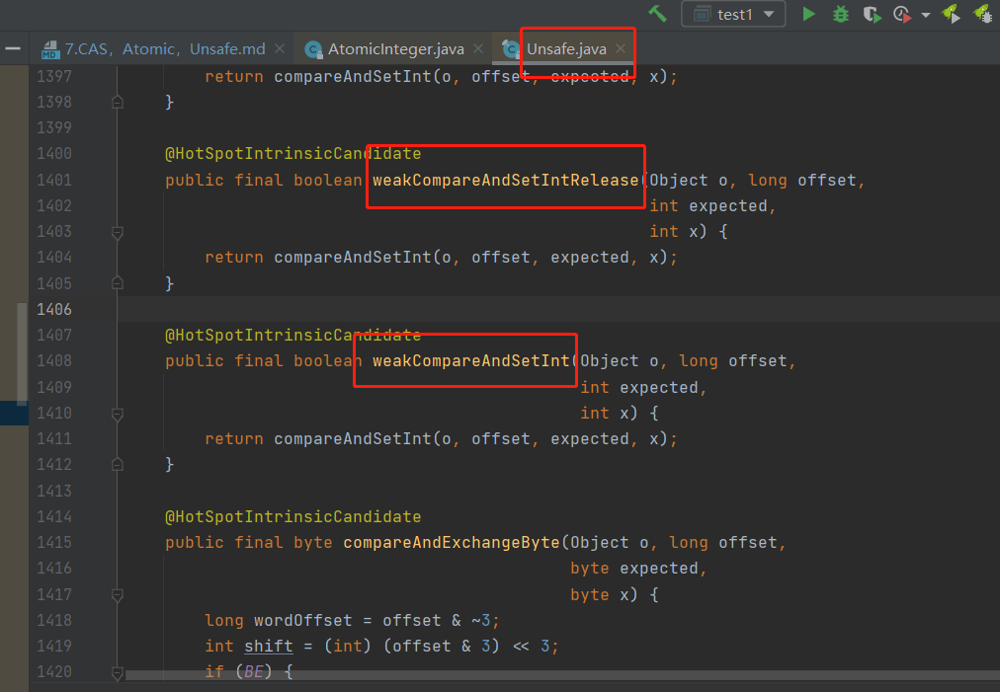

compare and swap 或者 compare and set

atomic相关的类多数是采用CAS保证原子性

如atomicInteger.incrementAndGet()

但多个atomic方法连续调用不能保证原子性

```
CAS 操作包含三个操作数 —— 内存位置（V）、预期原值（A）和新值(B)。

如果内存位置的值V与预期原值A相匹配，那么处理器会自动将该位置值V更新为新值B。

否则，处理器不做任何操作，整个操作保证了原子性，即在对比V==A后、设置V=B之前不会有其他线程修改V的值。
```

编译器翻译成机器语言后，CPU最终执行的是cmpxchg，多核CPU执行的是lock cmpxchg






Unsafe,Atomic,Condition内部的AbstractQueuedSynchronizer都是使用CAS


ABA问题：

    线程1： a -> b
    线程2： a -> b -> a
    如果 在不知道线程1和2 究竟谁的在谁前的情况下
    线程1先执行 在 -> 这个过程中 CPU切到了线程2
    线程2完成了 a -> b -> a 两个 -> 的过程
    在切回到 线程1的 -> 的逻辑 就有问题
    
    PS： 你和前女友复合，但分手期间她经历过别的男人。

解决的方式：

    1.每次修改加版本号，每修改一次加一次版本号

    2.从Java1.5开始JDK的atomic包里提供了一个类AtomicStampedReference来解决ABA问题。
    这个类的compareAndSet方法作用是首先检查当前引用是否等于预期引用，
    并且当前标志是否等于预期标志，如果全部相等，则以原子方式将该引用和该标志的值设置为给定的更新值。
    
CAS存在的问题：

    循环时间长开销大。Java的自旋锁（轻量锁）循环，自旋会占用CPU资源。

    只能保证一个共享变量的原子操作。
    当对一个共享变量执行操作时，我们可以使用循环CAS的方式来保证原子操作，
    但是对多个共享变量操作时，循环CAS就无法保证操作的原子性，这个时候就可以用锁，
    或者有一个取巧的办法，就是把多个共享变量合并成一个共享变量来操作。
    比如有两个共享变量i＝2,j=a，合并一下ij=2a，然后用CAS来操作ij。
    从Java1.5开始JDK提供了AtomicReference类来保证引用对象之间的原子性，
    你可以把多个变量放在一个对象里来进行CAS操作。

Unsafe
---



私有构造方法，和一个共有的静态方法

直接调静态方法不行, 还是得反射。






weakCompareAndSet方法的调用都可能会返回一个虚假的失败( 无任何明显的原因 )
（emmm 一开始以为这个weak是虚引用啥的）


CAS在硬件层面有没有使用到lock指令？
---

在硬件层面，Java中的CAS（Compare and Swap）底层实现通常会使用到lock指令。

lock指令是x86架构中的一种指令，它能够实现基于总线、缓存、内存等层次的原子操作，是实现CAS操作的关键。

在Java中，CAS操作通常涉及到以下几个步骤：

比较操作数和期望值是否相等。

如果相等，则使用新的值替换操作数的值。

如果不相等，则不进行任何操作。

这些操作通常是被编译器转换为汇编代码执行的，其中使用了lock指令来实现原子操作。

lock指令使得当前处理器的缓存行对其他处理器不可见，从而避免了多个处理器同时访问同一内存地址时的数据竞争问题。

具体来说，当一个CPU执行CAS操作时，它会使用lock指令将总线锁定，从而防止其他CPU访问内存。

然后，它会比较当前内存值和期望值是否相等，如果相等，则将新值写入内存并释放锁，完成CAS操作。

·如果不相等，则直接释放锁，不进行任何操作，并返回失败。

因此，可以看出，在硬件层面，Java中的CAS操作实现通常会使用到lock指令，它能够保证原子性操作，并避免出现数据竞争的问题。

    
参考：
---
https://blog.csdn.net/Hsuxu/article/details/9467651?spm=1001.2101.3001.6650.1&utm_medium=distribute.pc_relevant.none-task-blog-2%7Edefault%7ECTRLIST%7Edefault-1-9467651-blog-124416222.pc_relevant_multi_platform_whitelistv2&depth_1-utm_source=distribute.pc_relevant.none-task-blog-2%7Edefault%7ECTRLIST%7Edefault-1-9467651-blog-124416222.pc_relevant_multi_platform_whitelistv2&utm_relevant_index=1