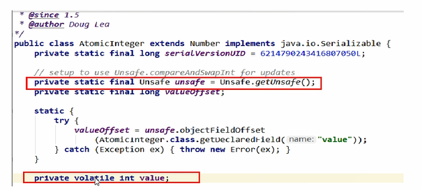
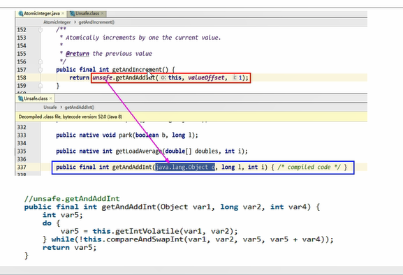
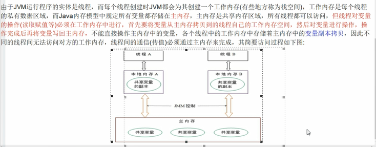
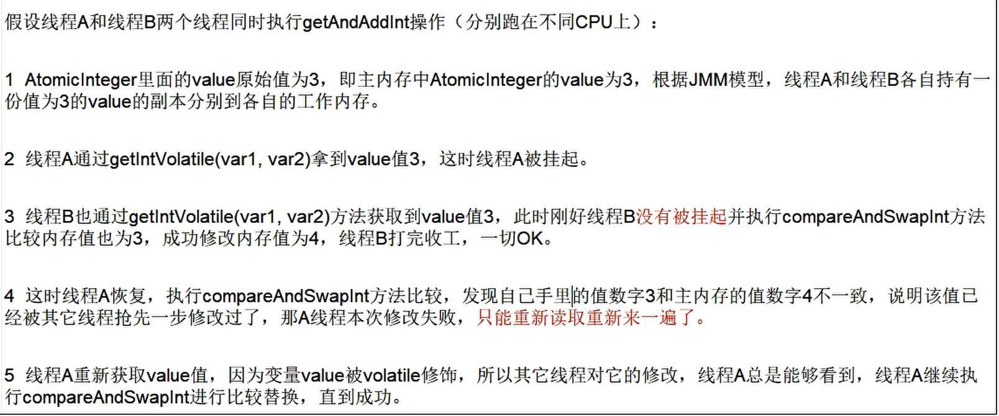

CAS 比较交换
---

AtomicInteger atomicInteger = new AtomicInteger(5);

atomicInteger.compareAndSet(5,6);

    5是期望原本的值是5，然后把5改成6

CAS的核心：自旋和Unsafe
---

使用volatile修饰value（保证可见性和顺序性）

为了保证原子性 需要使用unsafe调用本地方法

Unsafe根据ValueOffset 就是内存偏移地址获取数据

getAndIncrement()方法
---

内部使用do while循环 不断判断期望值和内存中的偏移量做比较，直到比较成功

直到compareAndSwapInt方法返回true

JMM内存模型
---

线程内存和主内存

CAS总结
---

比如有两个线程A , B 同时修改被volatile修饰的变量a（a开始等于3）

A线程时间片用完挂起， B 设置了变量a+1 （a被改成了4）

B被唤醒 ，因为volatile，B线程已经得知了变量a发生了变化，调用CAS的期望值不再是传入

3，4 而是 4，5