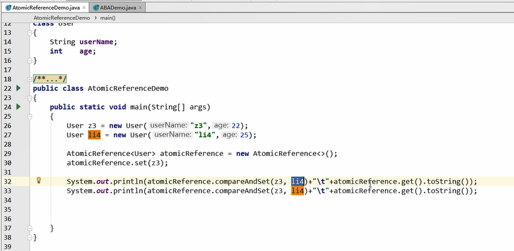
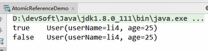

AtomicReference
---

    User z3 = new User("z3",22);
    User li4 = new User("li4",25);
    AtomicReference<User> aUser = new AtomicReference<User>();
    aUser.ser(z3);

    aUser.compareAndSet(z3,li4);
    aUser.compareAndSet(z3,li4);

AtomicStampedReference()
---

