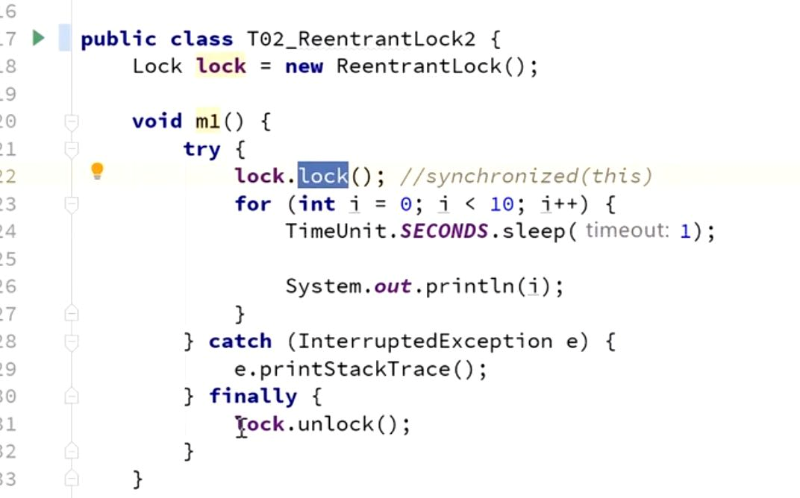
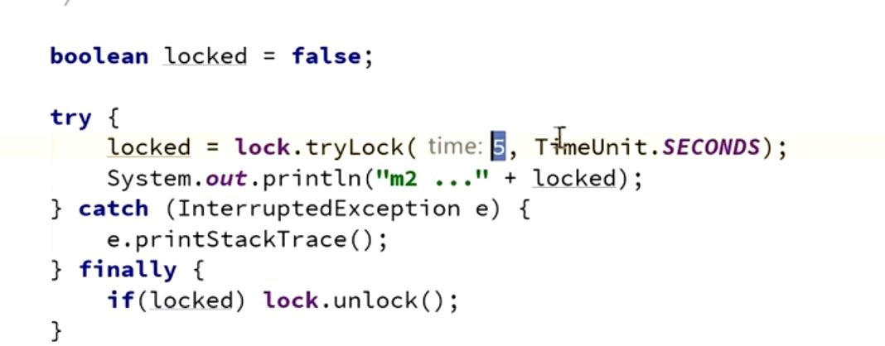
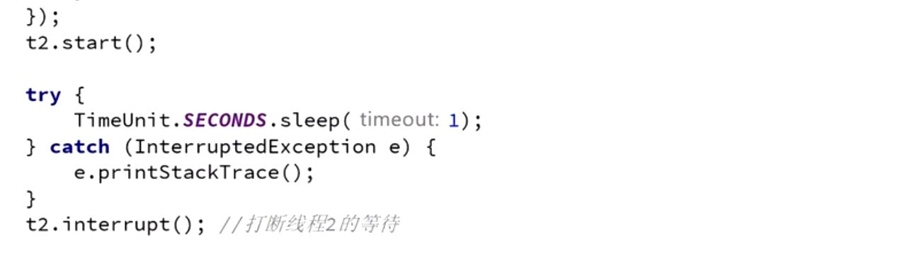

可重入锁
---

可以 再次 进入 同步锁

示例1

    public class ReentrantLockTest3 {
    
    
        public static void main(String[] args) {
            new ReentrantLockTest3().m1();
        }
    
        public synchronized void m1() {
            System.out.println("外---");
            m2();
        }
    
        public synchronized void m2() {
            System.out.println("中---");
            m3();
        }
    
        public synchronized void m3() {
            System.out.println("内---");
        }
    }

示例2

    public class ReentrantLockTest4 {
    
        static Lock lock = new ReentrantLock();
    
        public static void main(String[] args) {
    
            new Thread(()->{
               lock.lock();
               try {
                   System.out.println("=====外层");
                   lock.lock();
                   try {
                       System.out.println("=====内层");
                   } finally {
                       lock.unlock();
                   }
               } finally {
                   lock.unlock();
               }
            }).start();
    
        }
    
    }

synchronized和reentrantLock一样是可以重入的

reentrantLock和Synchronized都是可重入锁

可重入锁是指持有锁的对象再次进入内部方法时可以自动获取锁

不会因为之前已经获取过还没释放而阻塞

手动加锁，手动解锁（try finally)
---

synchronized获取不到锁会阻塞等待

reentrantLock可以尝试获取锁，并等待一定时间

等待尝试
---

lock.tryLock(5,TimeUnit.SECONDS) 在5秒内尝试拿锁。

可以打断
---

    在Thread a 内部  在加锁的时候写lock.lockInterruptibly();
    
    启动a线程
    a.start();
    
    调用方法就可以中止a线程
    a.interrupt();

公平锁，(默认非公平)
---
    
    默认false 非公平

    ReentrantLock lock = new ReentrantLock(true)

reentrantLock存放一个队列。

如果是公平锁，方法被占用，先进队列等待。

锁降级
---

锁降级指的是写锁降级为读锁。

锁降级是当前拥用写锁，再获取读锁，随后释放写锁的过程。需要注意的是开始拥用写后并没有立即释放写锁，而是在获取了读锁后才释放。