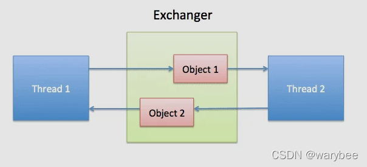

Exchanger是一个用于线程间协作的工具类。（只能两个线程之间）

Exchanger用于进行线程间的数据交 换。

它提供一个同步点，在这个同步点，两个线程可以交换彼此的数据。

这两个线程通过 exchange方法交换数据，

如果第一个线程先执行exchange()方法，它会一直等待第二个线程也执行exchange()方法，

当两个线程都到达同步点时，这两个线程就可以交换数据，将本线程生产 出来的数据传递给对方


exchange()方法是阻塞的。

方法执行到exchange()时线程时阻塞住的。




```
public class ExchangerDemo {
    static Exchanger<String> exgr = new Exchanger<>();
    public static void main(String[] args) {
         Thread taskA=new Thread(()->{
             try {
                 String message = exgr.exchange("from A");
                 System.out.println("A Task===>"+ message);
             } catch (InterruptedException e) {
                 e.printStackTrace();
             }
         });
        Thread taskB=new Thread(()->{
            try {
                String message = exgr.exchange("from B");
                System.out.println("B Task===>"+ message);
            } catch (InterruptedException e) {
                e.printStackTrace();
            }
        });
        taskA.start();
        taskB.start();

    }
}
```

子线程与主线程间交换数据

```
public class ExchangerDemo2 {
    static Exchanger<String> exchanger = new Exchanger<>();
    public static void main(String[] args) throws InterruptedException {
        Runnable childTask = () -> {
            try {
                String message = exchanger.exchange("来自子线程的数据");
                System.out.println("子线程： "+message);
            } catch (InterruptedException e) {
                Thread.currentThread().interrupt();
                throw new RuntimeException(e);
            }
        };
        //CompletableFuture java1.8中新增的异步编程类
        CompletableFuture<Void> result = CompletableFuture.runAsync(childTask);
        String msg = exchanger.exchange(" 来自主线程的数据");
        System.out.println("主线程： " +msg);
        result.join();
    }
}
```