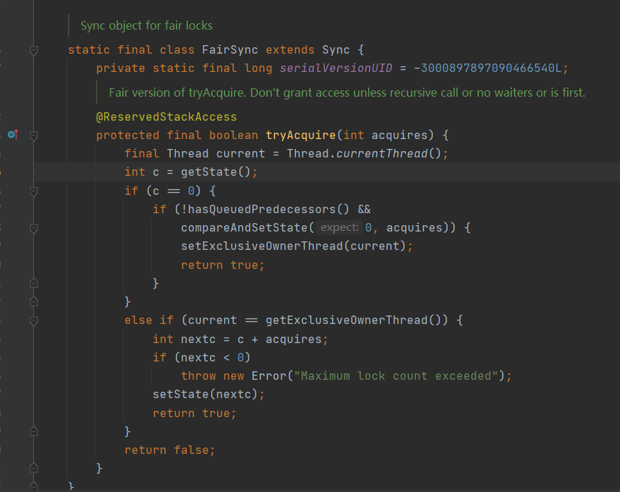

template method 模板方法

callback function 回调函数

像reentrantLock cyclicBarrier countdownLatch都是AQS实现

JUC的同步组件主要实现的AQS是哪些主要方法？

sync: FairSync NonFairSync

acquire

tryAcquire

为什么说AQS底层是CAS+volatile？

state（volatile） 当前线程获取了锁 state就变成1 释放了就变成0.
1和0就是加锁和解锁。

等待队列节点类。node内部存放着阻塞等待线程。

node有prev和next，等待队列就是双向链表。

reentrantLock.tryAcquire方法。

获取state，如果等于0，使用cas 尝试改成1，设定当前线程独占该锁。

如果当前线程已获得锁，state加1.

等待队列入队出队都是用CAS（compareAndSetState）

公平锁:
    
    线程尝试获取锁 先检查 等待队列

