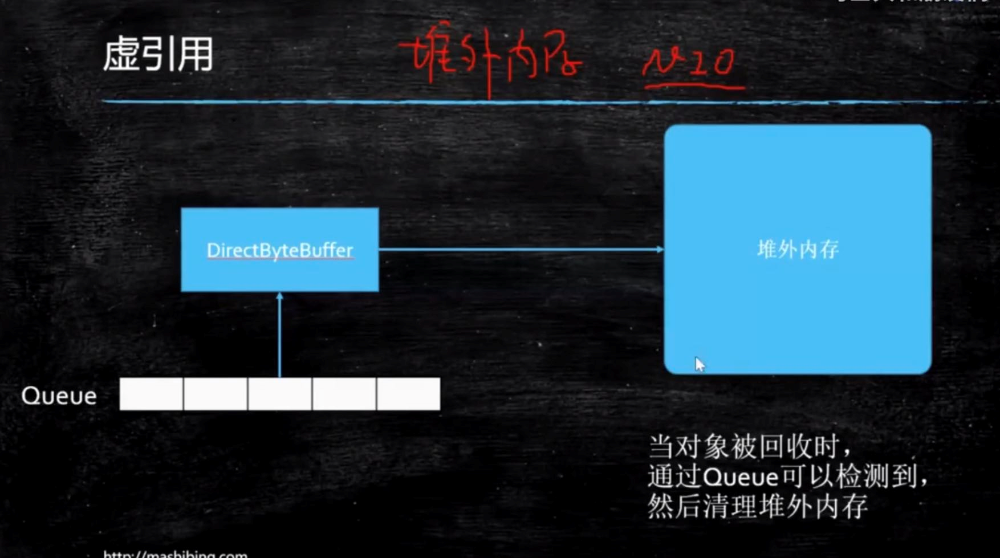

weakReference弱引用
---

    WeakReference<Object> m = new WekReference<>(new Object());

    System.out.println(m.get());

    System.gc();

    //每次GC都会回收，下次再打印就没了

    System.out.println(m.get());

PhantomReference虚引用
---

    /*
    *   队列控制虚引用
    */
    ReferenceQueue referenceQueue = new ReferenceQueue<>();

    PhantomReference<M> phantomReference = new PhantomReference<>(new M(),referenceQueue);

    //调用get()方法是get不到的,弱引用没GC还能get到，虚引用get不到

    phantomReference.get()

虚引用的作用？

    管理堆外内存

如果想把数据从系统写出去(1)，交给操作系统(2)，再给网卡(3)，JVM内存复制到操作系统内存这块操作。

NIO就使用了虚引用来管理直接内存（堆外内存），实现了zeroCopy。

java中有directByteBuffer代表了堆外内存。

ReferenceQueue(控制Reference入队) 

ReferenceHandler(线程实现类,一直for循环) 

这些会控制堆外内存的处理。

